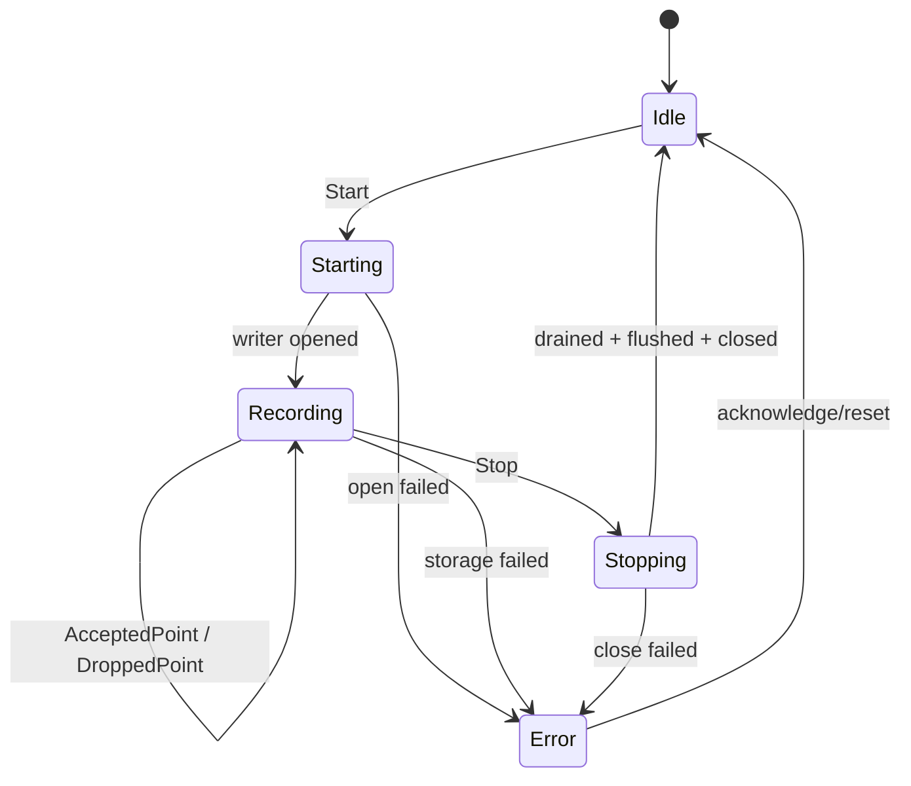

# State Machine: Track recording session

## State owner and persistent facts

TrackStateMachine holds the session state; Writer/Worker provides events but does not directly change the UI. The track file and its completion/incomplete marks are persistent facts, and Idle/Starting/Stopping are running states.

## Transition table

| Current state | event/guard | action | next state |
| --- | --- | --- | --- |
| Idle | Start | Create session, open writer | Starting |
| Starting | open success | Open sampling gate | Recording |
| Recording | valid sampled fix | bounded enqueue/count | Recording |
| Recording | Stop | Close the sampling gate and send drain | Stopping |
| Stopping | drain+flush+close success | Mark file complete | Idle |
| Active | storage failure | Stop new points, keep diagnostics | Error |

## Prohibition and Competition

The second Start in Starting/Recording/Stopping was rejected. Stop in Stopping is idempotent. Storage failure When competing with Stop, only one final path is allowed to have a writer close; AcceptedPoint is only valid when the gate is open and the session generation matches.

## The difference between Drop and Error

DroppedPoint is an observable degradation under the capacity policy and does not automatically terminate the session; storage write/close failure makes the file consistency unknown and must enter Error. The UI also displays the committed point, drop, and error reason.

## Recovery and testing

Restart scanning incomplete files and restore them according to the format or mark them as damaged, without restoring the Recording running state. Tests cover all transitions, repeat commands, Stop/failure races, and incomplete flags.
