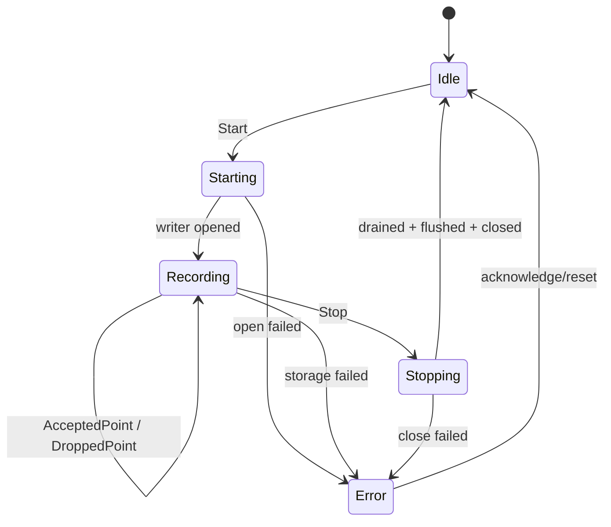

# State Machine：轨迹记录会话

## 状态 owner 与持久事实

TrackStateMachine 持有 session 状态；Writer/Worker 提供事件但不直接改 UI。轨迹文件及其完成/不完整标记是持久事实，Idle/Starting/Stopping 是运行态。

## Transition 表

| 当前状态 | 事件/guard | 动作 | 下一状态 |
| --- | --- | --- | --- |
| Idle | Start | 创建 session，open writer | Starting |
| Starting | open success | 开启采样 gate | Recording |
| Recording | valid sampled fix | 有界 enqueue/计数 | Recording |
| Recording | Stop | 关闭采样 gate，发 drain | Stopping |
| Stopping | drain+flush+close success | 标记文件 complete | Idle |
| 活动态 | storage failure | 停止新点，保留诊断 | Error |

## 禁止与竞争

Starting/Recording/Stopping 中的第二次 Start 被拒绝。Stopping 中的 Stop 幂等。Storage failure 与 Stop 竞争时只允许一个终结路径拥有 writer close；AcceptedPoint 只有在 gate open 且 session generation 匹配时有效。

## Drop 与 Error 的区别

DroppedPoint 是容量策略下的可观察退化，不自动终止会话；storage write/close failure 使文件一致性未知，必须进入 Error。UI 同时显示已提交点、drop 和错误原因。

## 恢复与测试

重启扫描 incomplete 文件并按格式恢复或标记损坏，不恢复 Recording 运行态。测试覆盖全部 transition、重复命令、Stop/失败竞争和 incomplete 标记。
