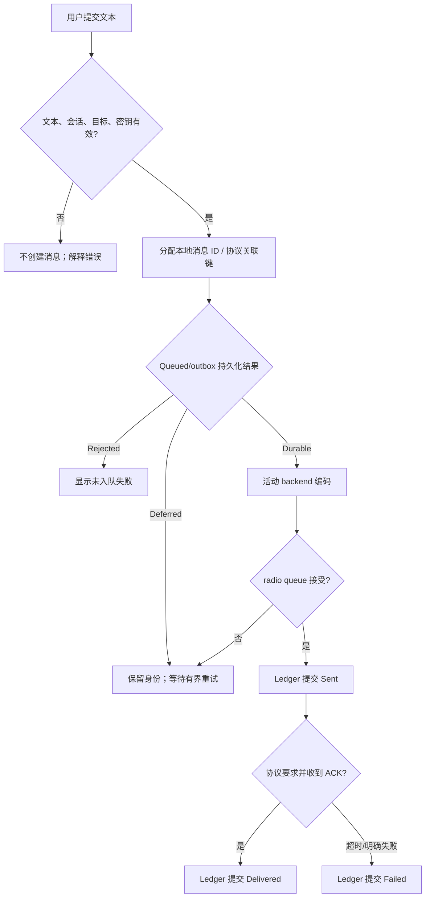

# Activity Diagram：消息提交与发送

## 本图回答的问题

一次“发送”从什么时候开始，哪些中间状态可以对用户可见，以及 `Sent`、`Delivered` 和 `Failed` 由什么事实决定。活动从用户提交完整意图开始，到 Ledger 接受不可倒退的终态为止。

## 输入验证与身份

文本、目标、会话、活动协议和所需密钥必须在创建消息之前验证。验证通过后先分配稳定本地消息 ID 和 protocol-scoped 关联键，再写入 outbox。重试必须复用这组身份，不能每次 radio enqueue 都创建一条新消息。

## 状态与提交语义

| 状态 | 事实 |
| --- | --- |
| Queued | 消息身份和发送意图已持久化，尚未证明 radio 接受 |
| Deferred | 身份已保留，但资源不足；进入有界重试 |
| Sent | backend/radio 报告发射阶段完成，不代表远端接收 |
| Delivered | 需要回执的协议已经匹配到有效 ACK |
| Failed | 明确不可恢复错误或 ACK deadline 到期 |

## 失败、重试与终态保护

radio queue 满、资源暂不可用和存储暂忙属于可延后条件；编码错误、目标无效和密钥缺失属于拒绝。Ledger 必须以状态偏序保护终态：迟到 timeout 不能把 Delivered 改回 Failed，迟到 ACK 可以按策略从 Sent/等待态推进，但不能复活用户已取消且确认终结的发送。

## 资源与并发

多个会话可以排队，但 radio owner 决定实际发送顺序。UI 不按回调到达顺序重排业务状态，而按消息 ID 将事实提交给 Ledger。重复点击、后台重试和协议 ACK 都通过同一关联键汇合。

## 源码证据与测试

验证对象包括 SendMessageService、活动协议 backend、radio queue 和 ChatMessageLedger。测试应覆盖 Deferred 恢复、radio 拒绝、ACK/timeout 竞争、重复 ACK、重启后 outbox 恢复和终态不可倒退。
