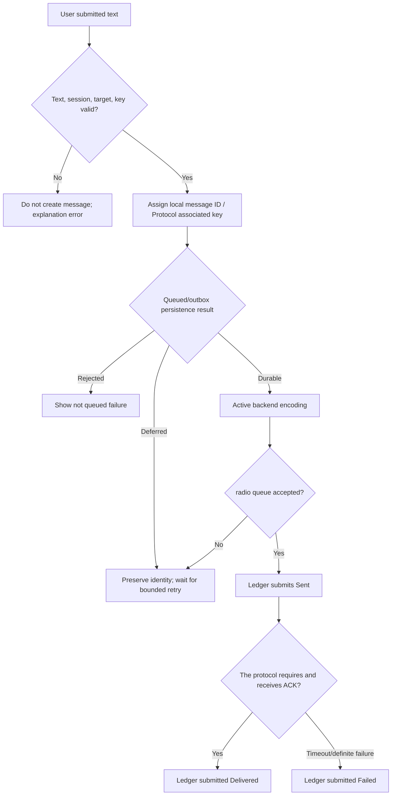

# Activity Diagram: Message submission and sending

## Questions answered by this picture

When does a "send" start, what intermediate states are visible to the user, and what facts determine `Sent`, `Delivered` and `Failed`. The activity starts when the user submits the complete intention and ends when the Ledger accepts the irreversible final state.

## Input Authentication and Identity

Text, destination, session, active protocol and required keys must be verified before creating the message. After passing the verification, first assign a stable local message ID and protocol-scoped associated key, and then write it to the outbox. Retries must reuse this set of identities and cannot create a new message for each radio enqueue.

## Status and Commit Semantics

| Status | Facts |
| --- | --- |
| Queued | Message identity and sending intent have been persisted, not yet proven radio Accept |
| Deferred | Identity has been preserved, but resources are insufficient; enter bounded retry |
| Sent | backend/radio Reporting that the transmission phase is completed does not mean that the remote end receives |
| Delivered | The protocol that requires a receipt has matched a valid ACK |
| Failed | Explicit unrecoverable errors or ACK deadline expiration |

## Failure, retry and final state protection

The radio queue full, the resource is temporarily unavailable and the storage is temporarily busy are deferrable conditions; encoding errors, invalid targets and missing keys are rejections. Ledger must protect the final state in a partial order of states: a late timeout cannot change Delivered back to Failed, and a late ACK can be advanced from the Sent/Waiting state according to the policy, but it cannot revive a send that has been canceled and confirmed by the user.

## Resources and Concurrency

Multiple sessions can be queued, but the radio owner determines the actual sending order. Instead of rearranging business states in the order in which callbacks arrive, the UI submits facts to the Ledger by message ID. Repeated clicks, background retries, and protocol ACKs all converge through the same correlation key.

## Source code evidence and testing

A
