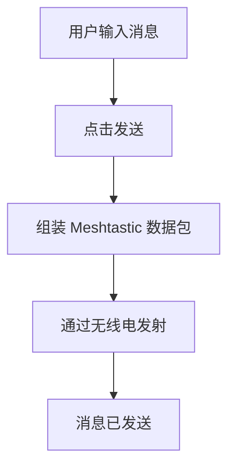

# Activity Diagram：业务流程：发送文本消息

<!-- praxis:use-case-diagram:start -->

## 元数据

项目版本：0.1.30-alpha
设计文档版本：0.1.30-alpha
Git 分支：main
Git 提交：34aad0bffa2f6450192f655f248a94b6c3cbd767
Git 工作区状态：dirty
Agent 版本决策：none - 本次渲染没有单独的 agent 版本决策
更新于：2026-06-25T14:17:55.307Z
来源：Agent 候选分析
父级 Use Case：use-case:send-text-message
业务边界路径：Trail Mate 系统 / 聊天通信
父级文档：docs/design/use-case-diagrams/send-text-message.md
Markdown 路径：docs/design/use-case-diagrams/send-text-message/activity.md
HTML 路径：docs/design/use-case-diagrams/send-text-message/activity.html

## 业务流程目标

用户与其他人通信，一条文本消息到达目标节点

## 流程边界

从用户编写消息到无线电成功发射

## 参与泳道 / 阶段

- 未显式声明泳道；请结合节点标签和实现范围判断业务阶段。

## 主成功路径

消息发送的主流程

- mainSuccessScenario[1]
- mainSuccessScenario[2]
- mainSuccessScenario[3]

## 决策点与分支

- 无

## 失败 / 补偿路径

- 无

## 流程业务规则

ChatLogic 封装消息，调用 Board 的无线电发送接口

## Activity UML 读图说明

线性流程，无决策分支

## 实现范围锚点

- 模块：apps/linux_uconsole_gtk
- 模块：boards
- 关键文件：apps/linux_uconsole_gtk/src/platform/gtk/gtk_uconsole_chat_logic.cpp
- 关键文件：boards/tlora_pager/src/tlora_pager_board.cpp
- 代码锚点：apps/linux_uconsole_gtk/src/platform/gtk/gtk_uconsole_chat_logic.cpp#L1
- 不覆盖代码：底层函数调用链
- 不覆盖代码：DTO/Mapper/Repository 细节

## 不覆盖范围

- 消息发送失败的重试
- 长消息分片

## Mermaid 图

## 证据上下文

| 来源 | 路径 | 行号 | 强度 | 摘要 |
| --- | --- | --- | --- | --- |
| 本地仓库扫描 | apps/nrf52_node/src/nrf52_node_app_facade_runtime.cpp | 9-9 | strong | Nrf52 节点固件包含聊天服务 |
| 本地仓库扫描 | apps/linux_uconsole_gtk/src/platform/gtk/gtk_uconsole_chat_logic.cpp | 1-1 | strong | 聊天页面生命周期提供输入处理与发送逻辑 |
| 本地仓库扫描 | apps/linux_uconsole_gtk/src/platform/gtk/gtk_uconsole_chat_logic.cpp | 1-1 | strong | 聊天逻辑处理消息发送流程 |

## 变更记录

### 0.1.30-alpha - 2026-06-25T14:17:55.307Z

变更类型：DISCOVERY
版本决策：none - 本次渲染没有单独的 agent 版本决策

Git 分支：main
Git 提交：34aad0bffa2f6450192f655f248a94b6c3cbd767
Git 工作区状态：dirty

摘要：
- 恢复或更新「发送文本消息」的 Activity Diagram。

<!-- praxis:use-case-diagram:end -->
