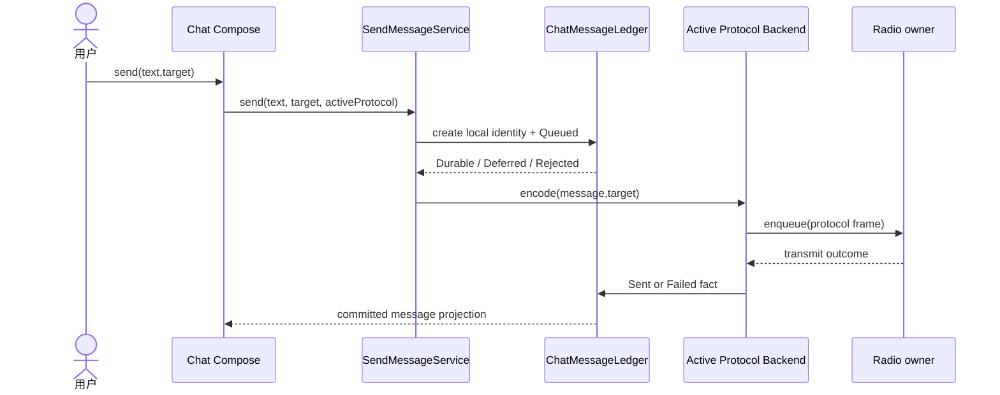

# Sequence Diagram：Compose 到 Ledger

## 场景与责任

该时序描述首轮提交和发射，不包含协议 ACK 的最终竞争。UI 只提交用户意图；SendMessageService 验证并创建稳定 identity；Ledger 拥有消息状态；Backend 拥有协议编码；Radio owner 拥有硬件排队和发射结果。

## 顺序约束

Queued 必须先 Durable，随后才允许编码和 radio enqueue。这样发射回调即使很快到达，也总能按 message identity 找到 Ledger 记录。UI 不能在 `send()` 返回或 enqueue 接受时直接显示 Delivered。

## 持久化结果

Ledger 返回 Deferred 时 Send 保留同一 identity 并等待受控 pump；Rejected 时不触发 backend。Radio transmit outcome 只提交 Sent/Failed 事实，是否 Delivered 留给协议回执时序。

## 重复与失败

重复点击通过 client intent/message identity 去重。Backend 编码失败、radio queue 满和发射失败必须保留不同原因。迟到 radio outcome 按 generation/message key 合并，不能更新另一次发送。

## 验证

测试记录 Ledger 与 radio 的调用顺序，覆盖 Queued Deferred、编码失败、queue 拒绝、重复点击和 UI 只消费 committed projection。
