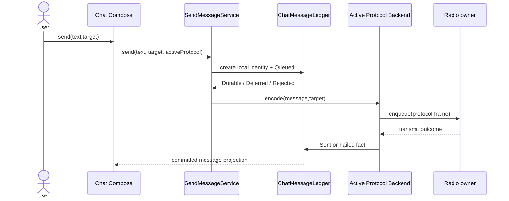

# Sequence Diagram: Compose to Ledger

## Scenarios and responsibilities

This sequence describes the first round of submission and emission, excluding the final competition for protocol ACK. The UI only submits user intent; SendMessageService verifies and creates a stable identity; Ledger owns the message state; Backend owns the protocol encoding; Radio owner owns the hardware queuing and emission results.

## Sequence constraints

Queued must be Durable first before encoding and radio enqueue are allowed. In this way, even if the emission callback arrives soon, the Ledger record can always be found according to the message identity. The UI cannot display Delivered directly when `send()` returns or when enqueue accepts.

## Persistent results

When Ledger returns Deferred, Send retains the same identity and waits for the controlled pump; backend is not triggered when Rejected. Radio transmit outcome only submits the Sent/Failed fact, whether it is Delivered is left to the protocol receipt timing.

## Repeat and failure

Repeated clicks are used to remove duplicates through client intent/message identity. Backend encoding failure, radio queue full and transmission failure must maintain different causes. Late radio outcomes are merged by generation/message key and cannot be updated for another send.

## Verification

The test records the calling sequence of Ledger and radio, covering Queued Deferred, encoding failure, queue rejection, repeated clicks and UI consumption only committed projection.
