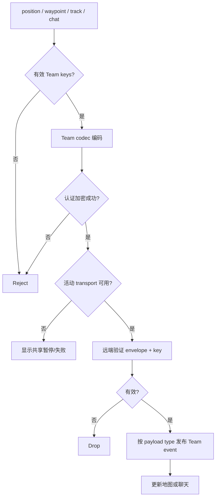

# Activity：团队态势共享

## 本图回答的问题

位置、航点、轨迹和聊天如何在团队业务层编码与认证，再复用活动 transport 发送；远端只有在验证成功后才更新地图或聊天。

## Payload 边界

四类 payload 共享 Team envelope，但有不同 schema、大小限制和投影 owner。位置是带时间的快照，航点是可标识对象，轨迹是有界分段数据，聊天具有稳定消息身份。它们不能只靠字符串 `type` 交给 UI 猜测。

## 发送规则

发送前检查有效 TeamId、用途正确且版本可接受的 key、payload 限制和活动 transport。Team codec 只负责业务 envelope；Meshtastic、MeshCore 或 Reticulum backend 继续拥有 wire framing 和 radio 发送。

## 接收与去重

远端先验证 envelope、团队和 key version，再按 payload type 解码。无效消息不发布部分事件。位置/航点/轨迹/聊天分别使用适合的 identity/revision 去重，不能用“来源 NodeId + 到达时间”统一替代。

## 暂停、失败与新鲜度

transport 不可用时显示共享暂停或失败；是否排队必须由各 payload 策略明确决定。地图投影保留 source time 和 receive time，过期位置不能继续显示为实时。大轨迹 payload 必须分段并有固定容量策略。

## 测试

覆盖错误团队、错误 key 用途、旧 key version、重复 payload、乱序位置、超限轨迹、transport 切换和地图/聊天投影失败。
