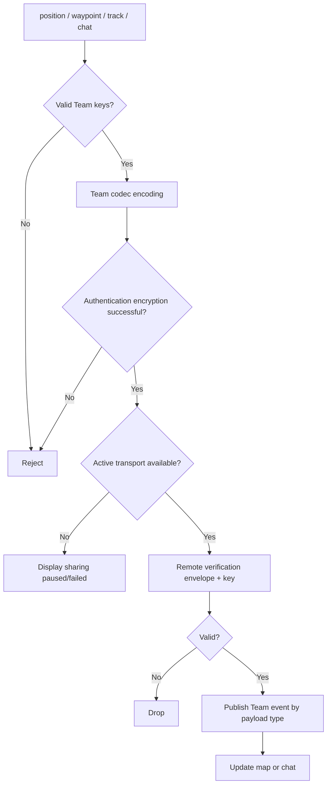

# Activity: Team situation sharing

## Questions answered by this picture

How to encode and authenticate location, waypoint, trajectory and chat in the team business layer, and then reuse the activity transport to send; the remote end will only update the map or chat after successful authentication.

## Payload boundary

The four types of payload share the Team envelope, but have different schema, size limits and projection owners. Locations are snapshots with time, waypoints are identifiable objects, trajectories are bounded segmented data, and chats have stable message identities. They cannot just rely on the string `type` and leave it to the UI to guess.

## Sending rules

Checks for a valid TeamId, key with correct purpose and acceptable version, payload restrictions and active transport before sending. The Team codec is only responsible for the business envelope; the Meshtastic, MeshCore or Reticulum backend continues to own the wire framing and radio transmission.

## Reception and deduplication

The remote end first verifies the envelope, team and key version, and then decodes it according to the payload type. Invalid messages do not publish some events. Position/waypoint/track/chat use appropriate identity/revision to remove duplicates respectively, and cannot be replaced by "source NodeId + arrival time".

## Pause, failure and freshness

Display shared pause or failure when transport is unavailable; whether to queue must be clearly determined by each payload policy. Map projections retain source time and receive time, and expired locations cannot continue to be displayed as real-time. Large trajectory payloads must be segmented and have a fixed capacity policy.

## Tests
