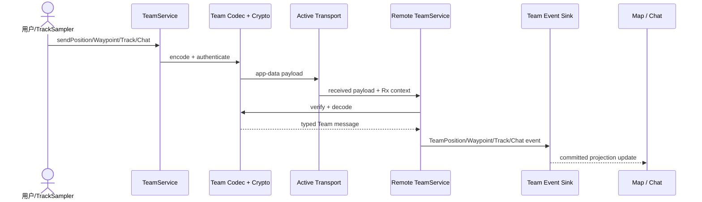

# Sequence：Team payload 到地图/聊天

## 场景与参与者

TeamService 接收业务命令并验证团队状态；Codec/Crypto 拥有 Team envelope；Active Transport 只负责 wire 传输；Remote TeamService 验证接收上下文；Event Sink 按类型提交；Map/Chat 消费投影。

## 发送顺序

业务 payload 先检查大小、identity/revision 和 key 用途，再编码认证；只有完整 envelope 交给 transport。Transport 成功只表示本地发送结果，不能伪造成所有远端成员已看到。

## 接收提交

Remote 使用 Rx context、TeamId、key version 和 payload identity 验证。typed message 形成后交给相应 Event Sink；只有 sink 提交成功才更新 UI。部分 track 或无效 waypoint 不发布半成品事件。

## 去重与新鲜度

位置按 member + revision/time 合并，聊天按 message identity 去重，航点和轨迹按对象 revision。旧位置可存历史但不能覆盖新地图位置。重复 envelope 可以重发 transport ACK，但不重复业务事件。

## 测试

覆盖错误团队/key、乱序位置、重复聊天、分段轨迹缺片、Event Sink Deferred 和 transport 切换。
