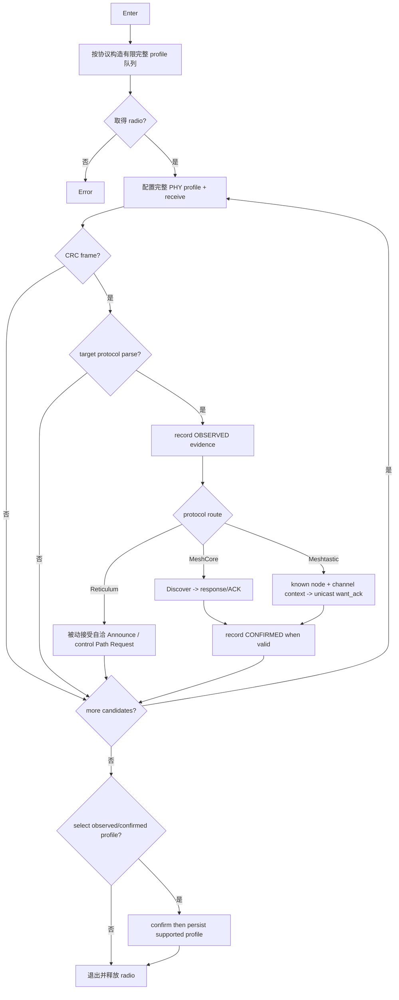

# Activity：协议空口参数探测

## 本图回答的问题

系统如何取得 radio、遍历完整协议 air profile、按协议语义记录证据，并只把真实观察到或确认的 profile 交给用户应用。

## 扫描计划

候选从当前实际 profile 派生，但不保留未实现的历史缓存：Meshtastic 只加入同一配置上下文的标准 modem profile，MeshCore 只加入相同频率族的区域 preset，Reticulum 只监听当前配置的 RNode profile。每项都包含频率、BW、SF、CR、sync word、preamble、header/CRC 等完整 PHY 参数；RT 不假定存在通用区域 plan，也不盲扫频率网格。

## Radio 所有权

探测需要临时独占或受策略约束的 radio lease。取得失败时不改变当前协议配置。主动 Discover、ACK 或 Ping 后必须保持接收至对应响应窗口结束，不能发完即刻 retune。退出和异常均恢复进入前的 radio 配置并释放 lease。

## 证据规则

E0 RF activity 与 E1 generic LoRa frame 只能进入诊断，不进入可应用列表。E2 protocol observed 是 MC 的可信包、MT 的可解密有效数据，或 RT 的自洽公开 Announce/控制 Path Request；E3 confirmed 只来自带本次 tag 的 MC Discover 响应或相关的 MT ROUTING ACK。RT 在这个独占临时调谐流程里没有 E3。无包或无 ACK 都是不确定结果，不能反向否定 E2。

## 中止与部分结果

用户取消或资源撤销时停止新的探测步骤，保留已完成证据并明确标识。已观察/已确认 profile 可以查看；只有目标协议存在无损配置映射时，才允许用户经二次确认应用。

## 测试

验证应覆盖当前实际 profile 优先、MC Discover 成功/超时、MT 广播不误判为 ACK、MT 密钥缺失、RT Announce/控制 Path Request 的被动证据、响应窗口内 radio 不提前 retune、取消、应用失败与 radio 配置恢复。不得把 RT Proof 升级或任意 CRC 帧写成协议证据。
