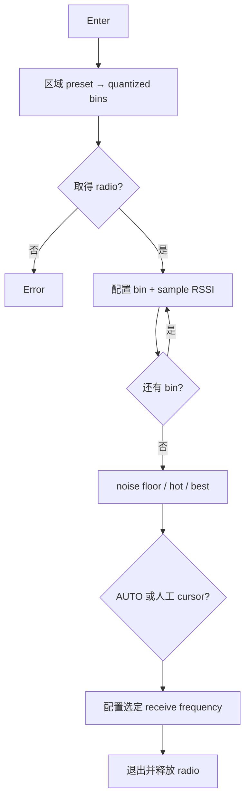

# Activity：频谱扫描

## 本图回答的问题

在区域 band plan 约束内，系统如何取得 radio、逐 bin 测量、计算噪声与热点，并只把真实测量过的候选应用为接收频率。

## 扫描计划

区域 preset 先转换成合法起止频率和量化步长。每个 bin 记录频率、样本数和统计值；未扫描、采样失败或被中止的 bin 标为 unknown，不能以零 RSSI 参与“最佳频点”排序。

## Radio 所有权

扫描需要临时独占或受策略约束的 radio lease。取得失败时不改变当前协议配置。扫描期间其他 radio owner 的抢占请求按明确优先级处理；退出和异常均恢复进入前的 radio 配置并释放 lease。

## 分析规则

noise floor、hot threshold 和 best candidate 使用同一完整扫描 revision。AUTO 只能选择满足 band plan、样本完整和干扰策略的 bin；人工 cursor 也必须量化到合法频率。应用选择是单独命令，不应在每个 cursor 移动时立即写配置。

## 中止与部分结果

用户取消或资源撤销时停止新的采样，保留已完成 bin 作为 partial scan 并明确标识。Partial 结果可用于查看，但默认不允许 AUTO 提交，除非策略显式支持并说明覆盖范围。

## 测试

覆盖区域边界量化、单 bin、采样失败、中途取消、全部噪声相同、热点排除、未扫描点不参与排序，以及应用后 radio 配置恢复。
