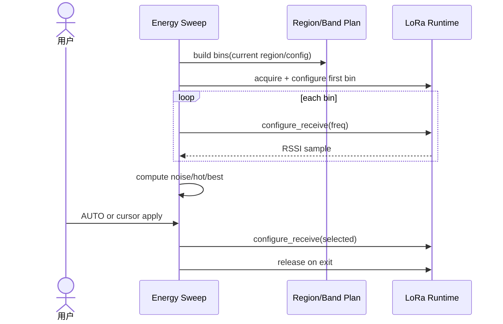

# Sequence：Sweep 与 Radio Owner

## 场景与责任

Band Plan 负责合法频率集合，Energy Sweep 编排扫描和分析，Radio Runtime 拥有硬件配置与 RSSI 采样。用户的 AUTO/cursor 选择是扫描完成后的独立提交。

## 获取与恢复

`acquire` 返回 lease 和进入前配置快照；未取得 lease 不调用 configure。退出、取消或错误时先停止扫描，再恢复需要保留的 radio 配置并 release。

## 采样顺序

每个 bin 先 configure，等待硬件 settle，再收集规定数量样本。RSSI response 带 bin/generation，迟到样本不能计入下一 bin。分析只消费标记 complete 的 bin。

## 应用选择

AUTO 基于同一 scan revision 的 noise/hot/best；cursor 量化到 Band Plan。`configure_receive(selected)` 成功后才更新配置投影，失败保留旧频率。

## 测试

覆盖 settle、迟到样本、采样超时、partial scan、AUTO 无候选、apply 失败、资源抢占和 release 后配置。
