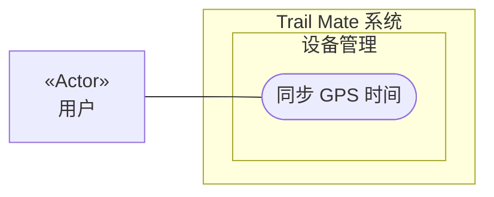

# 用例图：同步 GPS 时间

<!-- praxis:use-case-diagram:start -->

## 元数据

项目版本：0.1.30-alpha
设计文档版本：0.1.30-alpha
Git 分支：main
Git 提交：34aad0bffa2f6450192f655f248a94b6c3cbd767
Git 工作区状态：dirty
Agent 版本决策：none - 本次渲染没有单独的 agent 版本决策
更新于：2026-06-25T14:17:55.307Z
来源：Agent 候选分析
所属地图：../use-case-diagrams-maps.md
语义 HTML：sync-gps-time.html

## 身份信息

- ID：use-case:sync-gps-time
- 业务边界路径：Trail Mate 系统 / 设备管理
- 当前边界类型：业务模块
- 当前边界职责：提供设备状态的可见性和用户可控的硬件管理
- 状态：candidate
- 置信度：medium
- Markdown 路径：docs/design/use-case-diagrams/sync-gps-time.md
- HTML 路径：docs/design/use-case-diagrams/sync-gps-time.html
- 触发条件：用户在时间设置界面点击同步按钮

## 故事摘要

用户触发从 GPS 模块获取准确时间并同步到设备 RTC，或调整 RTC 偏移

## 参与者

- 用户（个人）

## 外部系统

- 无

## UML 下钻地图

- Use Case Diagram：[同步 GPS 时间](sync-gps-time.html)
  - Activity Diagram：[业务流程：同步 GPS 时间](sync-gps-time/activity.html)
  - Sequence Diagram：[对象交互：同步 GPS 时间](sync-gps-time/sequences/sequence-sync-gps-time-sequence.html)

## Mermaid 用例图



## 设计指标索引

此章节是 Design Explorer 可解析的指标索引。每个数字都必须能回溯到这里的具体条目，避免 UI 只展示不可解释的计数。

| 指标 | 数量 | 内容边界 |
| --- | ---: | --- |
| 节点 | 4 | 参与者、外部系统、上下文和当前用例。 |
| 关系 | 5 | 当前用例与上下文、参与者、外部系统或其他用例之间的关系。 |
| 证据 | 2 | 支撑当前候选用例的文件、代码证据、规范或推断证据。 |
| 待裁决 | 0 | 仍需产品或业务负责人裁决的外部问题。 |

### 节点

- Trail Mate 系统（业务边界：系统边界） - 管理整个应用的用户目标和业务能力
- 设备管理（业务边界：业务模块） - 提供设备状态的可见性和用户可控的硬件管理
- 同步 GPS 时间（用例） - 用户触发从 GPS 模块获取准确时间并同步到设备 RTC，或调整 RTC 偏移
- 用户（参与者） - 使用 Trail Mate 设备的最终用户，可以查看状态、收发消息、配置设备、使用诊断工具

### 关系

- Trail Mate 系统 包含业务边界「设备管理」（包含关系）
- 设备管理 包含 Use Case「同步 GPS 时间」（包含关系）
- 用户 作为主要参与者参与「同步 GPS 时间」（参与关系） - 使用 Trail Mate 设备的最终用户，可以查看状态、收发消息、配置设备、使用诊断工具
- 用户 -> 同步 GPS 时间（参与关系） - 用户同步时间
- 用户 -> 同步 GPS 时间（参与关系） - 用户同步 GPS 时间

### 证据

- 证据 1 · 本地仓库扫描 · boards/tlora_pager/src/tlora_pager_board.cpp · 1-1（FACT:strong） - 时间同步相关函数实现在 TLoRaPagerBoard 中

  ```text
  syncTimeFromGPS, adjustRTCByOffsetMinutes
  ```
- 证据 2 · 本地仓库扫描 · boards/tlora_pager/src/tlora_pager_board.cpp · 1-1（FACT:strong） - 与 RTC 同步相关的方法

  ```text
  tlora_pager_board.cpp
  ```

### 待裁决

- 无

## 主成功路径

1. 用户选择同步时间或进入自动同步流程
2. 系统从 GPS 模块读取 UTC 时间
3. 系统更新 RTC 并调整偏移值
4. 用户触发时间同步
5. 系统从 GPS 获取当前 UTC 时间
6. 系统写入 RTC

## 备选路径

1. 无

## 失败路径

1. GPS 未就绪或信号差，同步失败并提示用户
2. GPS 未锁定，同步失败

## 证据

| 来源 | 路径 | 行号 | 强度 | 摘要 |
| --- | --- | --- | --- | --- |
| 本地仓库扫描 | boards/tlora_pager/src/tlora_pager_board.cpp | 1-1 | strong | 时间同步相关函数实现在 TLoRaPagerBoard 中 |
| 本地仓库扫描 | boards/tlora_pager/src/tlora_pager_board.cpp | 1-1 | strong | 与 RTC 同步相关的方法 |

## 变更记录

### 0.1.30-alpha - 2026-06-25T14:17:55.307Z

变更类型：DISCOVERY
版本决策：none - 本次渲染没有单独的 agent 版本决策


Git 分支：main
Git 提交：34aad0bffa2f6450192f655f248a94b6c3cbd767
Git 工作区状态：dirty

摘要：
- 恢复或更新候选用例图「同步 GPS 时间」。

<!-- praxis:use-case-diagram:end -->
