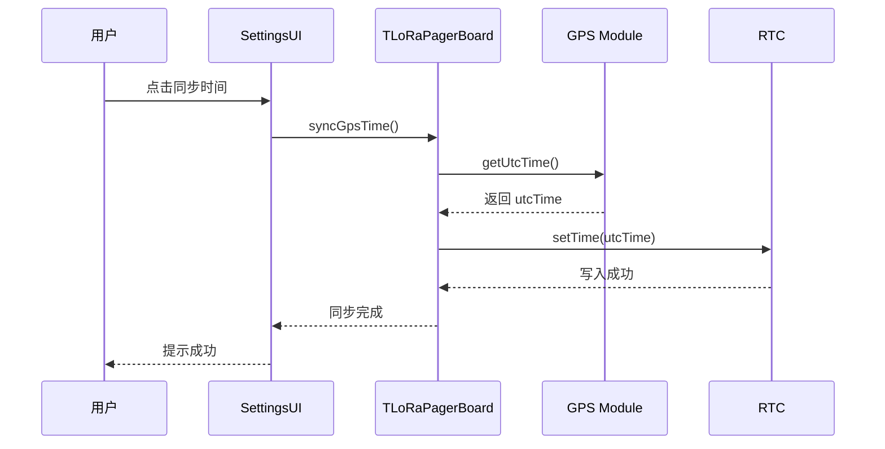

# Sequence Diagram：对象交互：同步 GPS 时间

<!-- praxis:use-case-diagram:start -->

## 元数据

项目版本：0.1.30-alpha
设计文档版本：0.1.30-alpha
Git 分支：main
Git 提交：34aad0bffa2f6450192f655f248a94b6c3cbd767
Git 工作区状态：dirty
Agent 版本决策：none - 本次渲染没有单独的 agent 版本决策
更新于：2026-06-25T14:17:55.307Z
来源：Agent 候选分析
父级 Use Case：use-case:sync-gps-time
业务边界路径：Trail Mate 系统 / 设备管理
父级文档：docs/design/use-case-diagrams/sync-gps-time.md
Markdown 路径：docs/design/use-case-diagrams/sync-gps-time/sequences/sequence-sync-gps-time-sequence.md
HTML 路径：docs/design/use-case-diagrams/sync-gps-time/sequences/sequence-sync-gps-time-sequence.html

## 交互场景

获取精确的时间基准

## 参与者 / 生命线

- participant User as 用户
- participant UI as SettingsUI
- participant Board as TLoRaPagerBoard
- participant GPS as GPS Module
- participant RTC as RTC

## 消息时序

- User->>UI: 点击同步时间
- UI->>Board: syncGpsTime()
- Board->>GPS: getUtcTime()
- GPS-->>Board: 返回 utcTime
- Board->>RTC: setTime(utcTime)
- RTC-->>Board: 写入成功
- Board-->>UI: 同步完成
- UI-->>User: 提示成功

## 同步 / 异步 / 回调

- GPS-->>Board: 返回 utcTime
- RTC-->>Board: 写入成功
- Board-->>UI: 同步完成
- UI-->>User: 提示成功

## 返回 / 异常 / 补偿

- GPS-->>Board: 返回 utcTime
- RTC-->>Board: 写入成功
- Board-->>UI: 同步完成
- UI-->>User: 提示成功

## 事务 / 幂等 / 重试边界

Board 作为 GPS 和 RTC 之间的适配器

- 无

## Sequence UML 读图说明

UI 请求同步，Board 检查 GPS 并写入 RTC

## 实现范围锚点

- 模块：boards
- 关键文件：boards/tlora_pager/src/tlora_pager_board.cpp
- 代码锚点：boards/tlora_pager/src/tlora_pager_board.cpp#L1
- 不覆盖代码：非当前场景的全部调用链
- 不覆盖代码：未被证据支持的异步/补偿路径

## 不覆盖场景

- 时间回退处理

## Mermaid 图

## 证据上下文

| 来源 | 路径 | 行号 | 强度 | 摘要 |
| --- | --- | --- | --- | --- |
| 本地仓库扫描 | boards/tlora_pager/src/tlora_pager_board.cpp | 1-1 | strong | 时间同步相关函数实现在 TLoRaPagerBoard 中 |
| 本地仓库扫描 | boards/tlora_pager/src/tlora_pager_board.cpp | 1-1 | strong | 与 RTC 同步相关的方法 |

## 变更记录

### 0.1.30-alpha - 2026-06-25T14:17:55.307Z

变更类型：DISCOVERY
版本决策：none - 本次渲染没有单独的 agent 版本决策

Git 分支：main
Git 提交：34aad0bffa2f6450192f655f248a94b6c3cbd767
Git 工作区状态：dirty

摘要：
- 恢复或更新「同步 GPS 时间」的 Sequence Diagram。

<!-- praxis:use-case-diagram:end -->
