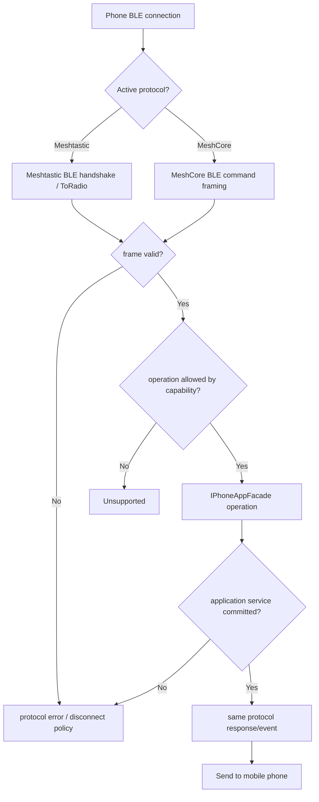

# Activity: Phone BLE request

## Questions answered by this picture

After the mobile phone is connected, how do Meshtastic and MeshCore two sets of BLE wire contracts share `IPhoneAppFacade` Application capabilities while maintaining separate handshake, frame, error and response semantics.

## Protocol selection

The connection is determined by a clear service/characteristic or configuration protocol, and is not based on fuzzy guesses based on the content of the first frame. When selected, the session is fixed to that protocol; error frames cannot cause the same connection to silently switch codecs.

## Boundary responsibilities

Meshtastic core handles protobuf/ToRadio/FromRadio, and MeshCore core handles its own command framing. Both only pass verified application intent to `IPhoneAppFacade`. Facade does not accept wire buffers and does not return protocol-specific structures.

## Capability and submission

 Operations supported by different device targets and active protocols are different. Capability checking occurs before business calls; success response/event is encoded only if the application service is submitted successfully. Receipt of the request by UI or BLE does not constitute business completion.

## Backpressure and memory

The notification queue and input frame use a fixed capacity policy; large protobuf/frame/config objects must not be placed on the ESP BLE task stack. When the queue is full, you must select the drop/replace/disconnect strategy and expose diagnostics.

## Disconnection and repeated requests

Disconnection invalidates the session generation and releases the subscription; late callbacks cannot be sent to new connections. Side-effect commands that allow retrying in the protocol need to stabilize the request identity to avoid repeated sending of messages or repeated configuration changes.

## Tests

The two sets of protocols perform handshakes, invalid frames, unsupported operations, repeated commands, queue full, disconnection reconnection and facade failure respectively; and verify that any Meshtastic wire type does not leak to the MeshCore path.
