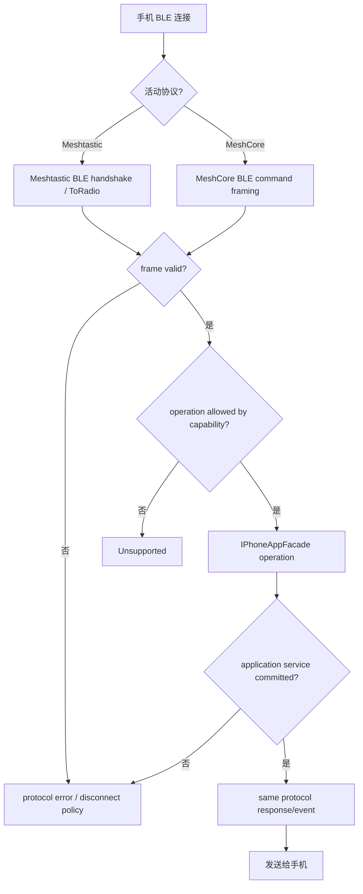

# Activity：Phone BLE 请求

## 本图回答的问题

手机连接后，Meshtastic 与 MeshCore 两套 BLE wire contract 如何共享 `IPhoneAppFacade` 应用能力，同时保持各自握手、frame、错误和响应语义隔离。

## 协议选择

连接由明确 service/characteristic 或配置决定协议，不根据首帧内容模糊猜测。选择后 session 固定为该协议；错误帧不能使同一连接悄悄切换 codec。

## 边界职责

Meshtastic core 处理 protobuf/ToRadio/FromRadio，MeshCore core 处理自己的 command framing。二者只把已验证的应用意图交给 `IPhoneAppFacade`。Facade 不接收 wire buffer，也不返回协议专用结构。

## Capability 与提交

不同设备目标和活动协议支持的 operation 不同。capability 检查发生在业务调用前；只有应用服务提交成功才编码 success response/event。UI 或 BLE 已接收请求不构成业务完成。

## 背压与内存

通知队列和输入 frame 使用固定容量策略；大 protobuf/frame/config 对象不得放在 ESP BLE task 栈。队列满必须选择 drop/replace/disconnect 策略并暴露诊断。

## 断连与重复请求

断连使 session generation 失效并释放订阅；迟到回调不能发送到新连接。协议允许重试的副作用命令需要稳定 request identity，避免重复发送消息或重复改配置。

## 测试

两套协议分别执行握手、无效帧、unsupported operation、重复命令、队列满、断连重连和 facade failure；并验证任何 Meshtastic wire 类型不会泄漏到 MeshCore 路径。
