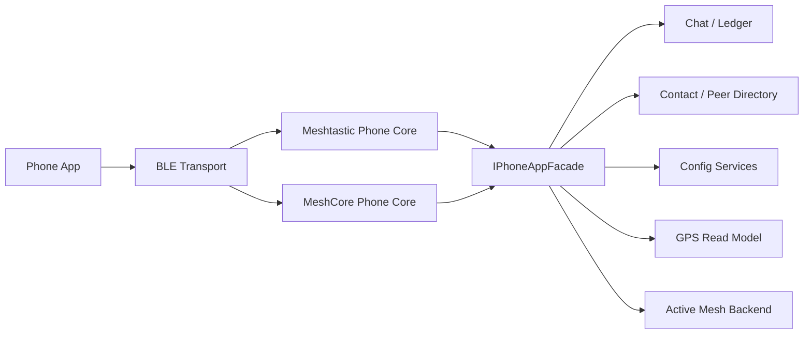

# Composite Structure：Phone Protocol Boundary

两个 protocol core 共享 facade，但不互相读取或编码对方的帧；active backend 仍由设备应用拥有。

## 结构职责

BLE Transport 提供连接、characteristic 和固定容量帧槽；Meshtastic/MeshCore Core 分别拥有自己的 handshake、codec、队列和错误语义；`IPhoneAppFacade` 暴露协议中立用例；下游服务拥有真实业务状态。

## 端口契约

Facade 输入使用稳定 command/value DTO，不包含 protobuf、MeshCore frame 或 BLE handle。输出区分 committed result、read snapshot 和 subscription event。协议 Core 负责把这些结果映射回本协议 wire contract。

## 隔离不变量

- 两个 Core 不能互相导入、读取或转码对方 frame。
- Facade 不根据协议类型决定业务规则。
- Active Mesh Backend 由设备应用选择，手机协议不能暗中替换它。
- Chat、Directory、Config、GPS 的 owner 不因 BLE 连接而转移。

## 内存与并发

每个连接使用 generation 和固定深度 RX/TX ring。大 protobuf/config/frame 使用成员 scratch 或 caller storage，禁止自动局部大对象。断连使订阅和旧 callback 失效。

## 替换与测试

可以替换 BLE adapter 或其中一个 Protocol Core，而无需改变 Facade/业务服务。契约测试对两套 Core 运行同一业务案例，再分别断言 native wire response、错误映射、背压和协议隔离。
