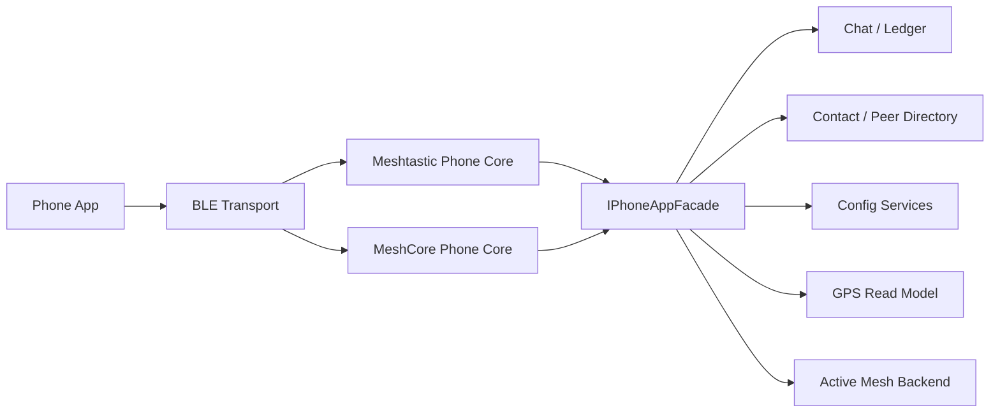

# Composite Structure:Phone Protocol Boundary

The two protocol cores share the facade, but do not read or encode each other's frames; the active backend is still owned by the device application.

## Structural responsibilities

BLE Transport provides connection, characteristic and fixed-capacity frame slots; Meshtastic/MeshCore Core has its own handshake, codec, queue and error semantics respectively; `IPhoneAppFacade` exposes protocol-neutral use cases; downstream services have real business status.

## Port Contract

Facade input uses stable command/value DTO and does not contain protobuf, MeshCore frame or BLE handle. The output distinguishes between committed result, read snapshot, and subscription event. The protocol Core is responsible for mapping these results back to this protocol wire contract.

## Isolation invariant

- Two Cores cannot import, read, or transcode each other's frames.
- Facade does not determine business rules based on protocol type.
- Active Mesh Backend is selected by the device application and the mobile protocol cannot override it implicitly.
- The owners of Chat, Directory, Config, and GPS are not transferred due to BLE connection.

## Memory and concurrency

Each connection uses generation and fixed depth RX/TX ring. Large protobuf/config/frame uses member scratch or caller storage, disabling automatic local large objects. Disconnection invalidates subscriptions and old callbacks.

## Replacement and Testing

The BLE adapter or one of the Protocol Cores can be replaced without changing the Facade/Business Services. The contract test runs the same business case on both sets of Cores, and then asserts native wire response, error mapping, backpressure and protocol isolation respectively.
