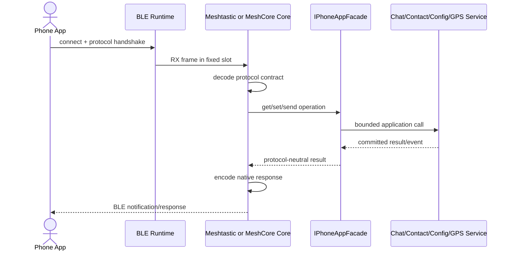

# Sequence：Phone Protocol Core 到 App Facade

## 场景与责任

BLE Runtime 管理连接和固定槽；Protocol Core 拥有各自 wire contract；Facade 提供协议中立应用接口；Chat/Contact/Config/GPS Service 拥有业务状态。依赖方向只能从协议 Core 指向 Facade。

## Frame 生命周期

RX frame 写入固定槽并关联 connection generation。Core 在槽有效期内 decode，提取紧凑命令后释放/复用槽；不得把大 protobuf 或 frame 作为深调用栈的值对象传递。

## 提交与响应

只读请求可以直接返回快照；副作用请求必须等待 App committed result。Facade 返回 protocol-neutral result/error，Core 再映射为本协议 response。应用 error 不能泄漏另一协议的枚举或 wire 类型。

## 通知与断连

异步 App event 经过 Facade/订阅映射到当前 Core 的 native notification。断连取消订阅并使 pending generation 失效；业务已提交但响应丢失时由 request identity 支持手机安全重试。

## 测试

分别覆盖 Meshtastic 与 MeshCore 的握手、frame 解码、Facade error 映射、重复副作用、通知背压、断连迟到和协议隔离。
