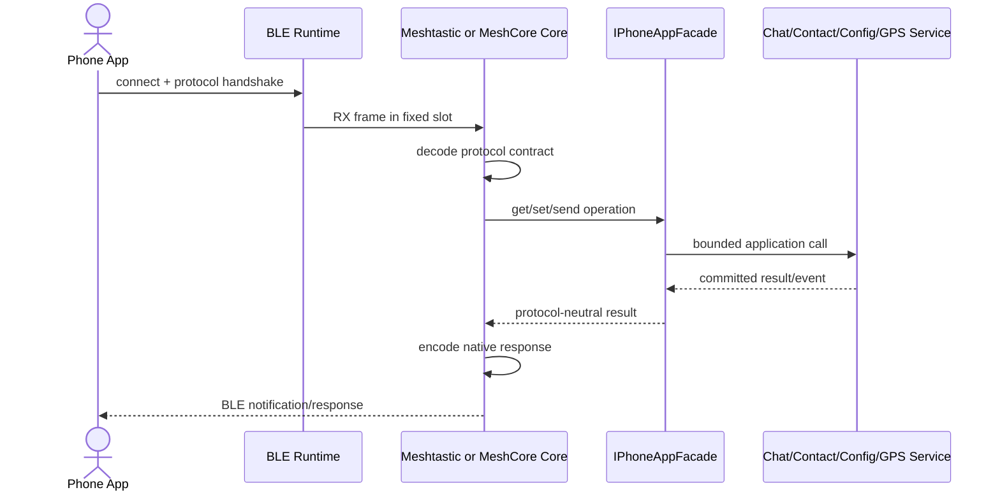

# Sequence: Phone Protocol Core to App Facade

## Scenarios and responsibilities

BLE Runtime manages connections and fixed slots; Protocol Core has its own wire contract; Facade provides protocol-neutral application interfaces; Chat/Contact/Config/GPS Service has business status. The dependency direction can only be from the protocol Core to the Facade.

## Frame life cycle

RX frame is written to the fixed slot and associated with the connection generation. Core decodes within the validity period of the slot and releases/reuses the slot after extracting compact commands; large protobufs or frames must not be passed as value objects in deep call stacks.

## Submission and response

Read-only requests can return snapshots directly; side-effect requests must wait for App committed result. Facade returns protocol-neutral result/error, and Core maps it to this protocol response. An application error cannot leak an enumeration or wire type of another protocol.

## Notification and disconnection

Asynchronous App events are mapped to the native notification of the current Core through Facade/subscription. Disconnect the subscription and invalidate the pending generation; when the business has been submitted but the response is lost, the request identity supports mobile phone safe retry.

## Testing

 Covers the handshake, frame decoding, Facade error mapping, repeated side effects, notification backpressure, late disconnection and protocol isolation of Meshtastic and MeshCore respectively.
