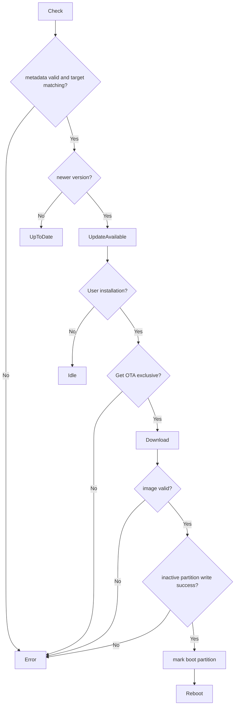

# Activity: Firmware Check and Installation

## Questions answered by this picture

How does the device determine whether the update is applicable, verify and write to the inactive partition after obtaining exclusive resources, and only change the next boot target if it is completely successful.

## Metadata matches target

metadata verifies at least signature/source, device target, hardware profile, version, image size and digest. Version comparison must use clear rules; whether the same version, downgraded and development versions are allowed is determined by policy and cannot just compare strings.

## Irreversible Boundary

Downloads and image verification can still be safely canceled. You can give up after writing the inactive partition but need to clean it up; `mark boot partition` is the key submission point and can only be executed after all writes and image verification are successful. After the marking is successful, the UI must enter the state to be restarted and no more conflicting tasks will be started.

## Exclusivity and power consumption

OTA obtains Wi-Fi/storage/flash exclusive and blocks Call, Package and tasks that will destroy flash/power supply stability. Acquisition failure explicitly returns Busy/ExclusiveOwner; the Access Runtime must not be bypassed to start the download directly.

## Failure and startup recovery

Any verification or write failure keeps the current boot partition. The rollback result of bootloader verification failure after restart must be read and displayed by the application and cannot only appear in the serial port log. Power failure recovery relies on the platform OTA contract and does not assume that the last write call was successful.

## test

Covering errors in target/profile, same version, hash/signature errors, shorthand, power outage points, mark boot failure, rollback startup and resource revocation.
