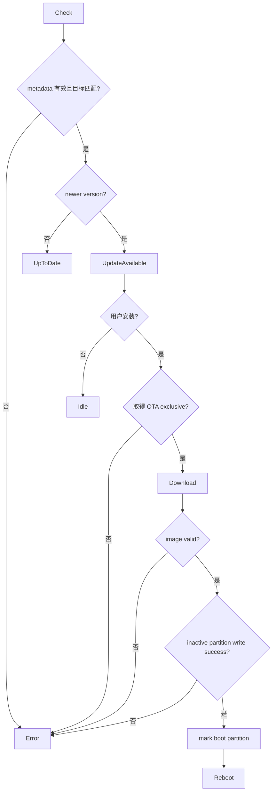

# Activity：固件检查与安装

## 本图回答的问题

设备如何判断更新是否适用，在取得独占资源后验证并写入 inactive partition，并且只在完整成功时改变下次启动目标。

## 元数据与目标匹配

metadata 至少验证签名/来源、设备 target、硬件 profile、版本、镜像大小和摘要。版本比较必须使用明确规则；同版本、降级和开发版本是否允许由策略决定，不能只比较字符串。

## 不可逆边界

下载和镜像验证仍可安全取消。写 inactive partition 后可以放弃但需要清理；`mark boot partition` 是关键提交点，只有所有写入和 image 校验成功后才能执行。标记成功后 UI 必须进入待重启状态，不再启动冲突任务。

## 独占与功耗

OTA 取得 Wi-Fi/storage/flash 独占，并阻止 Call、Package 和会破坏 flash/供电稳定的任务。获取失败明确返回 Busy/ExclusiveOwner；不得绕过 Access Runtime 直接开始下载。

## 失败与启动恢复

任何校验或写入失败都保持当前 boot partition。重启后 bootloader 验证失败的回滚结果必须被应用读取并展示，不能仅在串口日志中出现。掉电恢复依赖平台 OTA contract，不假设最后一次写调用成功。

## 测试

覆盖错误 target/profile、同版本、hash/signature 错误、短写、断电点、mark boot 失败、回滚启动和资源撤销。
