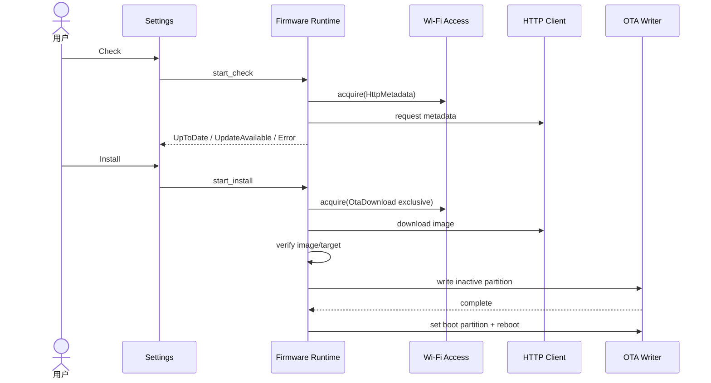

# Sequence：Firmware Settings 到 OTA

## 两阶段场景

Check 和 Install 是两次独立操作。Check 使用普通 metadata 访问，返回 UpToDate/UpdateAvailable/Error；Install 重新验证所选 metadata，并申请 OTA exclusive，不能沿用已经过期的“有更新”UI 状态直接写 flash。

## 顺序约束

metadata 的来源、target/profile、版本和摘要先验证。镜像下载完成后再次验证 size/hash/signature，再开始 inactive partition write。Writer 报告 complete 仍需 finalize/验证；之后才能 set boot partition。

## 独占与取消

OTA exclusive 覆盖下载、写入和 boot 标记。下载阶段允许安全取消；开始 flash write 后取消策略必须由平台 contract 定义，至少不能同时启动第二次 install。所有失败路径释放 Access 并保持当前 boot target。

## 重启语义

`set boot partition` 成功是持久提交，UI 进入 RebootPending。实际更新成功要等新固件启动并通过确认；bootloader rollback 是另一终态，应用启动后必须读取并报告。

## 测试

覆盖 Check 后 metadata 变化、exclusive 拒绝、断流、验证失败、partial write、boot 标记失败、重启前掉电和 rollback。
