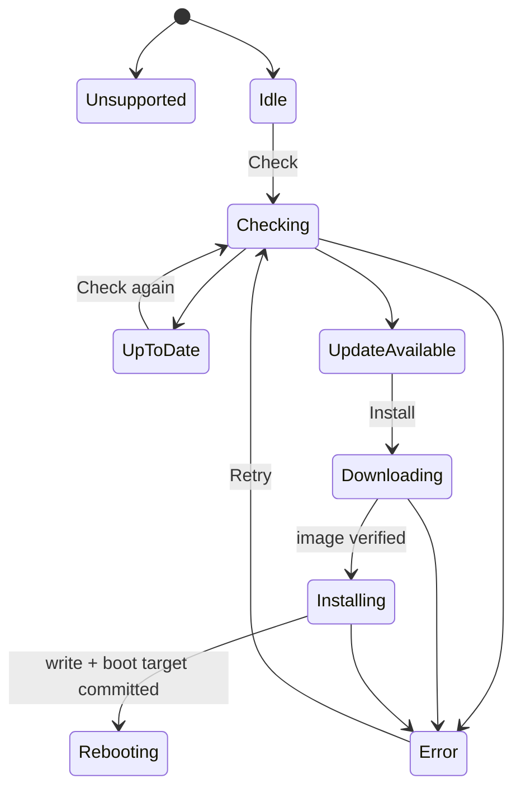

# State Machine：Firmware Update

## 状态 owner

Firmware Runtime 持有检查/安装 operation generation；平台 OTA metadata/boot partition 是持久事实。`Unsupported` 由目标能力决定，不能通过 Retry 离开；`Idle` 与 `Unsupported` 是互斥初始选择。

## Transition 表

| 当前状态 | 事件/guard | 下一状态 |
| --- | --- | --- |
| Idle/UpToDate/Error | Check 且 capability 支持 | Checking |
| Checking | metadata valid，无新版本 | UpToDate |
| Checking | metadata valid，有适用版本 | UpdateAvailable |
| UpdateAvailable | Install + OTA exclusive | Downloading |
| Downloading | image 完整验证 | Installing |
| Installing | write/finalize/boot target committed | Rebooting |
| 任意操作态 | 不可恢复错误 | Error |

## 取消与禁止

Downloading 在平台允许时可以取消并回 UpdateAvailable；Installing 是否可取消必须遵守 OTA writer contract，不能直接回 Idle。Rebooting 后禁止再次 Check/Install。旧 metadata generation 的回调不改变当前状态。

## 跨重启结果

Rebooting 不是最终成功。新固件启动确认后才形成 Updated；bootloader rollback 则形成 Rollback/Error 诊断。当前图需由启动恢复逻辑补充这两个跨重启结果。

## 测试

覆盖 capability Unsupported、metadata 过期、取消、write 期间错误、boot 标记、掉电点、回滚及迟到 progress。
