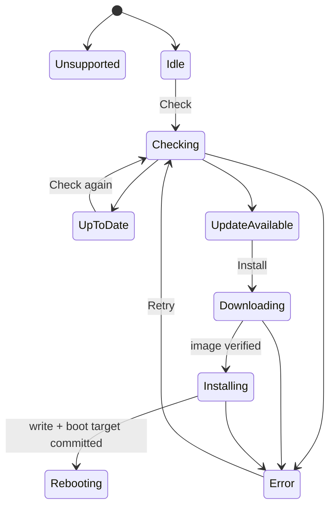

# State Machine:Firmware Update

## Status owner

Firmware Runtime holds check/installation operation generation; platform OTA metadata/boot partition is persistent fact. `Unsupported` is determined by the target's ability and cannot be left through Retry; `Idle` and `Unsupported` are mutually exclusive initial choices.

## Transition table

| Current state | Event/guard | Next state |
| --- | --- | --- |
| Idle/UpToDate/Error | Check and capability supported | Checking |
| Checking | metadata valid, no new version | UpToDate |
| Checking | metadata valid, there is an applicable version | UpdateAvailable |
| UpdateAvailable | Install + OTA exclusive | Downloading |
| Downloading | image Complete verification | Installing |
| Installing | write/finalize/boot target committed | Rebooting |
| Any operation state | Unrecoverable error | Error |

## Cancellation and prohibition

Downloading can be canceled and returned when the platform allows UpdateAvailable; Installing Whether it can be canceled must comply with the OTA writer contract and cannot be returned to Idle directly. It is forbidden to Check/Install again after Rebooting. Callbacks for the old metadata generation do not change the current state.

## Cross-restart results

Rebooting is not ultimately successful. Updated is formed after confirmation of new firmware startup; Rollback/Error diagnosis is formed after bootloader rollback. The current diagram needs to be supplemented by boot recovery logic for these two cross-reboot results.

## Tests

 Covers capability Unsupported, metadata expiration, cancellation, errors during write, boot mark, power-off point, rollback and late progress.
