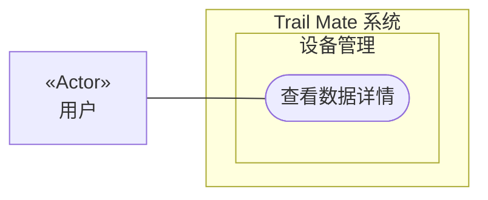

# 用例图：查看数据详情

<!-- praxis:use-case-diagram:start -->

## 元数据

项目版本：0.1.30-alpha
设计文档版本：0.1.30-alpha
Git 分支：main
Git 提交：34aad0bffa2f6450192f655f248a94b6c3cbd767
Git 工作区状态：dirty
Agent 版本决策：none - 本次渲染没有单独的 agent 版本决策
更新于：2026-06-25T14:17:55.307Z
来源：Agent 候选分析
所属地图：../use-case-diagrams-maps.md
语义 HTML：view-data-details.html

## 身份信息

- ID：use-case:view-data-details
- 业务边界路径：Trail Mate 系统 / 设备管理
- 当前边界类型：业务模块
- 当前边界职责：提供设备状态的可见性和用户可控的硬件管理
- 状态：candidate
- 置信度：medium
- Markdown 路径：docs/design/use-case-diagrams/view-data-details.md
- HTML 路径：docs/design/use-case-diagrams/view-data-details.html
- 触发条件：用户从导航栏进入数据页面

## 故事摘要

用户打开数据页面，查看传感器收集的详细数据（如温度、气压等）

## 参与者

- 用户（个人）

## 外部系统

- 无

## UML 下钻地图

- Use Case Diagram：[查看数据详情](view-data-details.html)
  - Activity Diagram：[业务流程：查看数据详情](view-data-details/activity.html)
  - Sequence Diagram：[对象交互：查看数据详情](view-data-details/sequences/sequence-view-data-details-sequence.html)

## Mermaid 用例图



## 设计指标索引

此章节是 Design Explorer 可解析的指标索引。每个数字都必须能回溯到这里的具体条目，避免 UI 只展示不可解释的计数。

| 指标 | 数量 | 内容边界 |
| --- | ---: | --- |
| 节点 | 4 | 参与者、外部系统、上下文和当前用例。 |
| 关系 | 7 | 当前用例与上下文、参与者、外部系统或其他用例之间的关系。 |
| 证据 | 2 | 支撑当前候选用例的文件、代码证据、规范或推断证据。 |
| 待裁决 | 0 | 仍需产品或业务负责人裁决的外部问题。 |

### 节点

- Trail Mate 系统（业务边界：系统边界） - 管理整个应用的用户目标和业务能力
- 设备管理（业务边界：业务模块） - 提供设备状态的可见性和用户可控的硬件管理
- 查看数据详情（用例） - 用户打开数据页面，查看传感器收集的详细数据（如温度、气压等）
- 用户（参与者） - 使用 Trail Mate 设备的最终用户，可以查看状态、收发消息、配置设备、使用诊断工具

### 关系

- Trail Mate 系统 包含业务边界「设备管理」（包含关系）
- 设备管理 包含 Use Case「查看数据详情」（包含关系）
- 用户 作为主要参与者参与「查看数据详情」（参与关系） - 使用 Trail Mate 设备的最终用户，可以查看状态、收发消息、配置设备、使用诊断工具
- 用户 -> 查看数据详情（参与关系） - 用户查看数据
- 查看数据详情 -> 查看硬件状态（includes） - 数据页依赖硬件传感器
- 用户 -> 查看数据详情（参与关系） - 用户查看数据详情
- 查看数据详情 -> 查看硬件状态（includes） - 数据页依赖硬件传感器

### 证据

- 证据 1 · 本地仓库扫描 · apps/linux_uconsole_gtk/src/platform/gtk/gtk_uconsole_data_logic.cpp · 1-1（FACT:strong） - 数据页面逻辑包含刷新和生命周期函数

  ```text
  refreshDataPage, makeDataPageLifecycle
  ```
- 证据 2 · 本地仓库扫描 · apps/linux_uconsole_gtk/src/platform/gtk/gtk_uconsole_data_logic.cpp · 1-1（FACT:medium） - 数据页面的逻辑实现

  ```text
  data_logic.cpp
  ```

### 待裁决

- 无

## 主成功路径

1. 用户选择查看数据
2. 系统获取传感器数据（温度、海拔、气压等）
3. 系统将数据格式化并显示在界面上
4. 用户选择数据页面
5. 系统从传感器获取最新数据并显示

## 备选路径

1. 无

## 失败路径

1. 某些传感器未就绪时，对应字段显示 N/A
2. 传感器读取失败，页面显示错误状态

## 证据

| 来源 | 路径 | 行号 | 强度 | 摘要 |
| --- | --- | --- | --- | --- |
| 本地仓库扫描 | apps/linux_uconsole_gtk/src/platform/gtk/gtk_uconsole_data_logic.cpp | 1-1 | strong | 数据页面逻辑包含刷新和生命周期函数 |
| 本地仓库扫描 | apps/linux_uconsole_gtk/src/platform/gtk/gtk_uconsole_data_logic.cpp | 1-1 | medium | 数据页面的逻辑实现 |

## 变更记录

### 0.1.30-alpha - 2026-06-25T14:17:55.307Z

变更类型：DISCOVERY
版本决策：none - 本次渲染没有单独的 agent 版本决策


Git 分支：main
Git 提交：34aad0bffa2f6450192f655f248a94b6c3cbd767
Git 工作区状态：dirty

摘要：
- 恢复或更新候选用例图「查看数据详情」。

<!-- praxis:use-case-diagram:end -->
