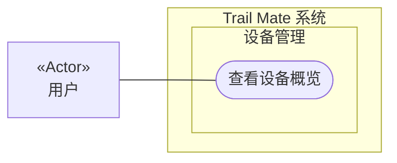

# 用例图：查看设备概览

<!-- praxis:use-case-diagram:start -->

## 元数据

项目版本：0.1.30-alpha
设计文档版本：0.1.30-alpha
Git 分支：main
Git 提交：34aad0bffa2f6450192f655f248a94b6c3cbd767
Git 工作区状态：dirty
Agent 版本决策：none - 本次渲染没有单独的 agent 版本决策
更新于：2026-06-25T14:17:55.307Z
来源：Agent 候选分析
所属地图：../use-case-diagrams-maps.md
语义 HTML：view-device-overview.html

## 身份信息

- ID：use-case:view-device-overview
- 业务边界路径：Trail Mate 系统 / 设备管理
- 当前边界类型：业务模块
- 当前边界职责：提供设备状态的可见性和用户可控的硬件管理
- 状态：candidate
- 置信度：medium
- Markdown 路径：docs/design/use-case-diagrams/view-device-overview.md
- HTML 路径：docs/design/use-case-diagrams/view-device-overview.html
- 触发条件：用户从导航栏进入概览页面

## 故事摘要

用户打开主概览页面，系统汇总展示关键硬件状态、电池、GPS、无线电等简要信息

## 参与者

- 用户（个人）

## 外部系统

- 无

## UML 下钻地图

- Use Case Diagram：[查看设备概览](view-device-overview.html)
  - Activity Diagram：[业务流程：查看设备概览](view-device-overview/activity.html)
  - Sequence Diagram：[对象交互：查看设备概览主成功场景](view-device-overview/sequences/sequence-view-device-overview-main.html)

## Mermaid 用例图



## 设计指标索引

此章节是 Design Explorer 可解析的指标索引。每个数字都必须能回溯到这里的具体条目，避免 UI 只展示不可解释的计数。

| 指标 | 数量 | 内容边界 |
| --- | ---: | --- |
| 节点 | 4 | 参与者、外部系统、上下文和当前用例。 |
| 关系 | 8 | 当前用例与上下文、参与者、外部系统或其他用例之间的关系。 |
| 证据 | 3 | 支撑当前候选用例的文件、代码证据、规范或推断证据。 |
| 待裁决 | 0 | 仍需产品或业务负责人裁决的外部问题。 |

### 节点

- Trail Mate 系统（业务边界：系统边界） - 管理整个应用的用户目标和业务能力
- 设备管理（业务边界：业务模块） - 提供设备状态的可见性和用户可控的硬件管理
- 查看设备概览（用例） - 用户打开主概览页面，系统汇总展示关键硬件状态、电池、GPS、无线电等简要信息
- 用户（参与者） - 使用 Trail Mate 设备的最终用户，可以查看状态、收发消息、配置设备、使用诊断工具

### 关系

- Trail Mate 系统 包含业务边界「设备管理」（包含关系）
- 设备管理 包含 Use Case「查看设备概览」（包含关系）
- 用户 作为主要参与者参与「查看设备概览」（参与关系） - 使用 Trail Mate 设备的最终用户，可以查看状态、收发消息、配置设备、使用诊断工具
- 用户 -> 查看设备概览（参与关系） - 用户是查看概览的参与者
- 用户 -> 查看设备概览（参与关系） - 用户参与查看设备概览
- 查看硬件状态 -> 查看设备概览（includes） - 概览页包含部分硬件状态
- 用户 -> 查看设备概览（参与关系） - 用户参与查看设备概览
- 查看硬件状态 -> 查看设备概览（includes） - 概览页面包含部分硬件状态

### 证据

- 证据 1 · 本地仓库扫描 · apps/linux_uconsole_gtk/src/platform/gtk/gtk_uconsole_overview_logic.cpp · n/a（FACT:medium） - 概览页面的生命周期和刷新逻辑存在
- 证据 2 · 本地仓库扫描 · boards/tlora_pager/include/boards/tlora_pager/tlora_pager_board.h · 1-1（FACT:strong） - 硬件状态查询方法集中定义在 TLoRaPagerBoard 类中

  ```text
  isHardwareOnline, isGPSReady...
  ```
- 证据 3 · 本地仓库扫描 · apps/linux_uconsole_gtk/src/platform/gtk/gtk_uconsole_widgets.cpp · 1-1（FACT:strong） - 实现概览页面的 UI 组件和硬件状态获取逻辑

  ```text
  gtk_uconsole_widgets.cpp
  ```

### 待裁决

- 无

## 主成功路径

1. 1. 用户进入概览页面
2. 2. 系统读取电池电量、GPS 坐标、无线连接状态等
3. 3. 系统在界面上展示所有状态
4. 用户选择查看设备概览
5. 系统收集电池电量、充电状态、GPS 可用性、无线电状态等
6. 系统在界面上展示这些状态信息
7. 用户选择概览页面
8. 系统请求刷新硬件状态数据
9. 系统更新页面上的各硬件状态指示器

## 备选路径

1. 无

## 失败路径

1. 某个硬件模块未就绪时，对应状态显示为未就绪或未知

## 证据

| 来源 | 路径 | 行号 | 强度 | 摘要 |
| --- | --- | --- | --- | --- |
| 本地仓库扫描 | apps/linux_uconsole_gtk/src/platform/gtk/gtk_uconsole_overview_logic.cpp | _n/a_ | medium | 概览页面的生命周期和刷新逻辑存在 |
| 本地仓库扫描 | boards/tlora_pager/include/boards/tlora_pager/tlora_pager_board.h | 1-1 | strong | 硬件状态查询方法集中定义在 TLoRaPagerBoard 类中 |
| 本地仓库扫描 | apps/linux_uconsole_gtk/src/platform/gtk/gtk_uconsole_widgets.cpp | 1-1 | strong | 实现概览页面的 UI 组件和硬件状态获取逻辑 |

## 变更记录

### 0.1.30-alpha - 2026-06-25T14:17:55.307Z

变更类型：DISCOVERY
版本决策：none - 本次渲染没有单独的 agent 版本决策


Git 分支：main
Git 提交：34aad0bffa2f6450192f655f248a94b6c3cbd767
Git 工作区状态：dirty

摘要：
- 恢复或更新候选用例图「查看设备概览」。

<!-- praxis:use-case-diagram:end -->
