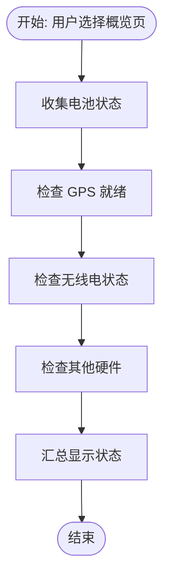

# Activity Diagram：业务流程：查看设备概览

<!-- praxis:use-case-diagram:start -->

## 元数据

项目版本：0.1.30-alpha
设计文档版本：0.1.30-alpha
Git 分支：main
Git 提交：34aad0bffa2f6450192f655f248a94b6c3cbd767
Git 工作区状态：dirty
Agent 版本决策：none - 本次渲染没有单独的 agent 版本决策
更新于：2026-06-25T14:17:55.307Z
来源：Agent 候选分析
父级 Use Case：use-case:view-device-overview
业务边界路径：Trail Mate 系统 / 设备管理
父级文档：docs/design/use-case-diagrams/view-device-overview.md
Markdown 路径：docs/design/use-case-diagrams/view-device-overview/activity.md
HTML 路径：docs/design/use-case-diagrams/view-device-overview/activity.html

## 业务流程目标

用户希望快速了解设备健康状态，流程依次检查关键硬件

## 流程边界

从用户选择概览页开始，到状态显示结束

## 参与泳道 / 阶段

- 未显式声明泳道；请结合节点标签和实现范围判断业务阶段。

## 主成功路径

主成功场景

- mainSuccessScenario[1-2]

## 决策点与分支

- 无

## 失败 / 补偿路径

- 无

## 流程业务规则

概览页聚合多个硬件状态，体现 Facade 模式

## Activity UML 读图说明

开始节点表示用户触发，检查活动是系统内部动作，最后汇总显示

## 实现范围锚点

- 模块：apps/linux_uconsole_gtk
- 入口：UI overview page
- 关键文件：apps/linux_uconsole_gtk/src/platform/gtk/gtk_uconsole_widgets.cpp
- 代码锚点：boards/tlora_pager/include/boards/tlora_pager/tlora_pager_board.h#L1
- 不覆盖代码：底层函数调用链
- 不覆盖代码：DTO/Mapper/Repository 细节

## 不覆盖范围

- 各模块详细状态查看（拆分到各自页面）

## Mermaid 图

## 证据

| 来源 | 路径 | 行号 | 强度 | 摘要 |
| --- | --- | --- | --- | --- |
| 本地仓库扫描 | apps/linux_uconsole_gtk/src/platform/gtk/gtk_uconsole_overview_logic.cpp | _n/a_ | medium | 概览页面逻辑文件 |

## 变更记录

### 0.1.30-alpha - 2026-06-25T14:17:55.307Z

变更类型：DISCOVERY
版本决策：none - 本次渲染没有单独的 agent 版本决策

Git 分支：main
Git 提交：34aad0bffa2f6450192f655f248a94b6c3cbd767
Git 工作区状态：dirty

摘要：
- 恢复或更新「查看设备概览」的 Activity Diagram。

<!-- praxis:use-case-diagram:end -->
