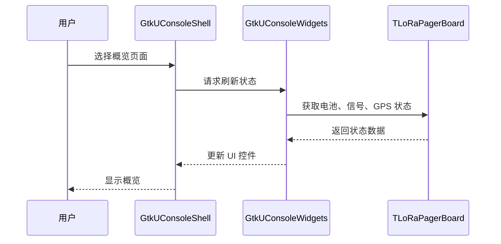

# Sequence Diagram：对象交互：查看设备概览主成功场景

<!-- praxis:use-case-diagram:start -->

## 元数据

项目版本：0.1.30-alpha
设计文档版本：0.1.30-alpha
Git 分支：main
Git 提交：34aad0bffa2f6450192f655f248a94b6c3cbd767
Git 工作区状态：dirty
Agent 版本决策：none - 本次渲染没有单独的 agent 版本决策
更新于：2026-06-25T14:17:55.307Z
来源：Agent 候选分析
父级 Use Case：use-case:view-device-overview
业务边界路径：Trail Mate 系统 / 设备管理
父级文档：docs/design/use-case-diagrams/view-device-overview.md
Markdown 路径：docs/design/use-case-diagrams/view-device-overview/sequences/sequence-view-device-overview-main.md
HTML 路径：docs/design/use-case-diagrams/view-device-overview/sequences/sequence-view-device-overview-main.html

## 交互场景

用户查看设备核心状态指标

## 参与者 / 生命线

- participant User as 用户
- participant Shell as GtkUConsoleShell
- participant Widgets as GtkUConsoleWidgets
- participant Board as TLoRaPagerBoard

## 消息时序

- User->>Shell: 选择概览页面
- Shell->>Widgets: 请求刷新状态
- Widgets->>Board: 获取电池、信号、GPS 状态
- Board-->>Widgets: 返回状态数据
- Widgets-->>Shell: 更新 UI 控件
- Shell-->>User: 显示概览

## 同步 / 异步 / 回调

- Board-->>Widgets: 返回状态数据
- Widgets-->>Shell: 更新 UI 控件
- Shell-->>User: 显示概览

## 返回 / 异常 / 补偿

- Board-->>Widgets: 返回状态数据
- Widgets-->>Shell: 更新 UI 控件
- Shell-->>User: 显示概览

## 事务 / 幂等 / 重试边界

UI 组件（Widgets）作为应用服务调用 Board 接口获取硬件事实

- 无

## Sequence UML 读图说明

用户生命线触发 UI，UI 向 Board 请求数据并返回

## 实现范围锚点

- 模块：apps/linux_uconsole_gtk
- 模块：boards
- 关键文件：apps/linux_uconsole_gtk/src/platform/gtk/gtk_uconsole_widgets.cpp
- 关键文件：boards/tlora_pager/src/tlora_pager_board.cpp
- 代码锚点：apps/linux_uconsole_gtk/src/platform/gtk/gtk_uconsole_widgets.cpp#L1
- 不覆盖代码：其他板的实现

## 不覆盖场景

- 硬件状态轮询
- 错误恢复

## Mermaid 图

## 证据

| 来源 | 路径 | 行号 | 强度 | 摘要 |
| --- | --- | --- | --- | --- |
| 本地仓库扫描 | apps/linux_uconsole_gtk/src/platform/gtk/gtk_uconsole_overview_logic.cpp | _n/a_ | medium | 概览页面逻辑文件 |

## 变更记录

### 0.1.30-alpha - 2026-06-25T14:17:55.307Z

变更类型：DISCOVERY
版本决策：none - 本次渲染没有单独的 agent 版本决策

Git 分支：main
Git 提交：34aad0bffa2f6450192f655f248a94b6c3cbd767
Git 工作区状态：dirty

摘要：
- 恢复或更新「查看设备概览」的 Sequence Diagram。

<!-- praxis:use-case-diagram:end -->
