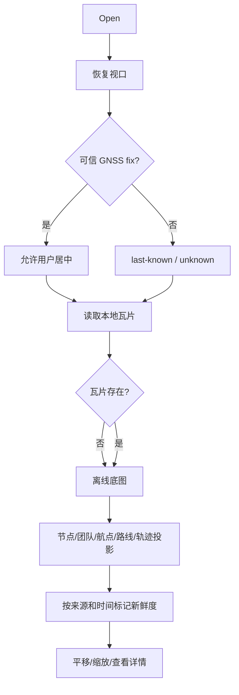

# Activity：离线态势组装

## 本图回答的问题

设备在无网络、无当前 fix 或缺少部分瓦片时，如何仍然构造诚实的现场态势。地图活动不把“能画出来”当成“数据仍有效”，每个底图和叠加对象都保留来源与新鲜度。

## 数据层与 owner

视口属于用户界面偏好；GNSS fix 属于定位服务；瓦片属于本地地图存储；节点、团队成员、航点、路线和轨迹来自各自业务投影。Map model 只组合和渲染，不获得这些事实的写权限。

## 分支规则

| 条件 | 地图行为 |
| --- | --- |
| 有可信当前 fix | 允许用户主动居中，不强制抢回视口 |
| 只有 last-known | 显示来源时间和陈旧标识 |
| 无位置 | 保留用户视口，不制造默认“当前位置” |
| 瓦片缺失 | 显示坐标背景与缺瓦片状态 |
| 存储忙 | 保留已显示瓦片并标记加载暂停 |

## 叠加对象语义

不同来源使用不同类型、标识和时间。协议节点不是联系人，联系人不是团队成员，路线不是已记录轨迹。点击详情沿 source owner 下钻，不能在地图层直接改写对方聚合。

## 并发与性能

视口变化、fix 更新和瓦片读取可以并发。每次异步瓦片结果携带 viewport generation，迟到结果不能覆盖新视口。叠加更新采用快照/差异投影，避免在 UI 线程读取可变共享容器。

## 测试

覆盖无 fix、last-known、缺瓦片、存储忙、快速平移导致迟到瓦片、过期团队位置和相同坐标的不同对象类型。
