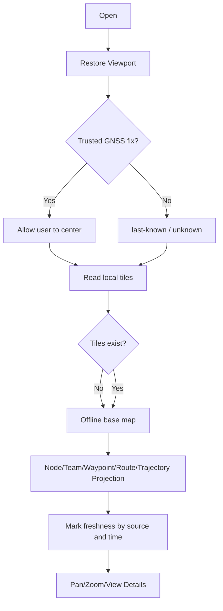

# Activity: Offline Situation Assembly

## Questions answered by this picture

How to create an honest on-site situation when the device has no network, no current fix, or some missing tiles. Map activities do not treat "can be drawn" as "the data is still valid", and each basemap and overlay object retains its source and freshness.

## The data layer and owner

The viewport belongs to the user interface preference; the GNSS fix belongs to the positioning service; the tiles belong to the local map storage; nodes, team members, waypoints, routes and trajectories come from their respective business projections. The Map model only composes and renders, and does not get write access to these facts.

## Branching rules

| Conditions | Map behavior |
| --- | --- |
| There is a trusted current fix | Allow users to actively center without forcing the viewport back |
| Only last-known | Show source time and stale identification |
| No position | Keep user viewport, do not create a default "current position" |
| Missing tiles | Display coordinate background and missing tile status |
| Storage busy | Keep the displayed tiles and mark the loading pause |

## Overlay object semantics

Different sources use different types, identifiers, and times. Protocol nodes are not contacts, contacts are not team members, and routes are not recorded tracks. Click the details to drill down along the source owner. You cannot directly overwrite the other aggregation on the map layer.

## Concurrency and performance

Viewport changes, fix updates and tile reading can be concurrent. Each asynchronous tile result carries the viewport generation, and late results cannot cover the new viewport. Overlay updates use snapshot/difference projection to avoid reading mutable shared containers on the UI thread.

## Testing

 Covers different object types with no fix, last-known, missing tiles, storage busy, late tiles caused by fast panning, expired team positions and the same coordinates.
