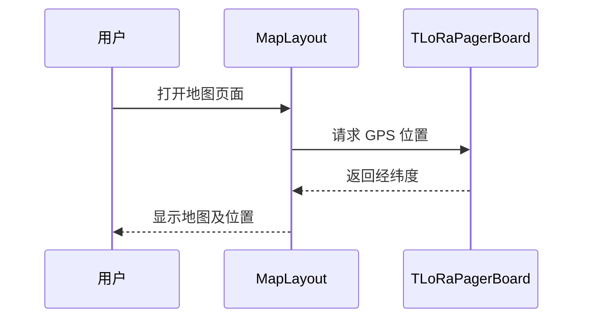

# Sequence Diagram：对象交互：查看地图导航主成功场景

<!-- praxis:use-case-diagram:start -->

## 元数据

项目版本：0.1.30-alpha
设计文档版本：0.1.30-alpha
Git 分支：main
Git 提交：34aad0bffa2f6450192f655f248a94b6c3cbd767
Git 工作区状态：dirty
Agent 版本决策：none - 本次渲染没有单独的 agent 版本决策
更新于：2026-06-25T14:17:55.307Z
来源：Agent 候选分析
父级 Use Case：use-case:view-map-navigate
业务边界路径：Trail Mate 系统 / 地图导航
父级文档：docs/design/use-case-diagrams/view-map-navigate.md
Markdown 路径：docs/design/use-case-diagrams/view-map-navigate/sequences/sequence-view-map-navigate-sequence.md
HTML 路径：docs/design/use-case-diagrams/view-map-navigate/sequences/sequence-view-map-navigate-sequence.html

## 交互场景

用户获得可视化的当前位置

## 参与者 / 生命线

- participant User as 用户
- participant MapUI as MapLayout
- participant Board as TLoRaPagerBoard

## 消息时序

- User->>MapUI: 打开地图页面
- MapUI->>Board: 请求 GPS 位置
- Board-->>MapUI: 返回经纬度
- MapUI-->>User: 显示地图及位置

## 同步 / 异步 / 回调

- Board-->>MapUI: 返回经纬度
- MapUI-->>User: 显示地图及位置

## 返回 / 异常 / 补偿

- Board-->>MapUI: 返回经纬度
- MapUI-->>User: 显示地图及位置

## 事务 / 幂等 / 重试边界

MapLayout 作为视图组件，通过 Board 获取位置

- 无

## Sequence UML 读图说明

用户触发地图 UI，UI 请求 GPS 位置并渲染

## 实现范围锚点

- 模块：apps/linux_uconsole_gtk
- 模块：boards
- 关键文件：apps/linux_uconsole_gtk/src/platform/gtk/gtk_uconsole_map_layout.cpp
- 关键文件：boards/tlora_pager/src/tlora_pager_board.cpp
- 代码锚点：apps/linux_uconsole_gtk/src/platform/gtk/gtk_uconsole_map_layout.cpp#L1
- 不覆盖代码：非当前场景的全部调用链
- 不覆盖代码：未被证据支持的异步/补偿路径

## 不覆盖场景

- 地图交互（拖拽、缩放）
- 轨迹显示

## Mermaid 图

## 证据上下文

| 来源 | 路径 | 行号 | 强度 | 摘要 |
| --- | --- | --- | --- | --- |
| 本地仓库扫描 | apps/linux_uconsole_gtk/src/platform/gtk/gtk_uconsole_map_logic.cpp | _n/a_ | medium | 存在地图页面逻辑实现 |
| 本地仓库扫描 | apps/linux_uconsole_gtk/src/platform/gtk/gtk_uconsole_map_logic.cpp | 1-1 | medium | 地图逻辑文件负责地图视图和位置更新 |
| 本地仓库扫描 | apps/linux_uconsole_gtk/src/platform/gtk/gtk_uconsole_map_layout.cpp | 1-1 | medium | 地图页面布局，包含地图显示入口 |

## 变更记录

### 0.1.30-alpha - 2026-06-25T14:17:55.307Z

变更类型：DISCOVERY
版本决策：none - 本次渲染没有单独的 agent 版本决策

Git 分支：main
Git 提交：34aad0bffa2f6450192f655f248a94b6c3cbd767
Git 工作区状态：dirty

摘要：
- 恢复或更新「查看地图并导航」的 Sequence Diagram。

<!-- praxis:use-case-diagram:end -->
