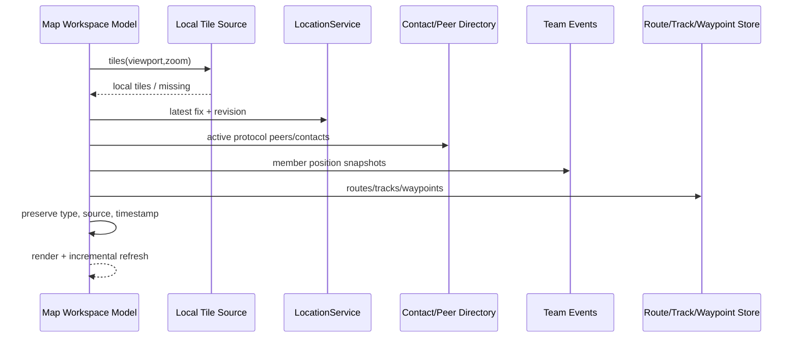

# Sequence: Data source to Map workspace

## Scenarios and participants

Map Workspace is a combined projection, not an aggregate owner of all data. Tiles, LocationService, Directory, Team events and Route/Track/Waypoint Store each provide read-only snapshots and revisions.

## Snapshot consistency

These sources are not committed in the same transaction, so the Map saves the source revision/timestamp of each object instead of forging a globally consistent version. Incremental refreshes merge by type and stable identity; new snapshots that are not returned cannot delete objects from other sources.

## Viewport competition

tiles request carries viewport generation. After the user pans quickly, even if the old request is late, it can only enter the cache and cannot replace the current screen. GPS auto-centering is a user-selected command and cannot grab the viewport back every time the fix updates.

## Missing and expired

Tile missing, no fix, directory unavailable and Team location expired are projected separately. The time must be displayed when retaining the last known data, and the error cannot be converted into an empty set and mislead into "no object in the field".

## Tests

 Covers the independent failure of each source, the same ID of different types, late tiles, expired team positions, route/track simultaneous existence and incremental deletion.
