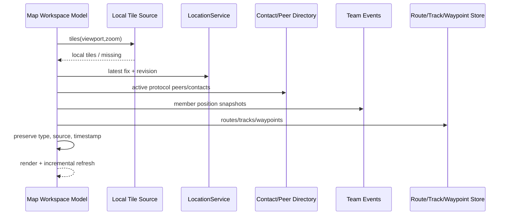

# Sequence：数据源到 Map workspace

## 场景与参与者

Map Workspace 是组合投影，不是所有数据的聚合 owner。Tiles、LocationService、Directory、Team events 与 Route/Track/Waypoint Store 各自提供只读快照和 revision。

## 快照一致性

这些来源不会在同一事务中提交，因此 Map 保存每个对象的 source revision/timestamp，而不是伪造一个全局一致版本。增量刷新按类型和稳定 identity 合并；未返回的新快照不能删除其他 source 的对象。

## 视口竞争

tiles 请求携带 viewport generation。用户快速平移后，旧请求即使迟到也只能进入缓存，不能替换当前画面。GPS 自动居中是用户选择的命令，不能在每次 fix 更新时抢回视口。

## 缺失与过期

Tile missing、无 fix、目录不可用和 Team 位置过期分别投影。保留最后已知数据时必须显示时间，不能把错误转换为空集合并误导为“现场没有对象”。

## 测试

覆盖各 source 独立失败、相同 ID 不同类型、迟到 tile、过期 team position、route/track 同时存在和增量删除。
