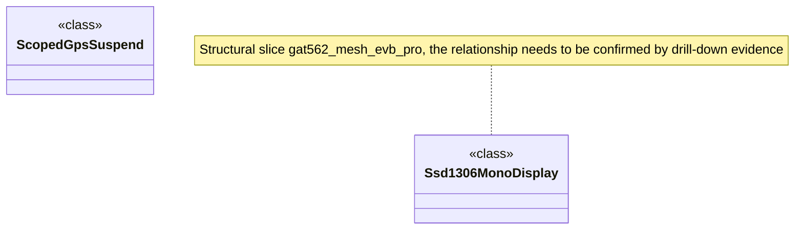

# Structural collaboration: Structural slicing gat562_mesh_evb_pro · gat562_mesh_evb_pro

Graph type: Class / Structural Diagrams
Status: candidate
Confidence: high
Project version: 0.1.30-alpha
Git:34aad0bffa2f / main / dirty
Updated on: 2026-06-25T09:19:20.669Z

## Positioning

Explain how classes, interfaces, components, or value objects in this structural slice boards/gat562_mesh_evb_pro share structural responsibilities in the structural slice gat562_mesh_evb_pro; candidates include Ssd1306MonoDisplay, ScopedGpsSuspend.

## How to read the diagram

- This Class / Structural Diagram focuses on the structural slice of boards/gat562_mesh_evb_pro, rather than the entire top-level directory of boards.
- It only puts classes, interfaces, enumerations or structure types; method-level high-reference objects will go into Component/Hotspot and will no longer be mixed into the structure collaboration diagram.
- The candidate context is "structure slice gat562_mesh_evb_pro". When reading the diagram, first confirm whether these objects jointly carry the same business capabilities, share support mechanisms or adaptation boundaries.
- There is currently insufficient evidence of class-level relationships, so the graph only retains candidate slice objects and is reduced to structural candidate perspectives.

## Technical Complexity Analysis

 - boards/gat562_mesh_evb_pro currently contains 2 classes/structures and 0 interface/trait candidates.
- There is currently a lack of class-level relationship evidence, and objects in the same directory cannot be directly interpreted as stable collaboration.
- The interpretation goal of this diagram is to structure responsibilities and boundaries: which objects are like domain models, which objects are like interface contracts, and which objects are like strategies/adapters or shared supports.
- If the objects in the diagram are in the same directory but have no common business context or structural relationship, the generation process must be split or downgraded to Component/Hotspot instead of remaining as Class/Structural Diagram.

## Association with business complexity

- The graph candidate association "structural slice gat562_mesh_evb_pro" should be connected back to the Class Collaboration, Activity or Sequence drill-down diagram corresponding to the Use Case in the organization/process model.
- The software structure model cannot just say "here are a lot of classes", but how these classes make business changes easier or more difficult.
- Candidates include: Ssd1306MonoDisplay, ScopedGpsSuspend.

## Governance Recommendations

- Do not treat top-level layers, directory names, or relationship numbers as the interpretation objects of the structure diagram; the structure diagram must be centered around a nameable business/technical context.
- When an object is out of context, has no relationship description, or is just a highly referenced utility class, it should be removed from the diagram and moved to Component/Hotspot or a shared supporting slice.
- When changing boards/gat562_mesh_evb_pro, simultaneously maintain the reference relationship between it and the related Use Case, Component, and Sequence.

## UML / Technical diagram

## Coverage

- Structural slice: boards/gat562_mesh_evb_pro
- Candidate business/technical context: structure slice gat562_mesh_evb_pro
- Project boundary: boards
- Number of candidate structure objects: 2
- Number of candidate structure relationships: 0
- Object: Ssd1306MonoDisplay (class)
-

## Drill-down of semantic elements in the diagram

### Ssd1306MonoDisplay

- Element type: component
- Description: Ssd1306MonoDisplay belongs to the boards/gat562_mesh_evb_pro structure slice, which is used to explain a structural responsibility in the "structural slice gat562_mesh_evb_pro", not because it is in boards Only those with a high number of relations are put into the graph.
- Technical role: Structural object: Its responsibilities must be explained in conjunction with Use Case, Sequence or Component drill-down evidence, and cannot be judged solely by name or directory.
- Why it appears: It is located in boards/gat562_mesh_evb_pro/src/gat562_board.cpp, and is in the same source code context as other classes/interfaces in the same slice; this context is closer to the real business or architectural boundary than the top-level directory boards.
- Relationship meaning: The same slice relationship in the diagram represents the collaboration boundary of the candidate structure; only when there is evidence of interface implementation, inheritance, composition, strategy or port, it should be further marked as a clear design relationship.
- Drill-down intention: Drill-down Ssd1306MonoDisplay should verify the specific role it plays in Component, Sequence, and Use Case Class Collaboration to avoid the isolated class name being misinterpreted as a business explanation.
-Business correlation: Ssd1306MonoDisplay is a candidate technology bearer object of "structural slicing gat562_mesh_evb_pro"; the current document explains the triggering conditions, processes or rules of its service through Trace/Refine links. When the evidence is insufficient, the confidence level will be reduced or the coverage will be reduced.
- Impact of change: Modifying Ssd1306MonoDisplay may affect the structure description in boards/gat562_mesh_evb_pro, and the relevant Design/Engineering/Architecture documents should be checked simultaneously to see if they are still consistent.
- Confidence: high
- Evidence:
  - boards/gat562_mesh_evb_pro/src/gat562_board.cpp#L398
 - Structure slice: boards/gat562_mesh_evb_pro
 - Object type: class
 - Candidate context: structural slice gat562_mesh_evb_pro
 - Risk:
 - The current slice comes from local warehouse evidence and path context inference; the objects in the graph must be able to interpret the same structural context, otherwise the generation process will be split or degraded.
- Question: None yet.
- Drill down: There is currently no evidence-based correlation to a finer picture.

### ScopedGpsSuspend

- Element type: component
- Description: ScopedGpsSuspend belongs to the boards/gat562_mesh_evb_pro structure slice and is used to explain a structural responsibility in the "structural slice gat562_mesh_evb_pro", rather than being put into the graph because it has a high number of relationships in boards.
- Technical role: Structural object: Its responsibilities must be explained in conjunction with Use Case, Sequence or Component drill-down evidence, and cannot be judged solely by name or directory.
- Why it appears: It is located in boards/gat562_mesh_evb_pro/src/settings_store.cpp, and is in the same source code context as other classes/interfaces in the same slice; this context is closer to the real business or architectural boundary than the top-level directory boards.
- Relationship meaning: The same slice relationship in the diagram represents the collaboration boundary of the candidate structure; only when there is evidence of interface implementation, inheritance, composition, strategy or port, it should be further marked as a clear design relationship.
- Drill-down intent: Drill-down ScopedGpsSuspend should verify the specific role it plays in Component, Sequence, and Use Case Class Collaboration to avoid isolated class names being misread as business explanations.
-Business correlation: ScopedGpsSuspend is a candidate technology bearer object of "structural slicing gat562_mesh_evb_pro"; the current document explains the triggering conditions, processes or rules of its service through Trace/Refine links. When the evidence is insufficient, the confidence level will be reduced or the coverage will be reduced.
- Impact of change: Modifying ScopedGpsSuspend may affect the structure description in boards/gat562_mesh_evb_pro, and relevant Design/Engineering/Architecture documents should be checked simultaneously to see if they are still consistent.
- Confidence: high
- Evidence:
  - boards/gat562_mesh_evb_pro/src/settings_store.cpp#L80
 - Structure slice: boards/gat562_mesh_evb_pro
 - Object type: class
 - Candidate context: structural slice gat562_mesh_evb_pro
 - Risk:
 - The current slice comes from local warehouse evidence and path context inference; the objects in the graph must be able to interpret the same structural context, otherwise the generation process will be split or degraded.
- Question: None yet.
- Drill down: There is currently no evidence-based correlation to a finer picture.

## Drill-down UML

- [Dependency cluster: boards technical hotspots](../../technical-hotspots/dependency-cluster--boards/technical-hotspot.md) - View the hotspots within the boundaries of this structure to identify which object, file, or relationship cluster the complexity is concentrated on.

## Evidence

- boards/gat562_mesh_evb_pro/src/gat562_board.cpp#L398
- boards/gat562_mesh_evb_pro/src/settings_store.cpp#L80

## Problem

- This structural slice comes from the local warehouse evidence; currently not enough Trace evidence has been found to bind it to the unique business story, so it is only used as a candidate perspective of the software structure model.

## Change Record

### 0.1.30-alpha - 2026-06-25T09:19:20.669Z

 - Generated from local repository evidence Structural collaboration: Structural slicing gat562_mesh_evb_pro · gat562_mesh_evb_pro.
