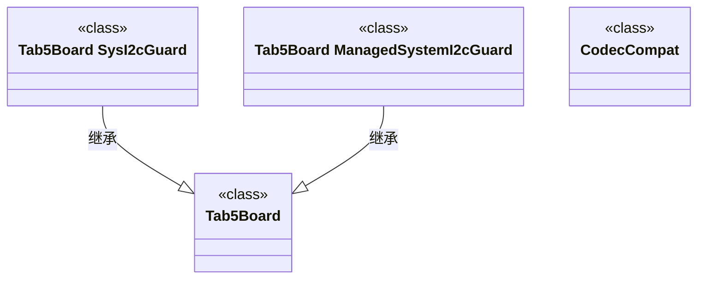

# 结构协作：结构切片 boards · tab5/include/boards

图种：Class / Structural Diagrams
状态：candidate
置信度：high
项目版本：0.1.30-alpha
Git：34aad0bffa2f / main / dirty
更新于：2026-06-25T09:19:20.669Z

## 定位

解释 boards/tab5/include/boards 这一结构切片中类、接口、组件或值对象如何共同承担结构切片 boards中的结构职责；候选对象包括 Tab5Board、Tab5Board::ManagedSystemI2cGuard、Tab5Board::SysI2cGuard、CodecCompat。

## 图的读法

- 这张 Class / Structural Diagram 聚焦 boards/tab5/include/boards 这一结构切片，而不是整个 boards 顶层目录。
- 它只放入类、接口、枚举或结构类型；方法级高引用对象会进入 Component/Hotspot，不再混入结构协作图。
- 候选语境是「结构切片 boards」。读图时先确认这些对象是否共同承载同一个业务能力、共享支撑机制或适配边界。
- 图中已绘制 2 条类级关系，主要来自继承、接口实现、创建或引用证据。

## 技术复杂度分析

- boards/tab5/include/boards 当前包含 4 个类/结构和 0 个接口/trait 候选对象。
- 当前观察到 2 条类级结构关系。
- 这张图的解释目标是结构职责和边界：哪些对象像领域模型、哪些对象像接口契约、哪些对象像策略/适配器或共享支撑。
- 如果图中对象只是同目录但没有共同业务语境或结构关系，生成流程必须拆分或降级为 Component/Hotspot，而不是继续保留为 Class / Structural Diagram。

## 与业务复杂度的关联

- 该图候选关联「结构切片 boards」，应该回连到组织/过程模型中对应 Use Case 的 Class Collaboration、Activity 或 Sequence 下钻图。
- 软件结构模型不能只说“这里有很多类”，而要说明这些类如何让业务变化更容易或更困难。
- 候选对象包括：Tab5Board、Tab5Board::ManagedSystemI2cGuard、Tab5Board::SysI2cGuard、CodecCompat。

## 治理建议

- 不要把顶层 layer、目录名或关系数量当作结构图的解释对象；结构图必须围绕可命名的业务/技术语境。
- 当某个对象脱离当前语境、没有关系说明或只是高引用工具类时，应从该图移除，转入 Component/Hotspot 或共享支撑切片。
- 变更 boards/tab5/include/boards 时，同步维护它和相关 Use Case、Component、Sequence 的引用关系。

## UML / 技术图

## 覆盖范围

- 结构切片：boards/tab5/include/boards
- 候选业务/技术语境：结构切片 boards
- 所属工程边界：boards
- 候选结构对象数：4
- 候选结构关系数：2
- 对象：Tab5Board (class)
- 对象：Tab5Board::ManagedSystemI2cGuard (class)
- 对象：Tab5Board::SysI2cGuard (class)
- 对象：CodecCompat (class)

## 图内语义元素下钻

### Tab5Board

- 元素类型：component
- 说明：Tab5Board 属于 boards/tab5/include/boards 结构切片，用来解释「结构切片 boards」中的一个结构职责，而不是因为它在 boards 中关系数量高才被放入图。
- 技术角色：结构对象：它的职责必须结合 Use Case、Sequence 或 Component 下钻证据解释，不能只靠名称或目录判断。
- 为什么出现：它位于 boards/tab5/include/boards/tab5/tab5_board.h，并且和同切片其它类/接口处在同一源码语境；该语境比顶层目录 boards 更接近真实业务或架构边界。
- 关系意义：图中的同切片关系表示候选结构协作边界；只有存在接口实现、继承、组合、策略或端口证据时，才应进一步标注为明确设计关系。
- 下钻意图：下钻 Tab5Board 应验证它在 Component、Sequence、Use Case Class Collaboration 中承担的具体角色，避免孤立类名被误读成业务解释。
- 业务关联：Tab5Board 是「结构切片 boards」候选技术承载对象；当前文档通过 Trace/Refine 链接说明它服务的触发条件、流程或规则，证据不足时会降低置信度或缩小覆盖范围。
- 变更影响：修改 Tab5Board 可能影响 boards/tab5/include/boards 内的结构说明，并应同步检查相关 Design/Engineering/Architecture 文档是否仍一致。
- 置信度：high
- 证据：
  - boards/tab5/include/boards/tab5/tab5_board.h#L17
  - 结构切片：boards/tab5/include/boards
  - 对象类型：class
  - 候选语境：结构切片 boards
- 风险：
  - 当前切片来自本地仓库证据和路径语境推断；图中对象必须能解释同一个结构语境，否则生成流程会拆分或降级。
- 问题：暂无。
- 下钻：当前没有根据证据关联到更细图。

### Tab5Board::ManagedSystemI2cGuard

- 元素类型：component
- 说明：Tab5Board::ManagedSystemI2cGuard 属于 boards/tab5/include/boards 结构切片，用来解释「结构切片 boards」中的一个结构职责，而不是因为它在 boards 中关系数量高才被放入图。
- 技术角色：结构对象：它的职责必须结合 Use Case、Sequence 或 Component 下钻证据解释，不能只靠名称或目录判断。
- 为什么出现：它位于 boards/tab5/include/boards/tab5/tab5_board.h，并且和同切片其它类/接口处在同一源码语境；该语境比顶层目录 boards 更接近真实业务或架构边界。
- 关系意义：图中的同切片关系表示候选结构协作边界；只有存在接口实现、继承、组合、策略或端口证据时，才应进一步标注为明确设计关系。
- 下钻意图：下钻 Tab5Board::ManagedSystemI2cGuard 应验证它在 Component、Sequence、Use Case Class Collaboration 中承担的具体角色，避免孤立类名被误读成业务解释。
- 业务关联：Tab5Board::ManagedSystemI2cGuard 是「结构切片 boards」候选技术承载对象；当前文档通过 Trace/Refine 链接说明它服务的触发条件、流程或规则，证据不足时会降低置信度或缩小覆盖范围。
- 变更影响：修改 Tab5Board::ManagedSystemI2cGuard 可能影响 boards/tab5/include/boards 内的结构说明，并应同步检查相关 Design/Engineering/Architecture 文档是否仍一致。
- 置信度：high
- 证据：
  - boards/tab5/include/boards/tab5/tab5_board.h#L44
  - 结构切片：boards/tab5/include/boards
  - 对象类型：class
  - 候选语境：结构切片 boards
- 风险：
  - 当前切片来自本地仓库证据和路径语境推断；图中对象必须能解释同一个结构语境，否则生成流程会拆分或降级。
- 问题：暂无。
- 下钻：当前没有根据证据关联到更细图。

### Tab5Board::SysI2cGuard

- 元素类型：component
- 说明：Tab5Board::SysI2cGuard 属于 boards/tab5/include/boards 结构切片，用来解释「结构切片 boards」中的一个结构职责，而不是因为它在 boards 中关系数量高才被放入图。
- 技术角色：结构对象：它的职责必须结合 Use Case、Sequence 或 Component 下钻证据解释，不能只靠名称或目录判断。
- 为什么出现：它位于 boards/tab5/include/boards/tab5/tab5_board.h，并且和同切片其它类/接口处在同一源码语境；该语境比顶层目录 boards 更接近真实业务或架构边界。
- 关系意义：图中的同切片关系表示候选结构协作边界；只有存在接口实现、继承、组合、策略或端口证据时，才应进一步标注为明确设计关系。
- 下钻意图：下钻 Tab5Board::SysI2cGuard 应验证它在 Component、Sequence、Use Case Class Collaboration 中承担的具体角色，避免孤立类名被误读成业务解释。
- 业务关联：Tab5Board::SysI2cGuard 是「结构切片 boards」候选技术承载对象；当前文档通过 Trace/Refine 链接说明它服务的触发条件、流程或规则，证据不足时会降低置信度或缩小覆盖范围。
- 变更影响：修改 Tab5Board::SysI2cGuard 可能影响 boards/tab5/include/boards 内的结构说明，并应同步检查相关 Design/Engineering/Architecture 文档是否仍一致。
- 置信度：high
- 证据：
  - boards/tab5/include/boards/tab5/tab5_board.h#L27
  - 结构切片：boards/tab5/include/boards
  - 对象类型：class
  - 候选语境：结构切片 boards
- 风险：
  - 当前切片来自本地仓库证据和路径语境推断；图中对象必须能解释同一个结构语境，否则生成流程会拆分或降级。
- 问题：暂无。
- 下钻：当前没有根据证据关联到更细图。

### CodecCompat

- 元素类型：component
- 说明：CodecCompat 属于 boards/tab5/include/boards 结构切片，用来解释「结构切片 boards」中的一个结构职责，而不是因为它在 boards 中关系数量高才被放入图。
- 技术角色：结构对象：它的职责必须结合 Use Case、Sequence 或 Component 下钻证据解释，不能只靠名称或目录判断。
- 为什么出现：它位于 boards/tab5/include/boards/tab5/codec_compat.h，并且和同切片其它类/接口处在同一源码语境；该语境比顶层目录 boards 更接近真实业务或架构边界。
- 关系意义：图中的同切片关系表示候选结构协作边界；只有存在接口实现、继承、组合、策略或端口证据时，才应进一步标注为明确设计关系。
- 下钻意图：下钻 CodecCompat 应验证它在 Component、Sequence、Use Case Class Collaboration 中承担的具体角色，避免孤立类名被误读成业务解释。
- 业务关联：CodecCompat 是「结构切片 boards」候选技术承载对象；当前文档通过 Trace/Refine 链接说明它服务的触发条件、流程或规则，证据不足时会降低置信度或缩小覆盖范围。
- 变更影响：修改 CodecCompat 可能影响 boards/tab5/include/boards 内的结构说明，并应同步检查相关 Design/Engineering/Architecture 文档是否仍一致。
- 置信度：high
- 证据：
  - boards/tab5/include/boards/tab5/codec_compat.h#L9
  - 结构切片：boards/tab5/include/boards
  - 对象类型：class
  - 候选语境：结构切片 boards
- 风险：
  - 当前切片来自本地仓库证据和路径语境推断；图中对象必须能解释同一个结构语境，否则生成流程会拆分或降级。
- 问题：暂无。
- 下钻：当前没有根据证据关联到更细图。

## 可下钻 UML

- [依赖簇：boards 技术热点](../../technical-hotspots/dependency-cluster--boards/technical-hotspot.md) - 查看该结构边界中的热点，确认复杂度集中在哪个对象、文件或关系簇上。

## 证据

- boards/tab5/include/boards/tab5/tab5_board.h#L17
- boards/tab5/include/boards/tab5/tab5_board.h#L44
- boards/tab5/include/boards/tab5/tab5_board.h#L27
- boards/tab5/include/boards/tab5/codec_compat.h#L9

## 问题

- 该结构切片来自本地仓库证据；当前未发现足够 Trace 证据把它绑定到唯一业务故事，因此只作为软件结构模型候选视角。

## 变更记录

### 0.1.30-alpha - 2026-06-25T09:19:20.669Z

- 从本地仓库证据生成 结构协作：结构切片 boards · tab5/include/boards。
