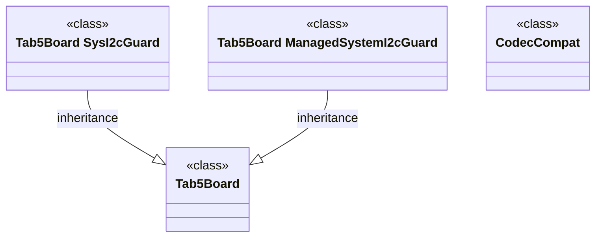

# Structure collaboration: structure slicing boards · tab5/include/boards

Image type: Class / Structural Diagrams
Status: candidate
Confidence: high
Project version: 0.1.30-alpha
Git:34aad0bffa2f / main / dirty
Updated on: 2026-06-25T09:19:20.669Z

## Positioning

Explain how classes, interfaces, components or value objects in the structural slice boards/tab5/include/boards share structural responsibilities in the structural slice boards; candidates include Tab5Board, Tab5Board::ManagedSystemI2cGuard, Tab5Board::SysI2cGuard, and CodecCompat.

## How to read the diagram

- This Class / Structural Diagram focuses on the structural slice of boards/tab5/include/boards, rather than the entire top-level directory of boards.
- It only puts classes, interfaces, enumerations or structure types; method-level high-reference objects will go into Component/Hotspot and will no longer be mixed into the structure collaboration diagram.
- The candidate context is "structural slice boards". When reading the diagram, first confirm whether these objects jointly carry the same business capabilities, share support mechanisms or adaptation boundaries.
- 2 class-level relationships have been drawn in the diagram, mainly from inheritance, interface implementation, creation or reference evidence.

## Technical complexity analysis

- boards/tab5/include/boards currently contains 4 classes/structures and 0 interface/trait candidates.
- Currently 2 class-level structural relationships are observed.
- The interpretation goal of this diagram is to structure responsibilities and boundaries: which objects are like domain models, which objects are like interface contracts, and which objects are like strategies/adapters or shared supports.
- If the objects in the diagram are in the same directory but have no common business context or structural relationship, the generation process must be split or downgraded to Component/Hotspot instead of remaining as Class/Structural Diagram.

## Association with business complexity

- This graph candidate association "structural slice boards" should be connected back to the Class Collaboration, Activity or Sequence drill-down diagram corresponding to the Use Case in the organization/process model.
- The software structure model cannot just say "here are a lot of classes", but how these classes make business changes easier or more difficult.
 - Candidates include: Tab5Board, Tab5Board::ManagedSystemI2cGuard, Tab5Board::SysI2cGuard, CodecCompat.

## Governance Recommendations

- Do not treat top-level layers, directory names, or relationship numbers as the interpretation objects of the structure diagram; the structure diagram must be centered around a nameable business/technical context.
- When an object is out of context, has no relationship description, or is just a highly referenced utility class, it should be removed from the diagram and moved to Component/Hotspot or a shared supporting slice.
- When changing boards/tab5/include/boards, simultaneously maintain the reference relationship between it and the related Use Case, Component, and Sequence.

## UML / Technical diagram

## Coverage

- Structure slice: boards/tab5/include/boards
- Candidate business/technical context: structure slice boards
- Project boundary: boards
- Number of candidate structure objects: 4
- Number of candidate structure relationships: 2
- Object: Tab5Board (class)
- Object: Tab5Board::ManagedSystemI2cGuard (class)
- Object: Tab5Board::SysI2cGuard (class)
- Object: CodecCompat (class)

## Drill-down of semantic elements in the diagram

### Tab5Board

- Element type: component
- Description: Tab5Board belongs to boards/tab5/include/boards Structural slicing is used to explain a structural responsibility in "structural slicing boards", rather than being put into the diagram because it has a high number of relationships in the boards.
- Technical role: Structural object: Its responsibilities must be explained in conjunction with Use Case, Sequence or Component drill-down evidence, and cannot be judged solely by name or directory.
- Why it appears: It is located in boards/tab5/include/boards/tab5/tab5_board.h, and is in the same source code context as other classes/interfaces in the same slice; this context is closer to the real business or architectural boundary than the top-level directory boards.
- Relationship meaning: The same slice relationship in the diagram represents the collaboration boundary of the candidate structure; only when there is evidence of interface implementation, inheritance, composition, strategy or port, it should be further marked as a clear design relationship.
- Drill-down intention: Drill-down Tab5Board should verify the specific role it plays in Component, Sequence, and Use Case Class Collaboration to avoid isolated class names being misinterpreted as business explanations.
-Business correlation: Tab5Board is a candidate technology carrier object for "structural slicing boards"; the current document explains the triggering conditions, processes or rules of its service through Trace/Refine links. When the evidence is insufficient, the confidence level will be reduced or the coverage will be reduced.
- Impact of changes: Modifying Tab5Board may affect the structure description in boards/tab5/include/boards, and you should check whether the relevant Design/Engineering/Architecture documents are still consistent.
- Confidence: high
- Evidence:
  - boards/tab5/include/boards/tab5/tab5_board.h#L17
 - Structural slice: boards/tab5/include/boards
 - Object type: class
 - Candidate context: structural slice boards
 - Risk:
 - The current slice comes from local warehouse evidence and path context inference; the objects in the graph must be able to interpret the same structural context, otherwise the generation process will be split or degraded.
- Question: None yet.
- Drill down: There is currently no evidence-based correlation to a finer picture.

### Tab5Board::ManagedSystemI2cGuard

- Element type: component
- Description: Tab5Board::ManagedSystemI2cGuard belongs to the boards/tab5/include/boards structural slice, which is used to explain a structural responsibility in the "structural slice boards", rather than being put into the diagram because it has a high number of relationships in the boards.
- Technical role: Structural object: Its responsibilities must be explained in conjunction with Use Case, Sequence or Component drill-down evidence, and cannot be judged solely by name or directory.
- Why it appears: It is located in boards/tab5/include/boards/tab5/tab5_board.h, and is in the same source code context as other classes/interfaces in the same slice; this context is closer to the real business or architectural boundary than the top-level directory boards.
- Relationship meaning: The same slice relationship in the diagram represents the collaboration boundary of the candidate structure; only when there is evidence of interface implementation, inheritance, composition, strategy or port, it should be further marked as a clear design relationship.
- Drill-down intent: Drill-down Tab5Board::ManagedSystemI2cGuard should verify the specific role it plays in Component, Sequence, and Use Case Class Collaboration to avoid isolated class names being misinterpreted as business explanations.
-Business association: Tab5Board::ManagedSystemI2cGuard is a candidate technology carrier object for "structural slicing boards"; the current document explains the triggering conditions, processes or rules of its service through Trace/Refine links. When the evidence is insufficient, the confidence level will be reduced or the coverage will be reduced.
- Impact of change: Modifying Tab5Board::ManagedSystemI2cGuard may affect the structure description in boards/tab5/include/boards, and the relevant Design/Engineering/Architecture documents should be checked simultaneously to see if they are still consistent.
- Confidence: high
- Evidence:
  - boards/tab5/include/boards/tab5/tab5_board.h#L44
 - Structural slice: boards/tab5/include/boards
 - Object type: class
 - Candidate context: structural slice boards
 - Risk:
 - The current slice comes from local warehouse evidence and path context inference; the objects in the graph must be able to interpret the same structural context, otherwise the generation process will be split or degraded.
- Question: None yet.
- Drill down: There is currently no evidence-based correlation to a finer picture.

### Tab5Board::SysI2cGuard

- Element type: component
- Description: Tab5Board::SysI2cGuard belongs to the boards/tab5/include/boards structure slice and is used to explain a structural responsibility in the "structural slice boards", rather than being put into the diagram because it has a high number of relationships in the boards.
- Technical role: Structural object: Its responsibilities must be explained in conjunction with Use Case, Sequence or Component drill-down evidence, and cannot be judged solely by name or directory.
- Why it appears: It is located in boards/tab5/include/boards/tab5/tab5_board.h, and is in the same source code context as other classes/interfaces in the same slice; this context is closer to the real business or architectural boundary than the top-level directory boards.
- Relationship meaning: The same slice relationship in the diagram represents the collaboration boundary of the candidate structure; only when there is evidence of interface implementation, inheritance, composition, strategy or port, it should be further marked as a clear design relationship.
- Drill-down intent: Drill-down Tab5Board::SysI2cGuard should verify the specific role it plays in Component, Sequence, and Use Case Class Collaboration to avoid isolated class names being misread as business explanations.
-Business association: Tab5Board::SysI2cGuard is a candidate technology carrier object for "structural slicing boards"; the current document explains the triggering conditions, processes or rules of its service through Trace/Refine links. If the evidence is insufficient, the confidence level will be reduced or the coverage will be reduced.
- Impact of change: Modifying Tab5Board::SysI2cGuard may affect the structure description in boards/tab5/include/boards, and the relevant Design/Engineering/Architecture documents should be checked simultaneously to see if they are still consistent.
- Confidence: high
- Evidence:
  - boards/tab5/include/boards/tab5/tab5_board.h#L27
 - Structural slice: boards/tab5/include/boards
 - Object type: class
 - Candidate context: structural slice boards
 - Risk:
 - The current slice comes from local warehouse evidence and path context inference; the objects in the graph must be able to interpret the same structural context, otherwise the generation process will be split or degraded.
- Question: None yet.
- Drill down: There is currently no evidence-based correlation to a finer picture.

### CodecCompat

- Element type: component
- Note: CodecCompat belongs to the boards/tab5/include/boards structure slice, which is used to explain a structural responsibility in the "structural slice boards", rather than being put into the diagram because it has a high number of relationships in the boards.
- Technical role: Structural object: Its responsibilities must be explained in conjunction with Use Case, Sequence or Component drill-down evidence, and cannot be judged solely by name or directory.
- Why it appears: It is located in boards/tab5/include/boards/tab5/codec_compat.h, and is in the same source code context as other classes/interfaces in the same slice; this context is closer to the real business or architectural boundary than the top-level directory boards.
- Relationship meaning: The same slice relationship in the diagram represents the collaboration boundary of the candidate structure; only when there is evidence of interface implementation, inheritance, composition, strategy or port, it should be further marked as a clear design relationship.
- Drill-down intent: Drill-down CodecCompat should verify the specific roles it plays in Component, Sequence, and Use Case Class Collaboration to avoid isolated class names being misinterpreted as business explanations.
-Business correlation: CodecCompat is a candidate technology carrier object for "structural slicing boards"; the current document explains the triggering conditions, processes or rules of its service through Trace/Refine links. When the evidence is insufficient, the confidence level will be reduced or the coverage will be reduced.
- Impact of changes: Modifying CodecCompat may affect the structure description in boards/tab5/include/boards, and you should check whether the relevant Design/Engineering/Architecture documents are still consistent.
- Confidence: high
- Evidence:
  - boards/tab5/include/boards/tab5/codec_compat.h#L9
 - Structural slice: boards/tab5/include/boards
 - Object type: class
 - Candidate context: structural slice boards
 - Risk:
 - The current slice comes from local warehouse evidence and path context inference; the objects in the graph must be able to interpret the same structural context, otherwise the generation process will be split or degraded.
- Question: None yet.
- Drill down: There is currently no evidence-based correlation to a finer picture.

## Drill-down UML

- [Dependency cluster: boards technical hotspots](../../technical-hotspots/dependency-cluster--boards/technical-hotspot.md) - View the hotspots within the boundaries of this structure to identify which object, file, or relationship cluster the complexity is concentrated on.

## Evidence

- boards/tab5/include/boards/tab5/tab5_board.h#L17
- boards/tab5/include/boards/tab5/tab5_board.h#L44
- boards/tab5/include/boards/tab5/tab5_board.h#L27
- boards/tab5/include/boards/tab5/codec_compat.h#L9

## Problem

- This structural slice comes from the local warehouse evidence; currently not enough Trace evidence has been found to bind it to the unique business story, so it is only used as a candidate perspective of the software structure model.

## Change record

### 0.1.30-alpha - 2026-06-25T09:19:20.669Z
