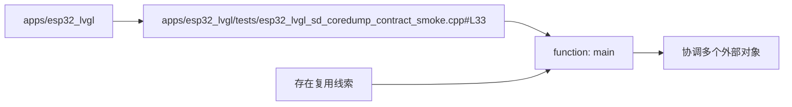

# 函数节点：main

图种：Component Diagrams
状态：candidate
置信度：high
项目版本：0.1.30-alpha
Git：34aad0bffa2f / main / dirty
更新于：2026-06-25T09:19:20.669Z

## 定位

function 位于 apps/esp32_lvgl/tests/esp32_lvgl_sd_coredump_contract_smoke.cpp#L33，协调多个外部对象或能力，用于解释技术协作和变更影响面。

## 图的读法

- 这张 Component Diagram 关注 main 这个 function，展示它所在文件、所属模块以及复用迹象、外部协作迹象。
- 复用迹象用于判断它是否是共享核心或公共接口；外部协作迹象用于判断它是否承担编排、聚合或桥接职责。
- 代码锚点是 apps/esp32_lvgl/tests/esp32_lvgl_sd_coredump_contract_smoke.cpp#L33。

## 技术复杂度分析

- main 在当前仓库证据中呈现为：被复用/被依赖迹象：存在局部复用或依赖线索，外部协作/编排迹象：协调多个外部对象或能力，因此它在技术结构中更像编排者或聚合入口。
- 过多对外依赖往往意味着该组件连接过多职责，阅读、测试和变更影响面都会扩大。
- 所属模块 apps/esp32_lvgl 决定了它更适合作为局部实现细节还是跨模块协作点。

## 与业务复杂度的关联

- main 可能是某些业务故事执行过程中的技术节点，但它本身不是业务用例。
- 从路径上无法直接判断业务角色，需要结合组织/过程模型的 Use Case 证据确认。
- 如果某个 Use Case 的 Activity、Sequence 或 Class Collaboration 图引用该组件，应在组织/过程模型中明确它承担的是入口、编排、领域规则、适配器还是基础设施职责。

## 治理建议

- 在修改该组件前，优先查找它被哪些 Use Case 下钻文档引用，避免只看局部代码而忽略业务语义。
- 该组件协作压力较高，应在对应 Sequence Diagram 或 Class / Structural Diagram 中解释具体协作边界。
- 如果该组件承载业务规则，应把规则写回组织/过程模型或对应领域文档，而不仅保留在仓库证据中。

## UML / 技术图

## 覆盖范围

- 组件类型：function
- 所属模块：apps/esp32_lvgl
- 代码锚点：apps/esp32_lvgl/tests/esp32_lvgl_sd_coredump_contract_smoke.cpp#L33
- 被复用/被依赖迹象：存在局部复用或依赖线索
- 外部协作/编排迹象：协调多个外部对象或能力

## 图内语义元素下钻

### apps/esp32_lvgl

- 元素类型：package
- 说明：apps/esp32_lvgl 是 函数节点：main 所属的 package/module 边界，用来判断该组件是局部实现细节还是跨模块协作点。
- 技术角色：组件归属边界：它定义当前组件默认应该服务的工程上下文。
- 为什么出现：组件不能脱离 package 解释；同一个符号如果位于不同 package，可能代表完全不同的职责、所有权和变更影响面。
- 关系意义：apps/esp32_lvgl -> 函数节点：main 表示该组件由这个技术边界承载；它的角色必须由入口、调用、导出、测试或配置证据来解释，而不是只由目录位置解释。
- 下钻意图：下钻 package 可以查看 apps/esp32_lvgl 的跨模块依赖、结构协作和热点，从边界层解释该组件为何出现在这里。
- 业务关联：如果 函数节点：main 被业务 Use Case 调用，那么 apps/esp32_lvgl 是该业务能力的候选技术落点。
- 变更影响：迁移或重命名该 package 可能改变组件导入路径、下钻索引和 Use Case 对技术承载边界的引用。
- 置信度：high
- 证据：
  - component package: apps/esp32_lvgl
  - 组件类型：function
  - 所属模块：apps/esp32_lvgl
  - 代码锚点：apps/esp32_lvgl/tests/esp32_lvgl_sd_coredump_contract_smoke.cpp#L33
  - 被复用/被依赖迹象：存在局部复用或依赖线索
  - 外部协作/编排迹象：协调多个外部对象或能力
  - apps/esp32_lvgl/tests/esp32_lvgl_sd_coredump_contract_smoke.cpp#L33
- 风险：
  - 组件职责可能被路径误导；仍需结合调用、导入、导出、入口和测试等代码证据判断真实角色。
- 问题：
  - 当前仓库证据尚未证明 函数节点：main 属于 apps/esp32_lvgl 的稳定职责，暂按候选归属处理。
- 下钻：[模块边界：apps/esp32_lvgl](../../package-diagrams/apps-esp32_lvgl/package-diagram.md) - 回到 apps/esp32_lvgl 的包级边界，确认 函数节点：main 是否属于这个模块的稳定职责。

### apps/esp32_lvgl/tests/esp32_lvgl_sd_coredump_contract_smoke.cpp

- 元素类型：file
- 说明：apps/esp32_lvgl/tests/esp32_lvgl_sd_coredump_contract_smoke.cpp 是当前组件的证据文件，说明 函数节点：main 的技术职责可以追溯到具体代码位置。
- 技术角色：代码证据锚点：它让组件解释可以回到具体文件，而不是停留在抽象图形上。
- 为什么出现：软件结构模型必须把每个组件图绑定到可验证文件，否则 UI 只是投影而不是可追溯解释。
- 关系意义：文件节点连接组件节点，表示该组件的实现、入口或符号事实来自这个文件。
- 下钻意图：下钻该文件相关的组件、sequence 或 hotspot，可以检查该文件是否只是实现细节，还是已经成为多个能力共用的技术枢纽。
- 业务关联：从路径上无法直接判断业务角色，需要结合组织/过程模型的 Use Case 证据确认。
- 变更影响：修改 apps/esp32_lvgl/tests/esp32_lvgl_sd_coredump_contract_smoke.cpp 可能影响该组件图、相关 sequence、热点判断，以及引用该组件的业务下钻文档。
- 置信度：high
- 证据：
  - apps/esp32_lvgl/tests/esp32_lvgl_sd_coredump_contract_smoke.cpp
  - apps/esp32_lvgl/tests/esp32_lvgl_sd_coredump_contract_smoke.cpp#L33
- 风险：
  - 文件路径只能说明位置，不能单独证明业务职责。
- 问题：
  - 当前文件锚点只能证明位置；如果同文件出现多个入口或职责，需在组件/sequence 文档中拆开解释。
- 下钻：[动态协作：tick 调用 log_loop_interval](../../sequence-diagrams/tick-calls-log_loop_interval/sequence-diagram.md) - 打开这条 sequence 是为了确认 函数节点：main 在 tick -> log_loop_interval 中的角色：它是在发起协作、接收调用、做编排，还是只暴露被依赖能力。
- 下钻：[动态协作：add_status_line 调用 add_label](../../sequence-diagrams/add_status_line-calls-add_label/sequence-diagram.md) - 打开这条 sequence 是为了确认 函数节点：main 在 add_status_line -> add_label 中的角色：它是在发起协作、接收调用、做编排，还是只暴露被依赖能力。
- 下钻：[动态协作：add_u32_line 调用 add_label](../../sequence-diagrams/add_u32_line-calls-add_label/sequence-diagram.md) - 打开这条 sequence 是为了确认 函数节点：main 在 add_u32_line -> add_label 中的角色：它是在发起协作、接收调用、做编排，还是只暴露被依赖能力。
- 下钻：[动态协作：add_hex_line 调用 add_status_line](../../sequence-diagrams/add_hex_line-calls-add_status_line/sequence-diagram.md) - 打开这条 sequence 是为了确认 函数节点：main 在 add_hex_line -> add_status_line 中的角色：它是在发起协作、接收调用、做编排，还是只暴露被依赖能力。
- 下钻：[动态协作：companion_enter 调用 add_label](../../sequence-diagrams/companion_enter-calls-add_label/sequence-diagram.md) - 打开这条 sequence 是为了确认 函数节点：main 在 companion_enter -> add_label 中的角色：它是在发起协作、接收调用、做编排，还是只暴露被依赖能力。

### 函数节点：main

- 元素类型：component
- 说明：函数节点：main 是当前 Component Diagram 的中心技术对象；这张图用它来解释职责、协作压力和下钻路径。
- 技术角色：关键技术对象：它需要结合复用迹象、外部协作迹象、文件位置和下钻图判断具体职责。
- 为什么出现：本地仓库证据将它识别为关键组件或符号，且它具有可定位文件 apps/esp32_lvgl/tests/esp32_lvgl_sd_coredump_contract_smoke.cpp、被引用/调用关系和对外依赖/调用关系。
- 关系意义：package、file、被引用/调用关系和对外依赖/调用关系都围绕该组件组织，用来判断它是入口、编排者、共享能力还是风险集中点。
- 下钻意图：下钻该组件可以进入它参与的 sequence、所属结构切片或附近热点，回答“它如何工作、谁调用它、它调用谁”。
- 业务关联：函数节点：main 不是业务用例，但可能是业务能力落地时经过的技术节点。 从路径上无法直接判断业务角色，需要结合组织/过程模型的 Use Case 证据确认。 如果组织/过程模型的 Use Case 下钻图引用它，应在业务文档中说明它承担入口、编排、领域规则、适配器还是基础设施职责。
- 变更影响：修改 函数节点：main 可能影响 apps/esp32_lvgl/tests/esp32_lvgl_sd_coredump_contract_smoke.cpp 中的入口逻辑、调用关系和引用它的业务/工程文档。
- 置信度：high
- 证据：
  - apps/esp32_lvgl/tests/esp32_lvgl_sd_coredump_contract_smoke.cpp
  - 组件类型：function
  - 所属模块：apps/esp32_lvgl
  - 代码锚点：apps/esp32_lvgl/tests/esp32_lvgl_sd_coredump_contract_smoke.cpp#L33
  - 被复用/被依赖迹象：存在局部复用或依赖线索
  - 外部协作/编排迹象：协调多个外部对象或能力
  - apps/esp32_lvgl/tests/esp32_lvgl_sd_coredump_contract_smoke.cpp#L33
- 风险：
  - 协作压力高不必然代表设计问题；必须结合业务入口、测试和变更频率判断。
- 问题：
  - 该组件协作压力较高；当前文档按候选编排中心或公共接口处理，并通过下钻图说明它的职责证据。
- 下钻：[动态协作：tick 调用 log_loop_interval](../../sequence-diagrams/tick-calls-log_loop_interval/sequence-diagram.md) - 打开这条 sequence 是为了确认 函数节点：main 在 tick -> log_loop_interval 中的角色：它是在发起协作、接收调用、做编排，还是只暴露被依赖能力。
- 下钻：[动态协作：add_status_line 调用 add_label](../../sequence-diagrams/add_status_line-calls-add_label/sequence-diagram.md) - 打开这条 sequence 是为了确认 函数节点：main 在 add_status_line -> add_label 中的角色：它是在发起协作、接收调用、做编排，还是只暴露被依赖能力。
- 下钻：[动态协作：add_u32_line 调用 add_label](../../sequence-diagrams/add_u32_line-calls-add_label/sequence-diagram.md) - 打开这条 sequence 是为了确认 函数节点：main 在 add_u32_line -> add_label 中的角色：它是在发起协作、接收调用、做编排，还是只暴露被依赖能力。
- 下钻：[动态协作：add_hex_line 调用 add_status_line](../../sequence-diagrams/add_hex_line-calls-add_status_line/sequence-diagram.md) - 打开这条 sequence 是为了确认 函数节点：main 在 add_hex_line -> add_status_line 中的角色：它是在发起协作、接收调用、做编排，还是只暴露被依赖能力。
- 下钻：[动态协作：companion_enter 调用 add_label](../../sequence-diagrams/companion_enter-calls-add_label/sequence-diagram.md) - 打开这条 sequence 是为了确认 函数节点：main 在 companion_enter -> add_label 中的角色：它是在发起协作、接收调用、做编排，还是只暴露被依赖能力。

### 被引用/调用关系

- 元素类型：reuse_signal
- 说明：被复用/被依赖迹象用于解释它在技术网络中的复用程度或编排程度；这里只展示含义，不把内部计数当作用户结论。
- 技术角色：复用压力线索：帮助识别共享核心、公共接口或高回归风险点。
- 为什么出现：单看组件名称无法判断复杂度，被复用/被依赖迹象 把本地仓库关系证据转译为用户可理解的协作压力。
- 关系意义：其它组件、文件或符号依赖当前组件；关系越多，修改它越可能影响更多调用方。
- 下钻意图：下钻相关 sequence 或 hotspot，可以把抽象数字落到具体调用片段、文件和风险位置。
- 业务关联：如果该组件支撑用户可见能力，这个关系指标会影响业务变更的验证成本和回归风险。
- 变更影响：重构被大量对象引用/调用的组件需要谨慎处理兼容性、调用方迁移和测试覆盖。
- 置信度：high
- 证据：
  - 组件类型：function
  - 所属模块：apps/esp32_lvgl
  - 代码锚点：apps/esp32_lvgl/tests/esp32_lvgl_sd_coredump_contract_smoke.cpp#L33
  - 被复用/被依赖迹象：存在局部复用或依赖线索
  - 外部协作/编排迹象：协调多个外部对象或能力
  - apps/esp32_lvgl/tests/esp32_lvgl_sd_coredump_contract_smoke.cpp#L33
- 风险：
  - 关系指标来自本地仓库分析，可能受扫描粒度、生成文件或 import 噪声影响。
- 问题：
  - 当前证据无法完全区分这些关系中的运行时调用、类型引用、导出聚合或生成物噪声，因此只作为候选协作压力。
- 下钻：[动态协作：tick 调用 log_loop_interval](../../sequence-diagrams/tick-calls-log_loop_interval/sequence-diagram.md) - 打开这条 sequence 是为了确认 函数节点：main 在 tick -> log_loop_interval 中的角色：它是在发起协作、接收调用、做编排，还是只暴露被依赖能力。
- 下钻：[动态协作：add_status_line 调用 add_label](../../sequence-diagrams/add_status_line-calls-add_label/sequence-diagram.md) - 打开这条 sequence 是为了确认 函数节点：main 在 add_status_line -> add_label 中的角色：它是在发起协作、接收调用、做编排，还是只暴露被依赖能力。
- 下钻：[动态协作：add_u32_line 调用 add_label](../../sequence-diagrams/add_u32_line-calls-add_label/sequence-diagram.md) - 打开这条 sequence 是为了确认 函数节点：main 在 add_u32_line -> add_label 中的角色：它是在发起协作、接收调用、做编排，还是只暴露被依赖能力。
- 下钻：[动态协作：add_hex_line 调用 add_status_line](../../sequence-diagrams/add_hex_line-calls-add_status_line/sequence-diagram.md) - 打开这条 sequence 是为了确认 函数节点：main 在 add_hex_line -> add_status_line 中的角色：它是在发起协作、接收调用、做编排，还是只暴露被依赖能力。
- 下钻：[动态协作：companion_enter 调用 add_label](../../sequence-diagrams/companion_enter-calls-add_label/sequence-diagram.md) - 打开这条 sequence 是为了确认 函数节点：main 在 companion_enter -> add_label 中的角色：它是在发起协作、接收调用、做编排，还是只暴露被依赖能力。

### 对外依赖/调用关系

- 元素类型：collaboration_signal
- 说明：外部协作/编排迹象用于解释它在技术网络中的复用程度或编排程度；这里只展示含义，不把内部计数当作用户结论。
- 技术角色：编排压力线索：帮助识别编排中心、聚合入口或耦合扩散点。
- 为什么出现：单看组件名称无法判断复杂度，外部协作/编排迹象 把本地仓库关系证据转译为用户可理解的协作压力。
- 关系意义：当前组件依赖其它组件、文件或符号；关系越多，越可能承担较宽的协调职责。
- 下钻意图：下钻相关 sequence 或 hotspot，可以把抽象数字落到具体调用片段、文件和风险位置。
- 业务关联：如果该组件支撑用户可见能力，这个关系指标会影响业务变更的验证成本和回归风险。
- 变更影响：降低过多对外依赖通常意味着拆分编排职责、引入接口边界或把适配逻辑移到更合适的位置。
- 置信度：high
- 证据：
  - 组件类型：function
  - 所属模块：apps/esp32_lvgl
  - 代码锚点：apps/esp32_lvgl/tests/esp32_lvgl_sd_coredump_contract_smoke.cpp#L33
  - 被复用/被依赖迹象：存在局部复用或依赖线索
  - 外部协作/编排迹象：协调多个外部对象或能力
  - apps/esp32_lvgl/tests/esp32_lvgl_sd_coredump_contract_smoke.cpp#L33
- 风险：
  - 关系指标来自本地仓库分析，可能受扫描粒度、生成文件或 import 噪声影响。
- 问题：
  - 当前证据无法完全区分这些关系中的运行时调用、类型引用、导出聚合或生成物噪声，因此只作为候选协作压力。
- 下钻：[动态协作：tick 调用 log_loop_interval](../../sequence-diagrams/tick-calls-log_loop_interval/sequence-diagram.md) - 打开这条 sequence 是为了确认 函数节点：main 在 tick -> log_loop_interval 中的角色：它是在发起协作、接收调用、做编排，还是只暴露被依赖能力。
- 下钻：[动态协作：add_status_line 调用 add_label](../../sequence-diagrams/add_status_line-calls-add_label/sequence-diagram.md) - 打开这条 sequence 是为了确认 函数节点：main 在 add_status_line -> add_label 中的角色：它是在发起协作、接收调用、做编排，还是只暴露被依赖能力。
- 下钻：[动态协作：add_u32_line 调用 add_label](../../sequence-diagrams/add_u32_line-calls-add_label/sequence-diagram.md) - 打开这条 sequence 是为了确认 函数节点：main 在 add_u32_line -> add_label 中的角色：它是在发起协作、接收调用、做编排，还是只暴露被依赖能力。
- 下钻：[动态协作：add_hex_line 调用 add_status_line](../../sequence-diagrams/add_hex_line-calls-add_status_line/sequence-diagram.md) - 打开这条 sequence 是为了确认 函数节点：main 在 add_hex_line -> add_status_line 中的角色：它是在发起协作、接收调用、做编排，还是只暴露被依赖能力。
- 下钻：[动态协作：companion_enter 调用 add_label](../../sequence-diagrams/companion_enter-calls-add_label/sequence-diagram.md) - 打开这条 sequence 是为了确认 函数节点：main 在 companion_enter -> add_label 中的角色：它是在发起协作、接收调用、做编排，还是只暴露被依赖能力。

## 可下钻 UML

- [动态协作：tick 调用 log_loop_interval](../../sequence-diagrams/tick-calls-log_loop_interval/sequence-diagram.md) - 打开这条 sequence 是为了确认 函数节点：main 在 tick -> log_loop_interval 中的角色：它是在发起协作、接收调用、做编排，还是只暴露被依赖能力。
- [动态协作：add_status_line 调用 add_label](../../sequence-diagrams/add_status_line-calls-add_label/sequence-diagram.md) - 打开这条 sequence 是为了确认 函数节点：main 在 add_status_line -> add_label 中的角色：它是在发起协作、接收调用、做编排，还是只暴露被依赖能力。
- [动态协作：add_u32_line 调用 add_label](../../sequence-diagrams/add_u32_line-calls-add_label/sequence-diagram.md) - 打开这条 sequence 是为了确认 函数节点：main 在 add_u32_line -> add_label 中的角色：它是在发起协作、接收调用、做编排，还是只暴露被依赖能力。
- [动态协作：add_hex_line 调用 add_status_line](../../sequence-diagrams/add_hex_line-calls-add_status_line/sequence-diagram.md) - 打开这条 sequence 是为了确认 函数节点：main 在 add_hex_line -> add_status_line 中的角色：它是在发起协作、接收调用、做编排，还是只暴露被依赖能力。
- [动态协作：companion_enter 调用 add_label](../../sequence-diagrams/companion_enter-calls-add_label/sequence-diagram.md) - 打开这条 sequence 是为了确认 函数节点：main 在 companion_enter -> add_label 中的角色：它是在发起协作、接收调用、做编排，还是只暴露被依赖能力。

## 证据

- apps/esp32_lvgl/tests/esp32_lvgl_sd_coredump_contract_smoke.cpp#L33

## 问题

- 该组件协作压力较高；当前文档按候选编排中心或公共接口处理，并通过下钻图说明它的职责证据。

## 变更记录

### 0.1.30-alpha - 2026-06-25T09:19:20.669Z

- 从本地仓库证据生成 函数节点：main。
