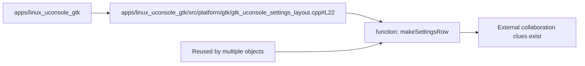

# Function node: makeSettingsRow

Diagram type: Component Diagrams
Status: candidate
Confidence: high
Project version: 0.1.30-alpha
Git:34aad0bffa2f / main / dirty
Updated on: 2026-06-25T09:19:20.669Z

## Positioning

function is located in apps/linux_uconsole_gtk/src/platform/gtk/gtk_uconsole_settings_layout.cpp#L22. It is reused or relied on by multiple objects and is used to explain technical collaboration and change impact.

## How to read the diagram

- This Component Diagram focuses on the makeSettingsRow function, showing the file where it is located, the module it belongs to, and signs of reuse and external collaboration.
- Reuse signs are used to determine whether it is a shared core or a common interface; external collaboration signs are used to determine whether it has orchestration, aggregation, or bridging responsibilities.
- The code anchor is apps/linux_uconsole_gtk/src/platform/gtk/gtk_uconsole_settings_layout.cpp#L22.

## Technical complexity analysis

- makeSettingsRow appears in the current warehouse evidence as: Reused/Dependent Signs: Reused or dependent on multiple objects, External collaboration/orchestration signs: There are local external collaboration clues, so it is more like a shared interface, public capability or reused object in the technical structure.
- Being referenced or called by a large number of objects often means that the component is a shared core, and any modification needs to be carefully evaluated for compatibility.
- The owning module apps/linux_uconsole_gtk determines whether it is more suitable as a local implementation detail or a cross-module collaboration point.

## Association with business complexity

- makeSettingsRow may be a technical node in the execution of some business stories, but it is not a business use case itself.
- The business role cannot be directly determined from the path, and it needs to be confirmed by using the Use Case evidence of the organization/process model.
- If a Use Case's Activity, Sequence or Class Collaboration diagram references this component, it should be clear in the organization/process model whether it has portal, orchestration, domain rules, adapter or infrastructure responsibilities.

## Governance Recommendations

- Before modifying the component, first find which Use Case drill-down documents it is referenced by, to avoid looking at only partial code and ignoring business semantics.
- This component has high collaboration pressure, and the specific collaboration boundaries should be explained in the corresponding Sequence Diagram or Class / Structural Diagram.
- If the component hosts business rules, the rules should be written back to the organization/process model or corresponding domain document, not just retained in the warehouse evidence.

## UML / Technical diagram

## Coverage

- Component type: function
-Official module: apps/linux_uconsole_gtk
- Code anchor: apps/linux_uconsole_gtk/src/platform/gtk/gtk_uconsole_settings_layout.cpp#L22
- Signs of being reused/dependent: reused or dependent on multiple objects
- Indications of external collaboration/orchestration: There are local external collaboration clues

## Drill-down of semantic elements in the diagram

### apps/linux_uconsole_gtk

- Element type: package
- Description: apps/linux_uconsole_gtk Yes Function node: makeSettingsRow The package/module boundary to which it belongs is used to determine whether the component is a local implementation detail or a cross-module collaboration point.
- Technical role: Component ownership boundary: It defines the engineering context that the current component should serve by default.
- Why it appears: Components cannot be interpreted without package; the same symbol may represent completely different responsibilities, ownership and change impact if it is located in different packages.
- Relationship meaning: apps/linux_uconsole_gtk -> Function node: makeSettingsRow Indicates that the component is hosted by this technology boundary; its role must be explained by entry, call, export, test or configuration evidence, not just by directory location.
- Drill-down intention: Drill-down package can view the cross-module dependencies, structural collaborations and hot spots of apps/linux_uconsole_gtk, and explain why this component appears here from the boundary layer.
- Business correlation: If the function node: makeSettingsRow is called by the business Use Case, then apps/linux_uconsole_gtk is a candidate technology landing point for this business capability.
- Impact of change: Migrating or renaming this package may change component import paths, drill-down indexes, and Use Case references to technology hosting boundaries.
- Confidence: high
- Evidence:
  - component package: apps/linux_uconsole_gtk
 - Component type: function
 - Own module: apps/linux_uconsole_gtk
 - Code anchor: apps/linux_uconsole_gtk/src/platform/gtk/gtk_uconsole_settings_layout.cpp#L22
 - Signs of being reused/dependent: reused or dependent on multiple objects
 - Signs of external collaboration/orchestration: There are local external collaboration clues
  - apps/linux_uconsole_gtk/src/platform/gtk/gtk_uconsole_settings_layout.cpp#L22
 - Risk:
 - Component responsibilities may be misdirected by paths; the true role still needs to be determined based on code evidence such as calls, imports, exports, entries and tests.
- Problem:
 - The current warehouse evidence has not yet been proven. Function node: makeSettingsRow belongs to the stable responsibility of apps/linux_uconsole_gtk and is temporarily treated as a candidate for ownership.
-Drill down: [Module boundary: apps/linux_uconsole_gtk](../../package-diagrams/apps-linux_uconsole_gtk/package-diagram.md) - Return to the package-level boundary of apps/linux_uconsole_gtk and confirm whether the function node: makeSettingsRow belongs to the stable responsibility of this module.

### apps/linux_uconsole_gtk/src/platform/gtk/gtk_uconsole_settings_layout.cpp

- Element type: file
- Description: apps/linux_uconsole_gtk/src/platform/gtk/gtk_uconsole_settings_layout.cpp is the evidence file of the current component, indicating that the technical responsibility of function node: makeSettingsRow can be traced to the specific code location.
- Technical role: Code evidence anchor: It allows component interpretation to go back to concrete files instead of staying on abstract graphics.
- Why it happens: The software structural model must bind each component diagram to a verifiable document, otherwise the UI is just a projection rather than a traceable interpretation.
- Relationship meaning: The file node connects the component node, indicating that the implementation, entry or symbolic fact of the component comes from this file.
- Drill down intention: Drill down into the components, sequences or hotspots related to the file to check whether the file is just an implementation detail, or has become a technology hub shared by multiple capabilities.
-Business correlation: The business role cannot be directly determined from the path and needs to be confirmed by using the Use Case evidence of the organization/process model.
- Impact of changes: Modifying apps/linux_uconsole_gtk/src/platform/gtk/gtk_uconsole_settings_layout.cpp may affect the component diagram, related sequences, hotspot judgments, and business drill-down documents that reference the component.
- Confidence: high
- Evidence:
  - apps/linux_uconsole_gtk/src/platform/gtk/gtk_uconsole_settings_layout.cpp
  - apps/linux_uconsole_gtk/src/platform/gtk/gtk_uconsole_settings_layout.cpp#L22
 - Risk:
 - The file path can only describe the location and cannot alone prove the business responsibility.
- Problem:
 - The current file anchor can only prove the position; if multiple entries or responsibilities appear in the same file, they need to be separated and explained in the component/sequence document.
-Drill down: [Candidates for external collaboration: launchSettingsLayout Technical Hotspots](../../technical-hotspots/collaboration-pressure--launchsettingslayout/technical-hotspot.md) - View Candidates for external collaboration: launchSettingsLayout Technical Hotspots Whether to specify function node: makeSettingsRow There is a risk of change impact, file size, or collaboration pressure nearby.
-Drill down: [Widely reused candidate: makeLabel technical hotspot](../../technical-hotspots/reuse-pressure--makelabel/technical-hotspot.md) - View widely reused candidate: makeLabel technical hotspot. Describe whether there is a risk of change impact, file size, or collaboration pressure near the function node: makeSettingsRow.
- Drill down: [Widely reused candidate object: makeSettingsRow technical hotspot](../../technical-hotspots/reuse-pressure--makesettingsrow/technical-hotspot.md) - View widely reused candidate object: makeSettingsRow technical hotspot. Whether to describe the function node: makeSettingsRow There is a risk of change impact, file size, or collaboration pressure nearby.

### Function node: makeSettingsRow

- Element type: component
- Description: The function node: makeSettingsRow is the central technical object of the current Component Diagram; this diagram uses it to explain responsibilities, collaboration pressures, and drill-down paths.
- Technical role: Key technical objects: It needs to determine specific responsibilities based on signs of reuse, signs of external collaboration, file locations, and drill-down maps.
- Why it appears: The local warehouse evidence identifies it as a key component or symbol, and it has the locateable file apps/linux_uconsole_gtk/src/platform/gtk/gtk_uconsole_settings_layout.cpp, referenced/calling relationship and external dependency/calling relationship.
- Relationship meaning: package, file, reference/call relationship and external dependency/call relationship are all organized around the component to determine whether it is an entry, orchestrator, shared capability or risk concentration point.
- Drill-down intent: Drill-down on this component can enter the sequence it participates in, the structure slice it belongs to, or nearby hotspots, and answer "how it works, who calls it, and who it calls".
- Business correlation: Function node: makeSettingsRow is not a business use case, but may be a technical node passed when the business capability is implemented. Business roles cannot be directly determined from the path, and need to be confirmed by using Use Case evidence from the organization/process model. If the Organization/Process Model's Use Case drill-down references it, it should be stated in the business documentation whether it has portal, orchestration, domain rules, adapter, or infrastructure responsibilities.
- Change impact: Modification of function node: makeSettingsRow may affect the entry logic, calling relationship and business/engineering documents that reference it in apps/linux_uconsole_gtk/src/platform/gtk/gtk_uconsole_settings_layout.cpp.
- Confidence: high
- Evidence:
  - apps/linux_uconsole_gtk/src/platform/gtk/gtk_uconsole_settings_layout.cpp
 - Component type: function
 - Own module: apps/linux_uconsole_gtk
 - Code anchor: apps/linux_uconsole_gtk/src/platform/gtk/gtk_uconsole_settings_layout.cpp#L22
 - Signs of being reused/dependent: reused or dependent on multiple objects
 - Signs of external collaboration/orchestration: There are local external collaboration clues
  - apps/linux_uconsole_gtk/src/platform/gtk/gtk_uconsole_settings_layout.cpp#L22
 - Risk:
 - High collaboration pressure does not necessarily represent a design problem; it must be judged based on business entry, testing and change frequency.
- Problem:
 - This component has high collaboration pressure; the current document is processed by the candidate orchestration center or public interface, and evidence of its responsibilities is illustrated through a drill-down diagram.
-Drill down: [Candidates for external collaboration: launchSettingsLayout Technical Hotspots](../../technical-hotspots/collaboration-pressure--launchsettingslayout/technical-hotspot.md) - View Candidates for external collaboration: launchSettingsLayout Technical Hotspots Whether to specify function node: makeSettingsRow There is a risk of change impact, file size, or collaboration pressure nearby.
-Drill down: [Widely reused candidate: makeLabel technical hotspot](../../technical-hotspots/reuse-pressure--makelabel/technical-hotspot.md) - View widely reused candidate: makeLabel technical hotspot. Describe whether there is a risk of change impact, file size, or collaboration pressure near the function node: makeSettingsRow.
- Drill down: [Widely reused candidate object: makeSettingsRow technical hotspot](../../technical-hotspots/reuse-pressure--makesettingsrow/technical-hotspot.md) - View widely reused candidate object: makeSettingsRow technical hotspot. Whether to describe the function node: makeSettingsRow There is a risk of change impact, file size, or collaboration pressure nearby.

### Referenced/called relationship

- Element type: reuse_signal
- Description: Reused/relied signs are used to explain its degree of reuse or orchestration in the technical network; only the meaning is shown here, and the internal count is not regarded as a user conclusion.
- Technical role: Reuse pressure clues: Help identify shared cores, common interfaces, or high regression risk points.
- Why it appears: The complexity cannot be judged by looking at the component name alone, and there are signs of reuse/dependence. Translate local warehouse relationship evidence into user-understandable collaboration pressure.
- Relationship meaning: other components, files or symbols depend on the current component; the more relationships there are, the more likely it is that modifying it will affect more callers.
- Drill-down intent: Drill down into relevant sequences or hotspots, which can reduce abstract numbers to specific calling fragments, files, and risk locations.
-Business correlation: If the component supports user visibility, this relationship indicator will affect the verification cost and regression risk of business changes.
- Impact of change: Refactoring components that are referenced/called by a large number of objects requires careful handling of compatibility, caller migration, and test coverage.
- Confidence: high
- Evidence:
 - Component type: function
 - Own module: apps/linux_uconsole_gtk
 - Code anchor: apps/linux_uconsole_gtk/src/platform/gtk/gtk_uconsole_settings_layout.cpp#L22
 - Signs of being reused/dependent: reused or dependent on multiple objects
 - Signs of external collaboration/orchestration: There are local external collaboration clues
  - apps/linux_uconsole_gtk/src/platform/gtk/gtk_uconsole_settings_layout.cpp#L22
 - Risk:
 - Relationship metrics are derived from local repository analysis and may be affected by scan granularity, makefiles, or import noise.
- Problem:
 - Current evidence does not fully differentiate between runtime calls, type references, exported aggregates, or product noise in these relationships, and thus are only candidates for collaboration pressure.
-Drill down: [Candidates for external collaboration: launchSettingsLayout Technical Hotspots](../../technical-hotspots/collaboration-pressure--launchsettingslayout/technical-hotspot.md) - View Candidates for external collaboration: launchSettingsLayout Technical Hotspots Whether to specify function node: makeSettingsRow There is a risk of change impact, file size, or collaboration pressure nearby.
-Drill down: [Widely reused candidate: makeLabel technical hotspot](../../technical-hotspots/reuse-pressure--makelabel/technical-hotspot.md) - View widely reused candidate: makeLabel technical hotspot. Describe whether there is a risk of change impact, file size, or collaboration pressure near the function node: makeSettingsRow.
- Drill down: [Widely reused candidate object: makeSettingsRow technical hotspot](../../technical-hotspots/reuse-pressure--makesettingsrow/technical-hotspot.md) - View widely reused candidate object: makeSettingsRow technical hotspot. Whether to describe the function node: makeSettingsRow There is a risk of change impact, file size, or collaboration pressure nearby.

### External dependency/calling relationship

- Element type: collaboration_signal
- Description: External collaboration/orchestration signs are used to explain its degree of reuse or orchestration in the technical network; only the meaning is shown here, and the internal count is not regarded as a user conclusion.
- Technical role: Orchestration stress cues: Help identify orchestration centers, convergence portals, or coupling diffusion points.
- Why it appears: The complexity cannot be judged by looking at the component name alone. External collaboration/orchestration signs translate local warehouse relationship evidence into user-understandable collaboration pressure.
- Relationship meaning: The current component depends on other components, files or symbols; the more relationships there are, the more likely it is to assume wider coordination responsibilities.
- Drill-down intent: Drill down into relevant sequences or hotspots, which can reduce abstract numbers to specific calling fragments, files, and risk locations.
-Business correlation: If the component supports user visibility, this relationship indicator will affect the verification cost and regression risk of business changes.
- Impact of change: Reducing excessive external dependencies usually means splitting orchestration responsibilities, introducing interface boundaries, or moving adaptation logic to a more appropriate location.
- Confidence: high
- Evidence:
 - Component type: function
 - Own module: apps/linux_uconsole_gtk
 - Code anchor: apps/linux_uconsole_gtk/src/platform/gtk/gtk_uconsole_settings_layout.cpp#L22
 - Signs of being reused/dependent: reused or dependent on multiple objects
 - Signs of external collaboration/orchestration: There are local external collaboration clues
  - apps/linux_uconsole_gtk/src/platform/gtk/gtk_uconsole_settings_layout.cpp#L22
 - Risk:
 - Relationship metrics are derived from local repository analysis and may be affected by scan granularity, makefiles, or import noise.
- Problem:
 - Current evidence does not fully differentiate between runtime calls, type references, exported aggregates, or product noise in these relationships, and thus are only candidates for collaboration pressure.
-Drill down: [Candidates for external collaboration: launchSettingsLayout Technical Hotspots](../../technical-hotspots/collaboration-pressure--launchsettingslayout/technical-hotspot.md) - View Candidates for external collaboration: launchSettingsLayout Technical Hotspots Whether to specify function node: makeSettingsRow There is a risk of change impact, file size, or collaboration pressure nearby.
-Drill down: [Widely reused candidate: makeLabel technical hotspot](../../technical-hotspots/reuse-pressure--makelabel/technical-hotspot.md) - View widely reused candidate: makeLabel technical hotspot. Describe whether there is a risk of change impact, file size, or collaboration pressure near the function node: makeSettingsRow.
- Drill down: [Widely reused candidate object: makeSettingsRow technical hotspot](../../technical-hotspots/reuse-pressure--makesettingsrow/technical-hotspot.md) - View widely reused candidate object: makeSettingsRow technical hotspot. Whether to describe the function node: makeSettingsRow There is a risk of change impact, file size, or collaboration pressure nearby.

## Drill-down UML

- [Candidates for external collaboration: launchSettingsLayout Technical Hotspots](../../technical-hotspots/collaboration-pressure--launchsettingslayout/technical-hotspot.md) - View Candidates for external collaboration: launchSettingsLayout Technical Hotspot Describe whether there is a risk of change impact, file size, or collaboration pressure near the function node: makeSettingsRow.
- [Widely reused candidate: makeLabel technical hotspot](../../technical-hotspots/reuse-pressure--makelabel/technical-hotspot.md) - View widely reused candidate: makeLabel technical hotspot. Whether to indicate that there is a risk of change impact, file size or collaboration pressure near the function node: makeSettingsRow.
- [Widely reused candidate: makeSettingsRow technical hotspots](../../technical-hotspots/reuse-pressure--makesettingsrow/technical-hotspot.md) - View widely reused candidate: makeSettingsRow technical hotspot. Describe whether there is a risk of change impact, file size or collaboration pressure near the function node: makeSettingsRow.

## Evidence

- apps/linux_uconsole_gtk/src/platform/gtk/gtk_uconsole_settings_layout.cpp#L22

## Problem

- This component has high collaboration pressure; the current document is processed by the candidate orchestration center or public interface, and evidence of its responsibilities is illustrated through a drill-down diagram.

## Change record

### 0.1.30-alpha - 2026-06-25T09:19:20.669Z

- Generate function node from local warehouse evidence: makeSettingsRow.
