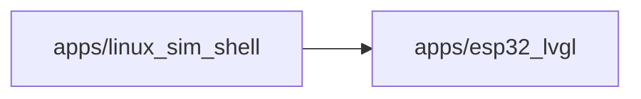

# Module boundary: apps/linux_sim_shell

Image type: Package Diagrams
Status: candidate
Confidence: high
Project version: 0.1.30-alpha
Git:34aad0bffa2f / main / dirty
Updated on: 2026-06-25T09:19:20.669Z

## Positioning

Explain the package/module boundaries, number of files, number of symbols and cross-module dependencies of apps/linux_sim_shell.

## How to read the diagram

- This Package Diagram is centered on apps/linux_sim_shell, showing the file size, symbol size and cross-module dependencies observed when it serves as a project module boundary.
- The arrows in the figure represent the cross-module relationships observed by the local warehouse evidence, which are mainly used to understand the direction of technical dependencies; it is not the business process sequence, nor the runtime message timing.
- The main external dependencies currently observed include: apps/esp32_lvgl.

## Technical complexity analysis

- apps/linux_sim_shell currently contains 15 files and 102 symbols that fall within the technical organizational boundaries identified by the Software Architecture Model.
- The cross-module relationship is as follows: it is referenced or called 6 times by other modules, and it actively depends on or calls external modules 12 times, so it depends on external modules more.
- There is currently no obvious abnormality in external dependence, but it is still necessary to judge whether the dependence direction is stable based on specific business entrances.

## Correlation with business complexity

- apps/linux_sim_shell is not the business story itself, but the technical boundaries that may pass when business capabilities are implemented.
- If the evidence, entry or drill-down diagram of a Use Case in the organization/process model falls in apps/linux_sim_shell, the Use Case should be linked back to this Package Diagram, indicating which engineering module the business story is hosted by.
 - The current association is still CANDIDATE: Technical boundaries can only be explained here based on warehouse evidence and are not a substitute for the organization/process model's confirmation of the business story, actors and business goals.

## Governance suggestions

- When adding a new function, give priority to confirming that it belongs to the stable responsibility of the module, rather than falling into the module because of the convenience of calling.
- Keep the dependency direction of this module interpretable to avoid forming an implicit public toolbox.
- When the business Use Case document references this module, the specific entry, call chain or configuration evidence should be recorded in the Use Case drill-down document.

## UML / Technical diagram

## Coverage

-Module path: apps/linux_sim_shell
-Number of files: 15
-Number of symbols: 102
-Dependent or called by other modules: 6
- Depend on or call external modules: 12

## Drill-down of semantic elements in the diagram

### apps/linux_sim_shell

- Element type: package
- Description: apps/linux_sim_shell is the central project boundary of the current Package Diagram, used to observe its own scale, dependency direction and drill-down technical complexity.
- Technical role: Technical organizational boundary: It aggregates files, symbols and cross-module relationships under apps/linux_sim_shell into a discussable engineering unit.
- Why it appears: Local repository evidence observes enough files, symbols, or cross-module relationships under apps/linux_sim_shell that it deserves to be promoted to a package-level entry in the software structure model.
- Relationship meaning: The arrows pointing from apps/linux_sim_shell to other nodes in the figure indicate that the current boundary depends on external package/module; it is dependent on or called 6 times by other modules and 12 times by external modules, which is used to determine whether it is more like a stable reuse boundary or an orchestration/bridging boundary.
- Drill down intention: Drill down into this node to continue viewing the key components, structural collaboration slices, running links, deployment nodes and complexity hotspots within apps/linux_sim_shell to understand how this project boundary carries functional changes.
-Business correlation: This node is not the business story itself, but the Use Case that falls into apps/linux_sim_shell in the organization/process model can refer to this as the technology bearing boundary. The current association is still CANDIDATE.
- Change impact: Modifying the public entry, dependency direction or directory boundary of apps/linux_sim_shell may affect the verification path of component diagrams, sequence fragments, deployment configurations and related business stories that reference it.
- Confidence: high
- Evidence:
  - package scope: apps/linux_sim_shell
 - Module path: apps/linux_sim_shell
 - Number of files: 15
 - Number of symbols: 102
 - Depends on or called by other modules: 6
 - Depends on or calls external modules: 12
  - apps/linux_sim_shell/APP_SHELL_MANIFEST.md
  - apps/linux_sim_shell/CMakeLists.txt
- Risks:
 - If you only regard this node as a directory name, you will miss its responsibility as a stable project boundary.
 - If signs of dependency on external modules continue to increase, it may be a sign that the boundary is taking on too much orchestration or bridging responsibility.
- Question:
 - The current repository evidence does not yet explicitly trace the package to a Use Case; therefore the business association remains a candidate.
- Drill down: There is currently no evidence-based link to a finer picture.

### apps/esp32_lvgl

- Element type: package
- Description: apps/esp32_lvgl is the currently observed external technical boundary dependency of apps/linux_sim_shell; it indicates that the current module is not implemented in isolation, but requires the help of another set of engineering capabilities to complete its responsibilities.
-Technical role: Cross-module technology dependency boundary: The current package requires another package/module to provide capabilities, contracts, configuration or running support.
- Why it appears: Local repository evidence observed a cross-module factual relationship between apps/linux_sim_shell and apps/esp32_lvgl, so the dependency was put into the Package Diagram instead of just hidden in the code import/call.
- Relationship meaning: apps/linux_sim_shell -> apps/esp32_lvgl indicates that local warehouse evidence observes a cross-module relationship; it explains the technical dependency direction, but does not directly prove the business process.
- Drill-down intention: Drill down into apps/esp32_lvgl to view its own Package Diagram, and then continue to enter its components, structures, sequences or hotspots to determine whether the current dependency falls on the entry, runtime, tool registration, model adaptation or infrastructure boundary.
- Business correlation: apps/linux_sim_shell If hosting a user-visible capability, the dependency on apps/esp32_lvgl may be the operating mechanism, extension point, or governance constraint of that capability. This business association needs to be confirmed by the Use Case evidence of the organization/process model.
- Impact of changes: Modifying the public interface, path or running mode of apps/esp32_lvgl may cause chain changes in the call chain, packaging entry, agent workflow or UI behavior of apps/linux_sim_shell.
- Confidence: high
- Evidence:
  - dependency edge: apps/linux_sim_shell -> apps/esp32_lvgl
  - apps/esp32_lvgl/APP_SHELL_MANIFEST.md
  - apps/esp32_lvgl/CMakeLists.txt
  - apps/esp32_lvgl/library.json
  - apps/esp32_lvgl/README.md
  - apps/esp32_lvgl/src/esp32_lvgl_app_shell.cpp
  - apps/esp32_lvgl/src/esp32_lvgl_app_shell.h
  - apps/esp32_lvgl/src/esp32_lvgl_arduino_app_registry.cpp
- Risks:
 - Cross-module dependencies can only prove technical relationships, but cannot directly prove business relationships.
 - If this dependency exists only for implementation convenience, future changes may cause boundary drift or implicit public toolboxes.
- Question:
 - There is currently no evidence that apps/linux_sim_shell's dependence on apps/esp32_lvgl is directly related to a Use Case, runtime command, or configuration decision.
 - The current dependency direction is a candidate according to the warehouse fact record, and no architectural decision document has been found to prove that it is a stable boundary.
 - Drill down: [Module Boundary: apps/esp32_lvgl](../apps-esp32_lvgl/package-diagram.md) - Open apps/esp32_lvgl's own package-level boundary and check whether apps/linux_sim_shell depends on it by borrowing run commands, shared capabilities, governance tools, model adaptation, or infrastructure responsibilities.
-Drill down: [Function node: main](../../component-diagrams/apps-esp32_lvgl-main/component-diagram.md) - Open function node: main to confirm which specific object within apps/esp32_lvgl is responsible for entry, orchestration, adaptation, contract or sharing responsibilities. Focus on checking the code anchor apps/esp32_lvgl/tests/esp32_lvgl_sd_coredump_contract_smoke.cpp, and whether its referenced/calling relationship and external dependency/calling relationship mean that changes will propagate.
-Drill down: [Function node: contains](../../component-diagrams/apps-esp32_lvgl-contains/component-diagram.md) - Open the function node: contains to confirm which specific object within apps/esp32_lvgl is responsible for entry, orchestration, adaptation, contract or sharing responsibilities. Focus on checking the code anchor apps/esp32_lvgl/tests/esp32_lvgl_sd_coredump_contract_smoke.cpp, and whether its referenced/calling relationship and external dependency/calling relationship mean that changes will propagate.
 - Drill down: [Function node: companion_enter](../../component-diagrams/apps-esp32_lvgl-companion_enter/component-diagram.md) - Open function node: companion_enter to confirm which specific object within apps/esp32_lvgl is responsible for entry, orchestration, adaptation, contract or sharing responsibilities. Focus on checking the code anchor apps/esp32_lvgl/src/esp32_lvgl_idf_app_registry.cpp, and whether its referenced/calling relationship and external dependency/calling relationship mean that changes will propagate.
-Drill down: [Dynamic collaboration: tick calls log_loop_interval](../../sequence-diagrams/tick-calls-log_loop_interval/sequence-diagram.md) - This sequence is opened to restore the static dependency of apps/esp32_lvgl to a readable collaboration: tick -> log_loop_interval. Focus on determining whether this is an import, call, reference or message direction, and whether it really affects the running path.
-Drill down: [Dynamic collaboration: add_status_line calls add_label](../../sequence-diagrams/add_status_line-calls-add_label/sequence-diagram.md) - This sequence is opened to restore the static dependency of apps/esp32_lvgl to a readable collaboration: add_status_line -> add_label. Focus on determining whether this is an import, call, reference or message direction, and whether it really affects the running path.
-Drill down: [Dynamic collaboration: add_u32_line calls add_label](../../sequence-diagrams/add_u32_line-calls-add_label/sequence-diagram.md) - This sequence is opened to restore the static dependency of apps/esp32_lvgl to a readable collaboration: add_u32_line -> add_label. Focus on determining whether this is an import, call, reference or message direction, and whether it really affects the running path.
-Drill down: [Dynamic collaboration: add_hex_line calls add_status_line](../../sequence-diagrams/add_hex_line-calls-add_status_line/sequence-diagram.md) - This sequence is opened to restore the static dependency of apps/esp32_lvgl into a readable collaboration: add_hex_line -> add_status_line. Focus on determining whether this is an import, call, reference or message direction, and whether it really affects the running path.
-Drill down: [Dynamic collaboration: companion_enter calls add_label](../../sequence-diagrams/companion_enter-calls-add_label/sequence-diagram.md) - This sequence is opened to restore the static dependency of apps/esp32_lvgl to a readable collaboration: companion_enter -> add_label. Focus on determining whether this is an import, call, reference or message direction, and whether it really affects the running path.

## Drill-down UML

- There is currently no evidence linking to a more detailed picture.

## Evidence

- apps/linux_sim_shell/APP_SHELL_MANIFEST.md
- apps/linux_sim_shell/CMakeLists.txt
- apps/linux_sim_shell/README.md
- apps/linux_sim_shell/src/linux_sim_app_shell.cpp
- apps/linux_sim_shell/src/linux_sim_app_shell.h
- apps/linux_sim_shell/src/linux_sim_runtime_entry_adoption_probe.cpp
- apps/linux_sim_shell/src/linux_sim_runtime_entry_adoption_probe.h
- apps/linux_sim_shell/src/linux_sim_runtime_entry.cpp

## Problem

- There are no open issues yet.

## Change record

### 0.1.30-alpha - 2026-06-25T09:19:20.669Z
