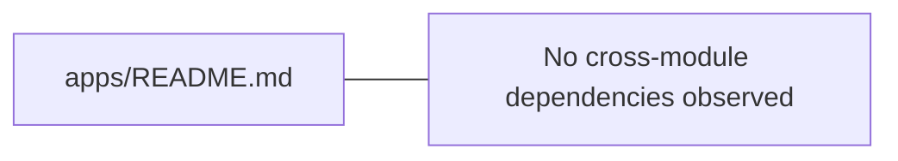

# Module boundary: apps/README.md

Image type: Package Diagrams
Status: candidate
Confidence: high
Project version: 0.1.30-alpha
Git:34aad0bffa2f / main / dirty
Updated on: 2026-06-25T09:19:20.669Z

## Positioning

Explain the package/module boundaries, number of files, number of symbols, and cross-module dependencies of apps/README.md.

## How to read the diagram

- This Package Diagram is centered on apps/README.md, showing the file size, symbol size, and cross-module dependencies observed when it serves as a project module boundary.
- The arrows in the figure represent the cross-module relationships observed by the local warehouse evidence, which are mainly used to understand the direction of technical dependencies; it is not the business process sequence, nor the runtime message timing.
- No clear external module dependencies are currently observed, which may indicate that the modules are relatively independent, or that the scanning granularity is not sufficient.

## Technical complexity analysis

- apps/README.md currently contains 1 file and 1 symbol belonging to the technical organization boundary identified by the Software Architecture Model.
- The cross-module relationship is as follows: it is referenced or called 0 times by other modules, and it actively depends on or calls external modules 0 times, so its signs of reuse and signs of external collaboration are relatively close.
- There is currently no obvious abnormality in external dependence, but it is still necessary to judge whether the dependence direction is stable based on specific business entrances.

## Correlation with business complexity

- apps/README.md is not the business story itself, but the technical boundaries that the business capabilities may pass through when implemented.
- If the evidence, entry or drill-down diagram of a Use Case in the organization/process model falls in apps/README.md, the Use Case should be linked back to this Package Diagram to indicate which engineering module the business story is hosted by.
 - The current association is still CANDIDATE: Technical boundaries can only be explained here based on warehouse evidence and are not a substitute for the organization/process model's confirmation of the business story, actors and business goals.

## Governance suggestions

- When adding a new function, give priority to confirming that it belongs to the stable responsibility of the module, rather than falling into the module because of the convenience of calling.
- Keep the dependency direction of this module interpretable to avoid forming an implicit public toolbox.
- When the business Use Case document references this module, the specific entry, call chain or configuration evidence should be recorded in the Use Case drill-down document.

## UML / Technical diagram

## Coverage

- Module path: apps/README.md
-Number of files: 1
-Number of symbols: 1
- Depends on or called by other modules: 0
- Depends on or calls external modules: 0

## Drill-down of semantic elements in the diagram

### apps/README.md

- Element type: package
- Note: apps/README.md is the central project boundary of the current Package Diagram, used to observe its own scale, dependency direction and drill-down technical complexity.
- Technical role: Technical organizational boundary: It aggregates files, symbols and cross-module relationships under apps/README.md into a discussable engineering unit.
- Why it appears: Local repository evidence observes enough files, symbols, or cross-module relationships under apps/README.md that it deserves to be promoted to a package-level entry in the software structure model.
- Relationship meaning: The arrows pointing from apps/README.md to other nodes in the figure indicate that the current boundary depends on external package/module; it is dependent or called 0 times by other modules, and depends on or called external modules 0 times, which is used to determine whether it is more like a stable reuse boundary or an orchestration/bridging boundary.
- Drill down intention: Drill down into this node to continue viewing the key components, structural collaboration slices, running links, deployment nodes and complexity hotspots within apps/README.md to understand how this project boundary carries functional changes.
-Business correlation: This node is not the business story itself, but the Use Case that falls into apps/README.md in the organization/process model can refer to this as the technology bearing boundary. The current association is still CANDIDATE.
- Change impact: Modifying the public entry, dependency direction or directory boundary of apps/README.md may affect the verification path of component diagrams, sequence fragments, deployment configurations and related business stories that reference it.
- Confidence: high
- Evidence:
  - package scope: apps/README.md
 - Module path: apps/README.md
 - Number of files: 1
 - Number of symbols: 1
 - Depends on or called by other modules: 0
 - Depends on or calls external modules: 0
  - apps/README.md
- Risks:
 - If you only regard this node as a directory name, you will miss its responsibility as a stable project boundary.
 - If signs of dependency on external modules continue to increase, it may be a sign that the boundary is taking on too much orchestration or bridging responsibility.
- Question:
 - No cross-module dependencies are observed in the current warehouse evidence; therefore, the module is temporarily processed according to the relative independence boundary, and the confidence level remains as a candidate.
- Drill down: There is currently no evidence-based link to a finer picture.

## Drill-down UML

- There is currently no evidence linking to a more detailed picture.

## Evidence

- apps/README.md

## Problem

- No cross-module dependencies are observed in the current warehouse evidence; therefore, the module is temporarily processed according to the relative independence boundary, and the confidence level remains as a candidate.

## Change record

### 0.1.30-alpha - 2026-06-25T09:19:20.669Z

-
