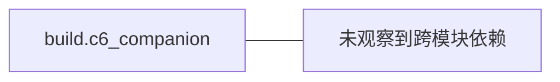

# 模块边界：build.c6_companion

图种：Package Diagrams
状态：candidate
置信度：high
项目版本：0.1.30-alpha
Git：34aad0bffa2f / main / dirty
更新于：2026-06-25T09:19:20.669Z

## 定位

解释 build.c6_companion 的包/模块边界、文件数量、符号数量和跨模块依赖。

## 图的读法

- 这张 Package Diagram 以 build.c6_companion 为中心，展示它作为工程模块边界时观察到的文件规模、符号规模和跨模块依赖。
- 图中的箭头表示本地仓库证据观察到的跨模块关系，主要用于理解技术依赖方向；它不是业务流程顺序，也不是运行时消息时序。
- 当前没有观察到明确的外部模块依赖，这可能表示模块相对独立，也可能表示扫描粒度尚不足。

## 技术复杂度分析

- build.c6_companion 当前包含 1641 个文件和 1527 个符号，属于软件结构模型识别出的技术组织边界。
- 跨模块关系呈现为：被其它模块引用或调用 0 次，主动依赖或调用外部模块 0 次，因此它复用迹象和外部协作迹象相对接近。
- 当前对外依赖未形成明显异常，但仍应结合具体业务入口判断依赖方向是否稳定。

## 与业务复杂度的关联

- build.c6_companion 不是业务故事本身，而是业务能力落地时可能经过的技术边界。
- 如果组织/过程模型中某个 Use Case 的证据、入口或下钻图落在 build.c6_companion，该 Use Case 应当反向链接到这张 Package Diagram，说明业务故事由哪个工程模块承载。
- 当前关联仍是 CANDIDATE：这里只能根据仓库证据解释技术边界，不能替代组织/过程模型对业务故事、参与者和业务目标的确认。

## 治理建议

- 新增功能时，优先确认它属于该模块的稳定职责，而不是因为调用方便而落入该模块。
- 保持该模块的依赖方向可解释，避免形成隐式公共工具箱。
- 当业务 Use Case 文档引用该模块时，应在 Use Case 下钻文档中记录具体入口、调用链或配置证据。

## UML / 技术图

## 覆盖范围

- 模块路径：build.c6_companion
- 文件数：1641
- 符号数：1527
- 被其他模块依赖或调用：0
- 依赖或调用外部模块：0

## 图内语义元素下钻

### build.c6_companion

- 元素类型：package
- 说明：build.c6_companion 是当前 Package Diagram 的中心工程边界，用来观察它自身规模、依赖方向和可下钻技术复杂度。
- 技术角色：技术组织边界：它把 build.c6_companion 下的文件、符号和跨模块关系聚合成一个可讨论的工程单元。
- 为什么出现：本地仓库证据在 build.c6_companion 下观察到足够文件、符号或跨模块关系，因此它值得被提升为软件结构模型中的 package 级入口。
- 关系意义：图中从 build.c6_companion 指向其它节点的箭头表示当前边界依赖外部 package/module；被其他模块依赖或调用 0 次、依赖或调用外部模块 0 次，用于判断它更像稳定复用边界还是编排/桥接边界。
- 下钻意图：下钻该节点可以继续查看 build.c6_companion 内的关键组件、结构协作切片、运行链路、部署节点和复杂度热点，从而理解这个工程边界如何承载功能变化。
- 业务关联：该节点不是业务故事本身，但组织/过程模型中落到 build.c6_companion 的 Use Case 可以把这里作为技术承载边界引用。当前关联仍是 CANDIDATE。
- 变更影响：修改 build.c6_companion 的公共入口、依赖方向或目录边界，可能影响引用它的组件图、sequence 片段、部署配置和相关业务故事的验证路径。
- 置信度：high
- 证据：
  - package scope: build.c6_companion
  - 模块路径：build.c6_companion
  - 文件数：1641
  - 符号数：1527
  - 被其他模块依赖或调用：0
  - 依赖或调用外部模块：0
  - build.c6_companion/app-flash_args
  - build.c6_companion/bootloader-flash_args
- 风险：
  - 如果只把该节点当作目录名，会遗漏它作为稳定工程边界的职责判断。
  - 如果依赖外部模块的迹象持续增加，可能说明该边界承担过多编排或桥接职责。
- 问题：
  - 当前仓库证据没有观察到跨模块依赖；因此该模块暂按相对独立边界处理，置信度保持为候选。
- 下钻：[大文件：build.c6_companion/bootloader/config/kconfig_menus.json 技术热点](../../technical-hotspots/large-file--build-c6_companion-bootloader-config-kconfig_menus-json/technical-hotspot.md) - 查看 大文件：build.c6_companion/bootloader/config/kconfig_menus.json 技术热点 这个复杂度信号是否会抬高 build.c6_companion 的阅读、修改、测试或回归成本。

## 可下钻 UML

- [大文件：build.c6_companion/bootloader/config/kconfig_menus.json 技术热点](../../technical-hotspots/large-file--build-c6_companion-bootloader-config-kconfig_menus-json/technical-hotspot.md) - 查看 大文件：build.c6_companion/bootloader/config/kconfig_menus.json 技术热点 这个复杂度信号是否会抬高 build.c6_companion 的阅读、修改、测试或回归成本。

## 证据

- build.c6_companion/app-flash_args
- build.c6_companion/bootloader-flash_args
- build.c6_companion/bootloader-prefix/src/bootloader-stamp/bootloader-configure
- build.c6_companion/bootloader-prefix/src/bootloader-stamp/bootloader-done
- build.c6_companion/bootloader-prefix/src/bootloader-stamp/bootloader-download
- build.c6_companion/bootloader-prefix/src/bootloader-stamp/bootloader-mkdir
- build.c6_companion/bootloader-prefix/src/bootloader-stamp/bootloader-patch
- build.c6_companion/bootloader-prefix/src/bootloader-stamp/bootloader-patch-info.txt

## 问题

- 当前仓库证据没有观察到跨模块依赖；因此该模块暂按相对独立边界处理，置信度保持为候选。

## 变更记录

### 0.1.30-alpha - 2026-06-25T09:19:20.669Z

- 从本地仓库证据生成 模块边界：build.c6_companion。
