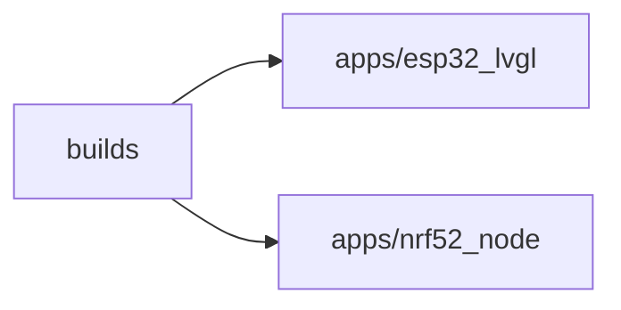

# 模块边界：builds

图种：Package Diagrams
状态：candidate
置信度：high
项目版本：0.1.30-alpha
Git：34aad0bffa2f / main / dirty
更新于：2026-06-25T09:19:20.669Z

## 定位

解释 builds 的包/模块边界、文件数量、符号数量和跨模块依赖。

## 图的读法

- 这张 Package Diagram 以 builds 为中心，展示它作为工程模块边界时观察到的文件规模、符号规模和跨模块依赖。
- 图中的箭头表示本地仓库证据观察到的跨模块关系，主要用于理解技术依赖方向；它不是业务流程顺序，也不是运行时消息时序。
- 当前观察到的主要外部依赖包括：apps/esp32_lvgl、apps/nrf52_node。

## 技术复杂度分析

- builds 当前包含 34 个文件和 46 个符号，属于软件结构模型识别出的技术组织边界。
- 跨模块关系呈现为：被其它模块引用或调用 0 次，主动依赖或调用外部模块 5 次，因此它依赖外部模块更多。
- 当前对外依赖未形成明显异常，但仍应结合具体业务入口判断依赖方向是否稳定。

## 与业务复杂度的关联

- builds 不是业务故事本身，而是业务能力落地时可能经过的技术边界。
- 如果组织/过程模型中某个 Use Case 的证据、入口或下钻图落在 builds，该 Use Case 应当反向链接到这张 Package Diagram，说明业务故事由哪个工程模块承载。
- 当前关联仍是 CANDIDATE：这里只能根据仓库证据解释技术边界，不能替代组织/过程模型对业务故事、参与者和业务目标的确认。

## 治理建议

- 新增功能时，优先确认它属于该模块的稳定职责，而不是因为调用方便而落入该模块。
- 保持该模块的依赖方向可解释，避免形成隐式公共工具箱。
- 当业务 Use Case 文档引用该模块时，应在 Use Case 下钻文档中记录具体入口、调用链或配置证据。

## UML / 技术图

## 覆盖范围

- 模块路径：builds
- 文件数：34
- 符号数：46
- 被其他模块依赖或调用：0
- 依赖或调用外部模块：5

## 图内语义元素下钻

### builds

- 元素类型：package
- 说明：builds 是当前 Package Diagram 的中心工程边界，用来观察它自身规模、依赖方向和可下钻技术复杂度。
- 技术角色：技术组织边界：它把 builds 下的文件、符号和跨模块关系聚合成一个可讨论的工程单元。
- 为什么出现：本地仓库证据在 builds 下观察到足够文件、符号或跨模块关系，因此它值得被提升为软件结构模型中的 package 级入口。
- 关系意义：图中从 builds 指向其它节点的箭头表示当前边界依赖外部 package/module；被其他模块依赖或调用 0 次、依赖或调用外部模块 5 次，用于判断它更像稳定复用边界还是编排/桥接边界。
- 下钻意图：下钻该节点可以继续查看 builds 内的关键组件、结构协作切片、运行链路、部署节点和复杂度热点，从而理解这个工程边界如何承载功能变化。
- 业务关联：该节点不是业务故事本身，但组织/过程模型中落到 builds 的 Use Case 可以把这里作为技术承载边界引用。当前关联仍是 CANDIDATE。
- 变更影响：修改 builds 的公共入口、依赖方向或目录边界，可能影响引用它的组件图、sequence 片段、部署配置和相关业务故事的验证路径。
- 置信度：high
- 证据：
  - package scope: builds
  - 模块路径：builds
  - 文件数：34
  - 符号数：46
  - 被其他模块依赖或调用：0
  - 依赖或调用外部模块：5
  - builds/esp_idf/CMakeLists.txt
  - builds/esp_idf/ESP_IDF_COMPONENT_SOURCES.cmake
- 风险：
  - 如果只把该节点当作目录名，会遗漏它作为稳定工程边界的职责判断。
  - 如果依赖外部模块的迹象持续增加，可能说明该边界承担过多编排或桥接职责。
- 问题：
  - 当前仓库证据尚未把该 package 明确 Trace 到某个 Use Case；因此业务关联保持候选。
- 下钻：当前没有根据证据关联到更细图。

### apps/esp32_lvgl

- 元素类型：package
- 说明：apps/esp32_lvgl 是 builds 当前观察到的外部技术边界依赖；它说明当前模块不是孤立实现，而是需要借助另一组工程能力完成职责。
- 技术角色：跨模块技术依赖边界：当前 package 需要另一个 package/module 提供能力、契约、配置或运行支撑。
- 为什么出现：本地仓库证据在 builds 与 apps/esp32_lvgl 之间观察到跨模块事实关系，因此该依赖被放入 Package Diagram，而不是只藏在代码 import/call 里。
- 关系意义：builds -> apps/esp32_lvgl 表示本地仓库证据观察到跨模块关系；它解释技术依赖方向，但不直接证明业务流程。
- 下钻意图：下钻 apps/esp32_lvgl 可以查看它自己的 Package Diagram，再继续进入其组件、结构、sequence 或热点，判断当前依赖究竟落在入口、运行时、工具注册、模型适配还是基础设施边界。
- 业务关联：builds 如果承载用户可见能力，那么对 apps/esp32_lvgl 的依赖可能是该能力的运行机制、扩展点或治理约束。该业务关联需要由组织/过程模型的 Use Case 证据确认。
- 变更影响：修改 apps/esp32_lvgl 的公共接口、路径或运行方式，可能让 builds 的调用链、打包入口、agent 工作流或 UI 行为发生连锁变化。
- 置信度：high
- 证据：
  - dependency edge: builds -> apps/esp32_lvgl
  - apps/esp32_lvgl/APP_SHELL_MANIFEST.md
  - apps/esp32_lvgl/CMakeLists.txt
  - apps/esp32_lvgl/library.json
  - apps/esp32_lvgl/README.md
  - apps/esp32_lvgl/src/esp32_lvgl_app_shell.cpp
  - apps/esp32_lvgl/src/esp32_lvgl_app_shell.h
  - apps/esp32_lvgl/src/esp32_lvgl_arduino_app_registry.cpp
- 风险：
  - 跨模块依赖只能证明技术关系，不能直接证明业务关系。
  - 如果该依赖只是因为实现方便而存在，未来变更可能形成边界漂移或隐式公共工具箱。
- 问题：
  - 当前证据尚未证明 builds 依赖 apps/esp32_lvgl 与某个 Use Case、runtime command 或配置决策直接相关。
  - 当前依赖方向按仓库事实记录为候选，尚未发现架构决策文档证明它是稳定边界。
- 下钻：[模块边界：apps/esp32_lvgl](../apps-esp32_lvgl/package-diagram.md) - 打开 apps/esp32_lvgl 自己的包级边界，检查 builds 依赖它时借用的是运行命令、共享能力、治理工具、模型适配还是基础设施职责。
- 下钻：[函数节点：main](../../component-diagrams/apps-esp32_lvgl-main/component-diagram.md) - 打开 函数节点：main 是为了确认 apps/esp32_lvgl 内部哪一个具体对象承担入口、编排、适配、契约或共享职责。重点查看代码锚点 apps/esp32_lvgl/tests/esp32_lvgl_sd_coredump_contract_smoke.cpp，以及它的被引用/调用关系和对外依赖/调用关系是否意味着变更会扩散。
- 下钻：[函数节点：contains](../../component-diagrams/apps-esp32_lvgl-contains/component-diagram.md) - 打开 函数节点：contains 是为了确认 apps/esp32_lvgl 内部哪一个具体对象承担入口、编排、适配、契约或共享职责。重点查看代码锚点 apps/esp32_lvgl/tests/esp32_lvgl_sd_coredump_contract_smoke.cpp，以及它的被引用/调用关系和对外依赖/调用关系是否意味着变更会扩散。
- 下钻：[函数节点：companion_enter](../../component-diagrams/apps-esp32_lvgl-companion_enter/component-diagram.md) - 打开 函数节点：companion_enter 是为了确认 apps/esp32_lvgl 内部哪一个具体对象承担入口、编排、适配、契约或共享职责。重点查看代码锚点 apps/esp32_lvgl/src/esp32_lvgl_idf_app_registry.cpp，以及它的被引用/调用关系和对外依赖/调用关系是否意味着变更会扩散。
- 下钻：[动态协作：tick 调用 log_loop_interval](../../sequence-diagrams/tick-calls-log_loop_interval/sequence-diagram.md) - 打开这条 sequence 是为了把 apps/esp32_lvgl 的静态依赖还原成一段可读协作：tick -> log_loop_interval。重点判断这是 import、调用、引用还是消息方向，以及它是否真的影响运行路径。
- 下钻：[动态协作：add_status_line 调用 add_label](../../sequence-diagrams/add_status_line-calls-add_label/sequence-diagram.md) - 打开这条 sequence 是为了把 apps/esp32_lvgl 的静态依赖还原成一段可读协作：add_status_line -> add_label。重点判断这是 import、调用、引用还是消息方向，以及它是否真的影响运行路径。
- 下钻：[动态协作：add_u32_line 调用 add_label](../../sequence-diagrams/add_u32_line-calls-add_label/sequence-diagram.md) - 打开这条 sequence 是为了把 apps/esp32_lvgl 的静态依赖还原成一段可读协作：add_u32_line -> add_label。重点判断这是 import、调用、引用还是消息方向，以及它是否真的影响运行路径。
- 下钻：[动态协作：add_hex_line 调用 add_status_line](../../sequence-diagrams/add_hex_line-calls-add_status_line/sequence-diagram.md) - 打开这条 sequence 是为了把 apps/esp32_lvgl 的静态依赖还原成一段可读协作：add_hex_line -> add_status_line。重点判断这是 import、调用、引用还是消息方向，以及它是否真的影响运行路径。
- 下钻：[动态协作：companion_enter 调用 add_label](../../sequence-diagrams/companion_enter-calls-add_label/sequence-diagram.md) - 打开这条 sequence 是为了把 apps/esp32_lvgl 的静态依赖还原成一段可读协作：companion_enter -> add_label。重点判断这是 import、调用、引用还是消息方向，以及它是否真的影响运行路径。

### apps/nrf52_node

- 元素类型：package
- 说明：apps/nrf52_node 是 builds 当前观察到的外部技术边界依赖；它说明当前模块不是孤立实现，而是需要借助另一组工程能力完成职责。
- 技术角色：跨模块技术依赖边界：当前 package 需要另一个 package/module 提供能力、契约、配置或运行支撑。
- 为什么出现：本地仓库证据在 builds 与 apps/nrf52_node 之间观察到跨模块事实关系，因此该依赖被放入 Package Diagram，而不是只藏在代码 import/call 里。
- 关系意义：builds -> apps/nrf52_node 表示本地仓库证据观察到跨模块关系；它解释技术依赖方向，但不直接证明业务流程。
- 下钻意图：下钻 apps/nrf52_node 可以查看它自己的 Package Diagram，再继续进入其组件、结构、sequence 或热点，判断当前依赖究竟落在入口、运行时、工具注册、模型适配还是基础设施边界。
- 业务关联：builds 如果承载用户可见能力，那么对 apps/nrf52_node 的依赖可能是该能力的运行机制、扩展点或治理约束。该业务关联需要由组织/过程模型的 Use Case 证据确认。
- 变更影响：修改 apps/nrf52_node 的公共接口、路径或运行方式，可能让 builds 的调用链、打包入口、agent 工作流或 UI 行为发生连锁变化。
- 置信度：high
- 证据：
  - dependency edge: builds -> apps/nrf52_node
  - apps/nrf52_node/APP_SHELL_MANIFEST.md
  - apps/nrf52_node/library.json
  - apps/nrf52_node/README.md
  - apps/nrf52_node/src/nrf52_node_app_facade_runtime.cpp
  - apps/nrf52_node/src/nrf52_node_app_facade_runtime.h
  - apps/nrf52_node/src/nrf52_node_app_runtime_access.cpp
  - apps/nrf52_node/src/nrf52_node_app_runtime_access.h
- 风险：
  - 跨模块依赖只能证明技术关系，不能直接证明业务关系。
  - 如果该依赖只是因为实现方便而存在，未来变更可能形成边界漂移或隐式公共工具箱。
- 问题：
  - 当前证据尚未证明 builds 依赖 apps/nrf52_node 与某个 Use Case、runtime command 或配置决策直接相关。
  - 当前依赖方向按仓库事实记录为候选，尚未发现架构决策文档证明它是稳定边界。
- 下钻：[模块边界：apps/nrf52_node](../apps-nrf52_node/package-diagram.md) - 打开 apps/nrf52_node 自己的包级边界，检查 builds 依赖它时借用的是运行命令、共享能力、治理工具、模型适配还是基础设施职责。

## 可下钻 UML

- 当前没有根据证据关联到更细图。

## 证据

- builds/esp_idf/CMakeLists.txt
- builds/esp_idf/ESP_IDF_COMPONENT_SOURCES.cmake
- builds/esp_idf/main/CMakeLists.txt
- builds/esp_idf/main/idf_component.yml
- builds/esp_idf/main/idf_entry.cpp
- builds/esp_idf/README.md
- builds/esp_idf/target_profiles.cmake
- builds/esp_idf/targets/README.md

## 问题

- 暂无未决问题。

## 变更记录

### 0.1.30-alpha - 2026-06-25T09:19:20.669Z

- 从本地仓库证据生成 模块边界：builds。
