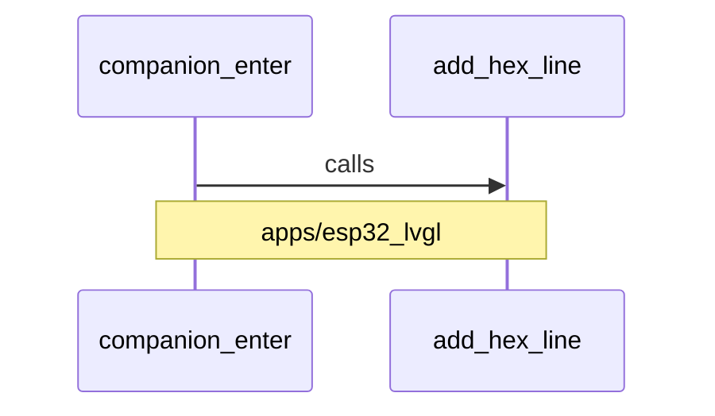

# 动态协作：companion_enter 调用 add_hex_line

图种：Sequence Diagrams
状态：candidate
置信度：high
项目版本：0.1.30-alpha
Git：34aad0bffa2f / main / dirty
更新于：2026-06-25T09:19:20.669Z

## 定位

apps/esp32_lvgl/src/esp32_lvgl_idf_app_registry.cpp 中的 companion_enter calls apps/esp32_lvgl/src/esp32_lvgl_idf_app_registry.cpp 中的 add_hex_line。

## 图的读法

- 这张 Sequence Diagram 聚焦 companion_enter 调用 add_hex_line 的技术协作片段。
- 它描述的是一个局部运行片段，不一定等同于完整业务流程。
- 当前关系来自本地调用证据；若没有 Use Case Trace，它只表示局部协作片段，不直接等同于主成功场景、回调、补偿或失败路径。

## 技术复杂度分析

- apps/esp32_lvgl/src/esp32_lvgl_idf_app_registry.cpp 与 apps/esp32_lvgl/src/esp32_lvgl_idf_app_registry.cpp 之间存在 calls 关系，所属技术边界是 apps/esp32_lvgl。
- Sequence Diagram 用于解释运行时或协作顺序，适合承接那些从 Package/Component 图看不清的动态行为。
- 如果未来证据显示存在异步消息、回调、超时或失败补偿，应为同一业务/技术场景拆出多张 sequence，而不是塞进一张大图。

## 与业务复杂度的关联

- 业务 Use Case 的主成功路径、失败路径和回调路径最终会落到若干技术 sequence 片段上。
- 当前片段可能解释某个业务故事中的技术执行步骤；如果没有 Use Case Trace，它只作为软件结构模型中的局部协作片段。
- 如果它被确认属于某个 Use Case，应在 docs/design 对应下钻 Sequence Diagram 中链接到这份工程 sequence 文档。

## 治理建议

- 不要只根据单条关系判断完整调用链；需要结合前后游关系补全场景。
- 当 sequence 涉及外部系统、模型调用、文件写入或 Git 操作时，应补充失败路径和重试/补偿说明。
- 如果该 sequence 支撑用户可见功能，应同步维护组织/过程模型的业务下钻图。

## UML / 技术图

## 覆盖范围

- 交互类型：calls
- 来源：apps/esp32_lvgl/src/esp32_lvgl_idf_app_registry.cpp
- 目标：apps/esp32_lvgl/src/esp32_lvgl_idf_app_registry.cpp
- 所属模块：apps/esp32_lvgl

## 图内语义元素下钻

### companion_enter

- 元素类型：component
- 说明：companion_enter 是当前 Sequence Diagram 的来源参与者，用来解释 apps/esp32_lvgl/src/esp32_lvgl_idf_app_registry.cpp 中的 companion_enter calls apps/esp32_lvgl/src/esp32_lvgl_idf_app_registry.cpp 中的 add_hex_line。
- 技术角色：消息发起/依赖方：它触发或引用目标能力。
- 为什么出现：本地仓库证据在 apps/esp32_lvgl/src/esp32_lvgl_idf_app_registry.cpp 与 apps/esp32_lvgl/src/esp32_lvgl_idf_app_registry.cpp 之间观察到 calls，因此 companion_enter 被放入 sequence。
- 关系意义：companion_enter -> add_hex_line 表示当前片段的依赖方向；如果关系只是 import，它只能说明静态依赖，不能直接证明运行时顺序。
- 下钻意图：下钻 companion_enter 可以查看对应 Component Diagram 或结构上下文，判断这个参与者在更大技术边界中的职责。
- 业务关联：业务 Use Case 的执行过程可能落到多个 sequence 片段上；当前片段只是候选技术步骤，需要组织/过程模型证据确认业务含义。
- 变更影响：修改 apps/esp32_lvgl/src/esp32_lvgl_idf_app_registry.cpp 可能改变该 sequence 的依赖关系、调用证据和相关组件/结构图的解释。
- 置信度：high
- 证据：
  - apps/esp32_lvgl/src/esp32_lvgl_idf_app_registry.cpp
  - 交互类型：calls
  - 来源：apps/esp32_lvgl/src/esp32_lvgl_idf_app_registry.cpp
  - 目标：apps/esp32_lvgl/src/esp32_lvgl_idf_app_registry.cpp
  - 所属模块：apps/esp32_lvgl
- 风险：
  - 单条 sequence 片段不足以证明完整调用链或业务主成功路径。
- 问题：
  - 当前关系类型需要按证据区分运行时调用、静态 import、类型引用或配置引用；若只是静态关系，本图不应被解释成真实调用顺序。
- 下钻：[函数节点：companion_enter](../../component-diagrams/apps-esp32_lvgl-companion_enter/component-diagram.md) - 打开 函数节点：companion_enter 的组件图，查看当前 sequence 参与者的真实职责、文件锚点和关系压力。

### add_hex_line

- 元素类型：component
- 说明：add_hex_line 是当前 Sequence Diagram 的目标参与者，用来解释 apps/esp32_lvgl/src/esp32_lvgl_idf_app_registry.cpp 中的 companion_enter calls apps/esp32_lvgl/src/esp32_lvgl_idf_app_registry.cpp 中的 add_hex_line。
- 技术角色：消息接收/被依赖方：它提供被当前片段引用或调用的能力。
- 为什么出现：本地仓库证据在 apps/esp32_lvgl/src/esp32_lvgl_idf_app_registry.cpp 与 apps/esp32_lvgl/src/esp32_lvgl_idf_app_registry.cpp 之间观察到 calls，因此 add_hex_line 被放入 sequence。
- 关系意义：companion_enter -> add_hex_line 表示目标能力被当前片段依赖；需要结合调用证据确认它是运行时调用、类型引用还是静态导入。
- 下钻意图：下钻 add_hex_line 可以查看对应 Component Diagram 或结构上下文，判断这个参与者在更大技术边界中的职责。
- 业务关联：业务 Use Case 的执行过程可能落到多个 sequence 片段上；当前片段只是候选技术步骤，需要组织/过程模型证据确认业务含义。
- 变更影响：修改 apps/esp32_lvgl/src/esp32_lvgl_idf_app_registry.cpp 可能改变该 sequence 的依赖关系、调用证据和相关组件/结构图的解释。
- 置信度：high
- 证据：
  - apps/esp32_lvgl/src/esp32_lvgl_idf_app_registry.cpp
  - 交互类型：calls
  - 来源：apps/esp32_lvgl/src/esp32_lvgl_idf_app_registry.cpp
  - 目标：apps/esp32_lvgl/src/esp32_lvgl_idf_app_registry.cpp
  - 所属模块：apps/esp32_lvgl
- 风险：
  - 单条 sequence 片段不足以证明完整调用链或业务主成功路径。
- 问题：
  - 当前关系类型需要按证据区分运行时调用、静态 import、类型引用或配置引用；若只是静态关系，本图不应被解释成真实调用顺序。
- 下钻：[函数节点：companion_enter](../../component-diagrams/apps-esp32_lvgl-companion_enter/component-diagram.md) - 打开 函数节点：companion_enter 的组件图，查看当前 sequence 参与者的真实职责、文件锚点和关系压力。

## 可下钻 UML

- [函数节点：companion_enter](../../component-diagrams/apps-esp32_lvgl-companion_enter/component-diagram.md) - 打开 函数节点：companion_enter 的组件图，查看当前 sequence 参与者的真实职责、文件锚点和关系压力。

## 证据

- apps/esp32_lvgl/src/esp32_lvgl_idf_app_registry.cpp
- apps/esp32_lvgl/src/esp32_lvgl_idf_app_registry.cpp

## 问题

- 暂无未决问题。

## 变更记录

### 0.1.30-alpha - 2026-06-25T09:19:20.669Z

- 从本地仓库证据生成 动态协作：companion_enter 调用 add_hex_line。
