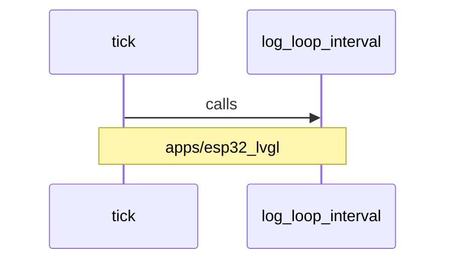

# Dynamic collaboration: tick calls log_loop_interval

Diagram type: Sequence Diagrams
Status: candidate
Confidence: high
Project version: 0.1.30-alpha
Git:34aad0bffa2f / main / dirty
Updated on: 2026-06-25T09:19:20.669Z

## Positioning

tick calls in apps/esp32_lvgl/src/esp32_lvgl_arduino_loop_runtime.cpp log_loop_interval in apps/esp32_lvgl/src/esp32_lvgl_arduino_loop_runtime.cpp.

## How to read the picture

- This Sequence Diagram focuses on the technical collaboration snippet of tick calling log_loop_interval.
- It describes a partial operation segment and is not necessarily equivalent to the complete business process.
- The current relationship comes from local call evidence; without Use Case Trace, it only represents a local collaboration fragment and is not directly equivalent to the main success scenario, callback, compensation or failure path.

## Technical Complexity Analysis

- There is a calls relationship between apps/esp32_lvgl/src/esp32_lvgl_arduino_loop_runtime.cpp and apps/esp32_lvgl/src/esp32_lvgl_arduino_loop_runtime.cpp, and the technical boundary is apps/esp32_lvgl.
- Sequence Diagram is used to explain runtime or collaboration sequences, and is suitable for undertaking dynamic behaviors that are not clearly visible from the Package/Component diagram.
- If future evidence shows that there are asynchronous messages, callbacks, timeouts or failure compensation, multiple sequences should be broken out for the same business/technical scenario rather than crammed into one big picture.

## Correlation with business complexity

- The main success path, failure path and callback path of the business Use Case will eventually fall on several technical sequence fragments.
- The current fragment may explain the technical execution steps in a business story; without Use Case Trace, it only serves as a partial collaboration fragment in the software structure model.
- If it is confirmed to belong to a Use Case, this project sequence document should be linked to the corresponding drill-down Sequence Diagram in docs/design.

## Governance suggestions

- Don't judge the complete call chain based on only a single relationship; you need to combine the upstream and downstream relationships to complete the scenario.
- When the sequence involves external systems, model calls, file writes, or Git operations, failure paths and retry/compensation instructions should be supplemented.
- If the sequence supports user-visible functions, the business drill-down diagram of the organization/process model should be maintained simultaneously.

## UML / technical diagram

## coverage

- Interaction type: calls
- Source: apps/esp32_lvgl/src/esp32_lvgl_arduino_loop_runtime.cpp
- Target: apps/esp32_lvgl/src/esp32_lvgl_arduino_loop_runtime.cpp
- Owning module: apps/esp32_lvgl

## Drill-down of semantic elements in the diagram

### tick

- Element type: component
- Description: tick is the source participant of the current Sequence Diagram, used to interpret tick calls in apps/esp32_lvgl/src/esp32_lvgl_arduino_loop_runtime.cpp log_loop_interval in.
- Technical role: Message originator/relying party: It triggers or references the target capability.
- Why it appears: Local repository evidence observes calls between apps/esp32_lvgl/src/esp32_lvgl_arduino_loop_runtime.cpp and apps/esp32_lvgl/src/esp32_lvgl_arduino_loop_runtime.cpp, so the tick is put into sequence.
- Relationship meaning: tick -> log_loop_interval indicates the dependency direction of the current fragment; if the relationship is only import, it can only indicate static dependencies and cannot directly prove the runtime order.
- Drill-down intention: Drill-down tick can view the corresponding Component Diagram or structural context to determine the responsibilities of this participant in the larger technical boundary.
-Business correlation: The execution process of the business Use Case may fall on multiple sequence fragments; the current fragment is only a candidate technical step and requires organizational/process model evidence to confirm the business meaning.
- Impact of changes: Modifications to apps/esp32_lvgl/src/esp32_lvgl_arduino_loop_runtime.cpp may change the sequence's dependencies, call evidence, and interpretation of related component/structure diagrams.
- Confidence: high
- Evidence:
  - apps/esp32_lvgl/src/esp32_lvgl_arduino_loop_runtime.cpp
 - Interaction type: calls
 - Source: apps/esp32_lvgl/src/esp32_lvgl_arduino_loop_runtime.cpp
 - Target: apps/esp32_lvgl/src/esp32_lvgl_arduino_loop_runtime.cpp
 - Belonging module: apps/esp32_lvgl
 - Risk:
 - A single sequence fragment is not enough to prove the complete call chain or the successful path of the business main.
- Question:
 - The current relationship type needs to be distinguished by evidence between runtime calls, static imports, type references, or configuration references; if it is only a static relationship, this diagram should not be interpreted as a real calling sequence.
- Drill down: There is currently no evidence-based link to a finer picture.

### log_loop_interval

- Element type: component
- Description: log_loop_interval is the target participant of the current Sequence Diagram, used to interpret tick calls in apps/esp32_lvgl/src/esp32_lvgl_arduino_loop_runtime.cpp log_loop_interval.
- Technical role: Message receiver/relying party: It provides the ability to be referenced or called by the current fragment.
- Why it appears: Local repository evidence calls were observed between apps/esp32_lvgl/src/esp32_lvgl_arduino_loop_runtime.cpp and apps/esp32_lvgl/src/esp32_lvgl_arduino_loop_runtime.cpp, so log_loop_interval was put into sequence.
- Relationship meaning: tick -> log_loop_interval indicates that the target capability is dependent on the current fragment; it needs to be combined with the call evidence to confirm whether it is a runtime call, a type reference or a static import.
- Drill-down intention: Drill-down log_loop_interval can view the corresponding Component Diagram or structural context to determine the responsibilities of this participant in the larger technical boundary.
-Business correlation: The execution process of the business Use Case may fall on multiple sequence fragments; the current fragment is only a candidate technical step and requires organizational/process model evidence to confirm the business meaning.
- Impact of changes: Modifications to apps/esp32_lvgl/src/esp32_lvgl_arduino_loop_runtime.cpp may change the sequence's dependencies, call evidence, and interpretation of related component/structure diagrams.
- Confidence: high
- Evidence:
  - apps/esp32_lvgl/src/esp32_lvgl_arduino_loop_runtime.cpp
 - Interaction type: calls
 - Source: apps/esp32_lvgl/src/esp32_lvgl_arduino_loop_runtime.cpp
 - Target: apps/esp32_lvgl/src/esp32_lvgl_arduino_loop_runtime.cpp
 - Belonging module: apps/esp32_lvgl
 - Risk:
 - A single sequence fragment is not enough to prove the complete call chain or the successful path of the business main.
- Question:
 - The current relationship type needs to be distinguished by evidence between runtime calls, static imports, type references, or configuration references; if it is only a static relationship, this diagram should not be interpreted as a real calling sequence.
- Drill down: There is currently no evidence-based link to a finer picture.

## Drill-down UML

- There is currently no evidence linking to a more detailed picture.

## Evidence

- apps/esp32_lvgl/src/esp32_lvgl_arduino_loop_runtime.cpp
- apps/esp32_lvgl/src/esp32_lvgl_arduino_loop_runtime.cpp

## Problem

- There are no open issues yet.

## Change record

### 0.1.30-alpha - 2026-06-25T09:19:20.669Z

- Generated from local warehouse evidence Dynamic collaboration: tick calls log_loop_interval.
