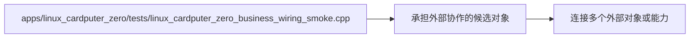

# 承担外部协作的候选对象：main 技术热点

图种：Technical Hotspots
状态：candidate
置信度：high
项目版本：0.1.30-alpha
Git：34aad0bffa2f / main / dirty
更新于：2026-06-25T09:19:20.669Z

## 定位

该符号连接多个外部对象或能力，可能承担编排、聚合或过宽责任。

## 图的读法

- 这张技术热点图解释 承担外部协作的候选对象：main，热点类型是 承担外部协作的候选对象。
- 热点是软件结构模型中的候选提醒：它提示复杂度集中点，但不直接等同于缺陷或必须整改项。
- 目标位置是 apps/linux_cardputer_zero/tests/linux_cardputer_zero_business_wiring_smoke.cpp，当前复杂度信号是：连接多个外部对象或能力。

## 技术复杂度分析

- 该符号连接多个外部对象或能力，可能承担编排、聚合或过宽责任。
- 依赖多个外部对象意味着该目标可能承担了过宽的编排或聚合职责。
- 热点分析需要和 Package、Component、Sequence 图交叉阅读，避免把单一指标误判为设计结论。

## 与业务复杂度的关联

- 技术热点会间接影响业务交付：它可能让某些 Use Case 的变更成本、验证成本和回归风险升高。
- 如果 apps/linux_cardputer_zero/tests/linux_cardputer_zero_business_wiring_smoke.cpp 被某个 Use Case 的证据引用，那么这个热点应出现在该 Use Case 的风险或治理说明中。
- 如果组织/过程模型没有 Use Case 证据引用该热点，它只作为工程治理候选，不作为业务风险结论。

## 治理建议

- 不要因为热点存在就立即重构；先确认它影响了哪些业务故事、哪些变更频率最高、哪些测试覆盖最薄弱。
- 如果决定治理，应把治理目标拆成可验证的原子提交，并记录语义化版本变化。
- 治理完成后，应重新生成软件结构模型文档，确认复杂度候选点是否被解释或缓解，并把结论写入 changelog。

## UML / 技术图

## 覆盖范围

- 热点类型：承担外部协作的候选对象
- 目标：apps/linux_cardputer_zero/tests/linux_cardputer_zero_business_wiring_smoke.cpp
- 复杂度信号：连接多个外部对象或能力

## 图内语义元素下钻

### apps/linux_cardputer_zero/tests/linux_cardputer_zero_business_wiring_smoke.cpp

- 元素类型：file
- 说明：apps/linux_cardputer_zero/tests/linux_cardputer_zero_business_wiring_smoke.cpp 是当前热点指向的具体文件、模块或目标位置，所有热点解释必须能回到这个证据锚点。
- 技术角色：热点证据目标：它承载复杂度信号，而不是抽象风险标签。
- 为什么出现：本地仓库证据或仓库扫描在 apps/linux_cardputer_zero/tests/linux_cardputer_zero_business_wiring_smoke.cpp 观察到复杂度信号，因此它被放入 Technical Hotspot Diagram。
- 关系意义：target -> hotspot 表示该位置产生或承载当前复杂度提醒；它需要反向关联到 package、component、结构或 sequence 才能判断真实影响。
- 下钻意图：下钻目标位置可以查看所属 package 或附近 component，确认热点是否影响真实业务能力和可维护性。
- 业务关联：如果 apps/linux_cardputer_zero/tests/linux_cardputer_zero_business_wiring_smoke.cpp 被 Use Case 证据引用，那么该热点会提高对应业务变更的阅读、验证或回归成本。
- 变更影响：治理 apps/linux_cardputer_zero/tests/linux_cardputer_zero_business_wiring_smoke.cpp 可能影响文件结构、导入路径、测试覆盖和语义化版本记录。
- 置信度：high
- 证据：
  - apps/linux_cardputer_zero/tests/linux_cardputer_zero_business_wiring_smoke.cpp
  - apps/linux_cardputer_zero/tests/linux_cardputer_zero_business_wiring_smoke.cpp#L49
  - 热点类型：承担外部协作的候选对象
  - 目标：apps/linux_cardputer_zero/tests/linux_cardputer_zero_business_wiring_smoke.cpp
  - 复杂度信号：连接多个外部对象或能力
- 风险：
  - 热点目标不等于缺陷；需要确认它是否真的影响高频业务变化或关键运行路径。
- 问题：
  - 当前热点只说明 apps/linux_cardputer_zero/tests/linux_cardputer_zero_business_wiring_smoke.cpp 存在复杂度信号；若证据来自生成文件、聚合导出或扫描噪声，应降级或移除。
- 下钻：[模块边界：apps/linux_cardputer_zero](../../package-diagrams/apps-linux_cardputer_zero/package-diagram.md) - 回到 apps/linux_cardputer_zero 的包级边界，判断热点是否只是局部文件问题，还是影响整个模块治理。
- 下钻：[函数节点：main](../../component-diagrams/apps-linux_cardputer_zero-main/component-diagram.md) - 查看 函数节点：main 是否是热点直接影响的组件，从具体职责和调用关系判断治理优先级。
- 下钻：[函数节点：contains](../../component-diagrams/apps-linux_cardputer_zero-contains/component-diagram.md) - 查看 函数节点：contains 是否是热点直接影响的组件，从具体职责和调用关系判断治理优先级。
- 下钻：[函数节点：not_contains](../../component-diagrams/apps-linux_cardputer_zero-not_contains/component-diagram.md) - 查看 函数节点：not_contains 是否是热点直接影响的组件，从具体职责和调用关系判断治理优先级。
- 下钻：[函数节点：read_file](../../component-diagrams/apps-linux_cardputer_zero-read_file/component-diagram.md) - 查看 函数节点：read_file 是否是热点直接影响的组件，从具体职责和调用关系判断治理优先级。

### 承担外部协作的候选对象：main 技术热点

- 元素类型：technical_hotspot
- 说明：承担外部协作的候选对象：main 技术热点 是当前技术复杂度热点，用来提醒治理前先理解影响面，而不是立即重构。
- 技术角色：候选风险/治理入口：它把复杂度信号转化为可讨论的工程问题。
- 为什么出现：该热点由本地仓库事实生成，说明某个文件、模块或依赖簇可能让理解、修改或验证成本升高。
- 关系意义：热点节点连接目标位置，表示风险来自具体工程事实；它需要和 package/component/sequence 交叉阅读。
- 下钻意图：下钻热点相关的 package、component 或 sequence，可以确认它影响的是边界、对象、调用链还是运行配置。
- 业务关联：技术热点会间接影响业务交付：它可能让某些 Use Case 的变更成本、验证成本和回归风险上升。
- 变更影响：治理热点应拆成可验证的原子提交，并同步记录语义化版本、Git 版本和文档变更。
- 置信度：high
- 证据：
  - apps/linux_cardputer_zero/tests/linux_cardputer_zero_business_wiring_smoke.cpp#L49
  - 热点类型：承担外部协作的候选对象
  - 目标：apps/linux_cardputer_zero/tests/linux_cardputer_zero_business_wiring_smoke.cpp
  - 复杂度信号：连接多个外部对象或能力
- 风险：
  - 不要把热点当作已确认缺陷；先确认业务影响和证据质量。
- 问题：
  - 该热点只是候选复杂度信号；当前文档只记录影响面和证据位置，不把它升级为已确认缺陷。
- 下钻：[模块边界：apps/linux_cardputer_zero](../../package-diagrams/apps-linux_cardputer_zero/package-diagram.md) - 回到 apps/linux_cardputer_zero 的包级边界，判断热点是否只是局部文件问题，还是影响整个模块治理。
- 下钻：[函数节点：main](../../component-diagrams/apps-linux_cardputer_zero-main/component-diagram.md) - 查看 函数节点：main 是否是热点直接影响的组件，从具体职责和调用关系判断治理优先级。
- 下钻：[函数节点：contains](../../component-diagrams/apps-linux_cardputer_zero-contains/component-diagram.md) - 查看 函数节点：contains 是否是热点直接影响的组件，从具体职责和调用关系判断治理优先级。
- 下钻：[函数节点：not_contains](../../component-diagrams/apps-linux_cardputer_zero-not_contains/component-diagram.md) - 查看 函数节点：not_contains 是否是热点直接影响的组件，从具体职责和调用关系判断治理优先级。
- 下钻：[函数节点：read_file](../../component-diagrams/apps-linux_cardputer_zero-read_file/component-diagram.md) - 查看 函数节点：read_file 是否是热点直接影响的组件，从具体职责和调用关系判断治理优先级。

## 可下钻 UML

- [模块边界：apps/linux_cardputer_zero](../../package-diagrams/apps-linux_cardputer_zero/package-diagram.md) - 回到 apps/linux_cardputer_zero 的包级边界，判断热点是否只是局部文件问题，还是影响整个模块治理。
- [函数节点：main](../../component-diagrams/apps-linux_cardputer_zero-main/component-diagram.md) - 查看 函数节点：main 是否是热点直接影响的组件，从具体职责和调用关系判断治理优先级。
- [函数节点：contains](../../component-diagrams/apps-linux_cardputer_zero-contains/component-diagram.md) - 查看 函数节点：contains 是否是热点直接影响的组件，从具体职责和调用关系判断治理优先级。
- [函数节点：not_contains](../../component-diagrams/apps-linux_cardputer_zero-not_contains/component-diagram.md) - 查看 函数节点：not_contains 是否是热点直接影响的组件，从具体职责和调用关系判断治理优先级。
- [函数节点：read_file](../../component-diagrams/apps-linux_cardputer_zero-read_file/component-diagram.md) - 查看 函数节点：read_file 是否是热点直接影响的组件，从具体职责和调用关系判断治理优先级。

## 证据

- apps/linux_cardputer_zero/tests/linux_cardputer_zero_business_wiring_smoke.cpp#L49

## 问题

- 该热点只是候选复杂度信号；当前文档只记录影响面和证据位置，不把它升级为已确认缺陷。

## 变更记录

### 0.1.30-alpha - 2026-06-25T09:19:20.669Z

- 从本地仓库证据生成 承担外部协作的候选对象：main 技术热点。
