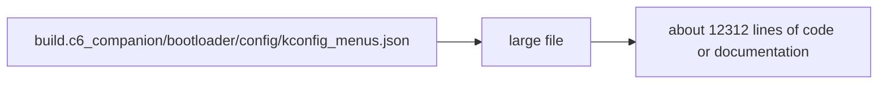

# Large file: build.c6_companion/bootloader/config/kconfig_menus.json Technology Hotspot

Image type: Technical Hotspots
Status: candidate
Confidence: high
Project version: 0.1.30-alpha
Git:34aad0bffa2f / main / dirty
Updated on: 2026-06-25T09:19:20.669Z

## Positioning

The file is approximately 12,312 lines long and may be a burden to read, change, and review.

## How to read the picture

- This technology hotspot map explains large files: build.c6_companion/bootloader/config/kconfig_menus.json. The hotspot type is large files.
- A hotspot is a candidate reminder in the software structure model: it indicates a concentration point of complexity, but is not directly equivalent to a defect or an item that must be corrected.
 - Target location is build.c6_companion/bootloader/config/kconfig_menus.json, current complexity signal is: ~12312 lines of code or documentation.

## Technical complexity analysis

- This file is approximately 12312 lines long and may be a burden to read, change, and review.
- Large files will increase the cost of reading, review, conflict merging and local modification, which is especially difficult for the agent to accurately locate the context.
- Hotspot analysis needs to be cross-read with Package, Component, and Sequence diagrams to avoid misjudgment of a single indicator as a design conclusion.

## Correlation with business complexity

-Technical hot spots will indirectly affect business delivery: it may increase the change cost, verification cost and regression risk of some Use Cases.
- If build.c6_companion/bootloader/config/kconfig_menus.json is referenced by evidence for a Use Case, then this hotspot should appear in the risk or governance description for that Use Case.
- If the organization/process model has no Use Case evidence referencing the hotspot, it is only a candidate for engineering governance and not a business risk conclusion.

## Governance suggestions

- Don't refactor immediately just because hot spots exist; first confirm which business stories it affects, which changes have the highest frequency, and which test coverage is the weakest.
- If governance is decided, the governance goals should be broken down into verifiable atomic commits and semantic version changes should be recorded.
- After the governance is completed, the software structure model document should be regenerated to confirm whether the complexity candidate points have been explained or alleviated, and the conclusions should be written into the changelog.

## UML / Technical diagram

## Coverage

- Hotspot type: large file
- Target: build.c6_companion/bootloader/config/kconfig_menus.json
- Complexity signal: about 12312 lines of code or documents

## Drill-down of semantic elements in the diagram

### build.c6_companion/bootloader/config/kconfig_menus.json

-Element type: file
- Description: build.c6_companion/bootloader/config/kconfig_menus.json is the specific file, module or target location pointed by the current hotspot, and all hotspot explanations must be able to return to this evidence anchor point.
- Technical role: Hot evidence target: It carries complexity signals rather than abstract risk labels.
- Why it appears: Local repository evidence or repository scan observed a complexity signal in build.c6_companion/bootloader/config/kconfig_menus.json, so it was put into the Technical Hotspot Diagram.
- Relationship meaning: target -> hotspot means that the location generates or carries the current complexity reminder; it needs to be reversely associated with the package, component, structure or sequence to determine the real impact.
- Drill down intention: Drill down to the target location to view the package or nearby components to confirm whether the hot spots affect the real business capabilities and maintainability.
- Business correlation: If build.c6_companion/bootloader/config/kconfig_menus.json is referenced by Use Case evidence, then this hotspot will increase the reading, verification or regression cost of the corresponding business change.
- Change impact: Governance build.c6_companion/bootloader/config/kconfig_menus.json may affect file structure, import paths, test coverage and semantic versioning.
- Confidence: high
- Evidence:
  - build.c6_companion/bootloader/config/kconfig_menus.json
 - Hotspot type: large files
 - Target: build.c6_companion/bootloader/config/kconfig_menus.json
 - Complexity signal: ~12312 lines of code or documentation
 - Risk:
 - A hot target does not equal a defect; it needs to be confirmed whether it actually affects high-frequency business changes or critical operating paths.
- Question:
 - The current hotspot only indicates that there is a complexity signal in build.c6_companion/bootloader/config/kconfig_menus.json; if the evidence comes from generated files, aggregate exports or scan noise, it should be downgraded or removed.
-Drill down: [Module boundary: build.c6_companion](../../package-diagrams/build-c6_companion/package-diagram.md) - Return to the package-level boundary of build.c6_companion to determine whether the hotspot is just a local file problem or affects the entire module management.

### Large file: build.c6_companion/bootloader/config/kconfig_menus.json Technical hotspot

- Element type: technical_hotspot
- Description: Large file: build.c6_companion/bootloader/config/kconfig_menus.json Technical hotspot is the current technical complexity hotspot, used to remind you to understand the impact before governance, rather than rebuild immediately.
- Technical Role: Candidate Risk/Governance Portal: It translates complexity signals into discussable engineering issues.
- Why it appears: This hotspot is generated by local warehouse facts, indicating that a certain file, module or dependency cluster may increase the cost of understanding, modifying or verifying.
- Relationship meaning: The hotspot node connects the target location and indicates that the risk comes from specific engineering facts; it needs to be read cross-reading with package/component/sequence.
- Drill-down intention: Drill down into the package, component or sequence related to the hotspot, and you can confirm whether it affects the boundary, object, call chain or running configuration.
-Business correlation: Technical hotspots will indirectly affect business delivery: it may increase the change cost, verification cost and regression risk of certain Use Cases.
- Change impact: Governance hot spots should be broken into verifiable atomic commits, and semantic versions, Git versions, and document changes should be recorded simultaneously.
- Confidence: high
- Evidence:
  - build.c6_companion/bootloader/config/kconfig_menus.json
 - Hotspot type: large files
 - Target: build.c6_companion/bootloader/config/kconfig_menus.json
 - Complexity signal: ~12312 lines of code or documentation
 - Risk:
 - Don't treat hot spots as confirmed defects; confirm business impact and quality of evidence first.
- Question:
 - This hotspot is only a candidate complexity signal; the current document only records the impact surface and evidence location, and does not upgrade it to a confirmed defect.
-Drill down: [Module boundary: build.c6_companion](../../package-diagrams/build-c6_companion/package-diagram.md) - Return to the package-level boundary of build.c6_companion to determine whether the hotspot is just a local file problem or affects the entire module management.

## Drill-down UML

- [Module boundary: build.c6_companion](../../package-diagrams/build-c6_companion/package-diagram.md) - Return to the package-level boundary of build.c6_companion to determine whether the hotspot is just a local file problem or affects the entire module management.

## Evidence

- build.c6_companion/bootloader/config/kconfig_menus.json

## Problem

- This hotspot is only a candidate complexity signal; the current document only records the impact surface and evidence location, and does not upgrade it to a confirmed defect.

## Change record

### 0.1.30-alpha - 2026-06-25T09:19:20.669Z

- Generate large file from local warehouse evidence: build.c6_companion/bootloader/config/kconfig_menus.json Technical hotspot.
