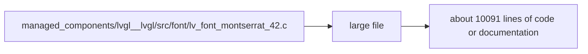

# Large file: managed_components/lvgl__lvgl/src/font/lv_font_montserrat_42.c Technology Hotspot

Image type: Technical Hotspots
Status: candidate
Confidence: high
Project version: 0.1.30-alpha
Git:34aad0bffa2f / main / dirty
Updated on: 2026-06-25T09:19:20.669Z

## Positioning

The file is approximately 10,091 lines long and may be a burden to read, change, and review.

## How to read the diagram

- This technology hotspot map explains large files: managed_components/lvgl__lvgl/src/font/lv_font_montserrat_42.c, the hotspot type is large files.
- A hotspot is a candidate reminder in the software structure model: it indicates a concentration point of complexity, but is not directly equivalent to a defect or an item that must be corrected.
 - Target location is managed_components/lvgl__lvgl/src/font/lv_font_montserrat_42.c, current complexity signal is: ~10091 lines of code or documentation.

## Technical complexity analysis

 - This file is approximately 10091 lines long and may be a burden to read, change, and review.
- Large files will increase the cost of reading, review, conflict merging and local modification, which is especially difficult for the agent to accurately locate the context.
- Hotspot analysis needs to be cross-read with Package, Component, and Sequence diagrams to avoid misjudgment of a single indicator as a design conclusion.

## Correlation with business complexity

-Technical hot spots will indirectly affect business delivery: it may increase the change cost, verification cost and regression risk of some Use Cases.
- If managed_components/lvgl__lvgl/src/font/lv_font_montserrat_42.c is referenced in evidence for a Use Case, then this hotspot should appear in the risk or governance description for that Use Case.
- If the organization/process model has no Use Case evidence referencing the hotspot, it is only a candidate for engineering governance and not a business risk conclusion.

## Governance suggestions

- Don't refactor immediately just because hot spots exist; first confirm which business stories it affects, which changes have the highest frequency, and which test coverage is the weakest.
- If governance is decided, the governance goals should be broken down into verifiable atomic commits and semantic version changes should be recorded.
- After the governance is completed, the software structure model document should be regenerated to confirm whether the complexity candidate points have been explained or alleviated, and the conclusions should be written into the changelog.

## UML / Technical diagram

## Coverage

- Hotspot type: large file
- Target: managed_components/lvgl__lvgl/src/font/lv_font_montserrat_42.c
- Complexity signal: about 10091 lines of code or documentation

## Drill-down of semantic elements in the diagram

### managed_components/lvgl__lvgl/src/font/lv_font_montserrat_42.c

- Element type: file
- Description: managed_components/lvgl__lvgl/src/font/lv_font_montserrat_42.c is the specific file, module or target location pointed by the current hotspot, and all hotspot interpretations must be able to return to this evidence anchor point.
- Technical role: Hot evidence target: It carries complexity signals rather than abstract risk labels.
- Why it appears: Local repository evidence or a repository scan observed a complexity signal at managed_components/lvgl__lvgl/src/font/lv_font_montserrat_42.c, so it was put into the Technical Hotspot Diagram.
- Relationship meaning: target -> hotspot means that the location generates or carries the current complexity reminder; it needs to be reversely associated with the package, component, structure or sequence to determine the real impact.
- Drill down intention: Drill down to the target location to view the package or nearby components to confirm whether the hot spots affect the real business capabilities and maintainability.
- Business correlation: If managed_components/lvgl__lvgl/src/font/lv_font_montserrat_42.c is referenced by Use Case evidence, then this hotspot will increase the reading, verification or regression cost of the corresponding business change.
 - Change Impact: Governance managed_components/lvgl__lvgl/src/font/lv_font_montserrat_42.c may affect file structure, import paths, test coverage and semantic versioning.
- Confidence: high
- Evidence:
  - managed_components/lvgl__lvgl/src/font/lv_font_montserrat_42.c
 - Hotspot type: large files
 - Target: managed_components/lvgl__lvgl/src/font/lv_font_montserrat_42.c
 - Complexity signal: ~10091 lines of code or documentation
- Risks:
 - Hot targets are not equal to defects; it needs to be confirmed whether it really affects high-frequency business changes or critical operating paths.
- Question:
 - The current hotspot only indicates the presence of complexity signals in managed_components/lvgl__lvgl/src/font/lv_font_montserrat_42.c; if the evidence comes from generated files, aggregate exports, or scan noise, it should be downgraded or removed.
-Drill down: [Module boundary: managed_components](../../package-diagrams/managed_components/package-diagram.md) - Return to the package-level boundary of managed_components to determine whether the hotspot is just a local file problem, or affects the entire module management.

### Large file: managed_components/lvgl__lvgl/src/font/lv_font_montserrat_42.c Technical Hotspot

- Element type: technical_hotspot
- Description: Large file: managed_components/lvgl__lvgl/src/font/lv_font_montserrat_42.c Technical Hotspot It is a hot topic of current technical complexity. It is used to remind you to understand the impact before governance, rather than reconstruct immediately.
- Technical Role: Candidate Risk/Governance Portal: It translates complexity signals into discussable engineering issues.
- Why it appears: This hotspot is generated by local warehouse facts, indicating that a file, module or dependency cluster may increase the cost of understanding, modification or verification.
- Relationship meaning: The hotspot node connects the target location, indicating that the risk comes from specific engineering facts; it needs to be cross-read with package/component/sequence.
- Drill-down intent: Drill down into the package, component or sequence related to the hotspot to confirm whether it affects the boundary, object, call chain or run configuration.
-Business correlation: Technical hotspots will indirectly affect business delivery: it may increase the change cost, verification cost and regression risk of certain Use Cases.
- Change impact: Governance hot spots should be broken into verifiable atomic commits, and semantic versions, Git versions, and document changes should be recorded simultaneously.
- Confidence: high
- Evidence:
  - managed_components/lvgl__lvgl/src/font/lv_font_montserrat_42.c
 - Hotspot type: large files
 - Target: managed_components/lvgl__lvgl/src/font/lv_font_montserrat_42.c
 - Complexity signal: ~10091 lines of code or documentation
- Risks:
 - Don't treat hot spots as confirmed defects; confirm business impact and quality of evidence first.
- Question:
 - This hotspot is only a candidate complexity signal; the current document only records the impact surface and evidence location, and does not upgrade it to a confirmed defect.
-Drill down: [Module boundary: managed_components](../../package-diagrams/managed_components/package-diagram.md) - Return to the package-level boundary of managed_components to determine whether the hotspot is just a local file problem, or affects the entire module management.

## Drill-down UML

- [Module boundary: managed_components](../../package-diagrams/managed_components/package-diagram.md) - Return to the package-level boundary of managed_components to determine whether the hotspot is just a local file problem, or affects the entire module management.

## Evidence

- managed_components/lvgl__lvgl/src/font/lv_font_montserrat_42.c

## Problem

- This hotspot is only a candidate complexity signal; the current document only records the impact surface and evidence location, and does not upgrade it to a confirmed defect.

## Change record

### 0.1.30-alpha - 2026-06-25T09:19:20.669Z

- Generate large file from local repository evidence: managed_components/lvgl__lvgl/src/font/lv_font_montserrat_42.c Technical hotspot.
