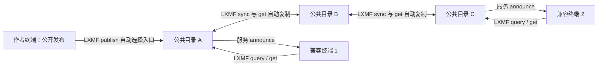

# 公共发现、发布传播与目录同步

状态：**待用户评审；本稿纠正 0.1 草案的定向分享模型，未授权开发**  
文档版本：`0.2.0-draft`；拟议线协议：`1`  
关联：[设计入口](./README.md) · [协议规范](./01-协议规范.md) · [交互设计](./02-交互设计.md) · [评审与验收](./03-评审与验收.md)

## 1. 必须满足的产品含义

建议先看 [UML 与坐标流转](./05-UML与坐标流转.md)：它用同一个坐标逐跳说明本文件中的 announce、publish、sync、query 和 get 各自传递什么。

用户明确要求：**藏宝点发布出去以后，Reticulum 网络下的终端都能看到，而不是单独分享给谁。**

因此，本稿规定：

1. 发布是面向公共藏宝点网络的动作，用户不填写收件人、不选择好友或私有群组。
2. 兼容终端自动发现公共目录、查询公共内容、按需下载。作者不维护读者名单。
3. 目录自动发现彼此并同步内容；不能把同步留成用户手工转发的可选补丁。
4. 公开读取不要求平台账号、邀请或作者批准。LXMF 的密码学身份用于验证和反滥用，不是私人访问许可。
5. 任意开发者可以实现协议，任意运营者可以运行目录，不依赖唯一中心站点。
6. “看到”指可以发现摘要并取得详情，不代表向每台小型设备强制推送全部正文。

Reticulum 是网络栈，不会自行给所有程序安装 geocaching 业务，也不能让断开的网络瞬间共享数据。兼容、可达和同步进度是技术条件，不是把公开需求降成定向分享的理由。

## 2. 三个独立角色

| 角色 | 职责 | 不要求 |
| --- | --- | --- |
| 发布/浏览终端 | 自动发现目录，提交自己的签名记录，浏览合并摘要、下载和离线使用 | 常驻在线、为他人托管内容 |
| 公共目录 | 发布发现 announce，接纳公开记录，提供 query/get/sync，主动同步其他目录 | 独占权威、批准读者名单 |
| Reticulum Transport / LXMF 传播节点 | 按各自原有协议路由或转递消息 | 理解藏宝点、执行目录查询 |

目录是本稿提出的必要业务角色，但不限定它必须是云服务器或独立硬件。可以与其他程序共机运行；手持终端是否也承担此角色由设备预算与用户评审决定。纯客户端只能在有公共目录可达时首次发布；已下载内容仍能离线用。



图中的目录不是用户选择的收件人。目录间数据可以最终传播，客户端只需接入当前可达的公共目录。

## 3. 自动发现协议

### 3.1 专用服务目的地

每个目录使用自己的 Reticulum Identity，注册 SINGLE 类型发现目的地：

```text
app_name = "trailmate"
aspects = ["geocache", "directory"]
完整名称 = trailmate.geocache.directory
```

同一 Identity 还注册标准 LXMF `lxmf.delivery` 地址。发现目的地只承担 announce 与地址发现，不接受第二套 Link/HTTP 业务请求；所有 publish/query/get/sync 仍发给对应 LXMF 地址。

终端只订阅匹配该专用 aspect 的合法 announce。Reticulum announce 本身携带签名身份信息，可包含应用数据；应用必须验证指定 aspect 与身份导出的目的地 hash，不能只相信正文标签。[Reticulum announce 说明](https://reticulum.network/manual/understanding.html)

### 3.2 announce 应用数据

app_data 使用 CMP1，固定数组：

```text
[discovery_schema, lxmf_delivery_hash, catalog_epoch,
 catalog_sequence, directory_name]
```

| 字段 | 类型 / 含义 |
| --- | --- |
| discovery_schema | 整数 1；与应用信封版本独立 |
| lxmf_delivery_hash | bin[16]，同身份的 LXMF delivery 目的地 |
| catalog_epoch | 随机 bin[16]，目录日志代际；见 §6 |
| catalog_sequence | uint64；当前目录已持久提交的最后日志序号，初始 0 |
| directory_name | str[40]；纯显示文本 |

app_data 总长不超过 96 字节。此数据不包含坐标、完整目录、私人资料或远端 URL。目录名称超出 40 字节必须在配置时拒绝，不悄悄截断签名数据。按字段最坏宽度编码为 89 字节，保留整体余量。

验证步骤：

1. 使用 Reticulum 验证 announce 签名与原生重放规则。
2. 从 announce 的完整公共身份派生 `trailmate.geocache.directory` hash，必须等于 announce 的目的地。
3. 从同一身份按标准派生 `lxmf.delivery` hash，必须等于 app_data 中地址；拒绝指向第三方地址。
4. 验证 CMP1、字段类型与长度，缓存目录候选。
5. 自动发起 capabilities；仅当 role=1 且完整支持五项操作时加入公共目录池。

目的地派生使用 Reticulum 正式名称与身份算法，不能自行截取昵称 hash。[Reticulum Destination 实现](https://raw.githubusercontent.com/markqvist/Reticulum/master/RNS/Destination.py)

### 3.3 发现节流与启动

- 目录启动在 0..60 秒随机延迟后宣告；已有同进程正常 announce 时不得重复调度。
- 正常建议每 6 小时宣告一次，加入 ±20% 抖动。
- 目录内容变化可以标记一次待宣告，但每个目录最多每 30 分钟一个内容变化 announce；多个变化合并。必须同时遵守 Reticulum/接口的更严格限流。
- 收到相同 epoch 下更大的 sequence 可以提前安排一次 sync，但不能每个 announce 立即全量下载。
- 新终端被动接收 announce，并使用上次持久保存的目录地址检查路径/能力。仅有旧地址不能宣称目录当前在线。
- 完全冷启动且尚未收到目录 announce 时显示“正在发现公共目录”；没有公共目录可达时显示明确等待状态，不改成让用户选择好友。
- 部署可以提供可替换的种子目录地址辅助冷启动；种子不是唯一信任根。高级诊断允许手工填种子，但普通用户不需要知道它。

v1 不发全网发现广播请求，也不修改 LXMF 原有 delivery announce 的 app_data。主动发现时延依赖原生网络传播与上述宣告调度，不能承诺打开页面立即列出所有目录。

## 4. 公开发布流程与确认含义

### 4.1 自动入口选择

用户点击“公开发布”后，应用从已验证公共目录池中自动选择入口。建议优先最近通信成功者，并轮换同等级候选；目标至少两个不同目录身份，避免只依赖单个目录。

- 每个目录一个独立 request_id，同一签名对象和 cache_id 不变。
- 同时在途最多一个；先向第一入口提交，再向第二入口提交，避免窄带突发。
- 第一个入口 200 后即可显示“已公开发布（至少一个目录已接纳），继续传播中”。
- 两个入口确认显示“已有两个目录接纳”；不能显示“全网同步完成”。
- 首个入口不响应或拒绝时自动尝试下一候选；同一次用户发布最多尝试 3 个入口，之后保留待发布任务并显示原因。
- 所有目录暂不可达时，任务保持等待公共入口，未获得接纳前不能显示发布成功。
- 同一入口的重试遵守请求幂等；换入口不是重用旧 request_id。

具体尝试数和复制目标是待评审的默认调度，不是全网可靠性证明。用户可暂停自动继续提交；已经入网的请求仍可能被接纳。

### 4.2 公开接纳必须原子成立

目录 publish 200 之前必须同时完成：原作者验证、对象持久保存、公开查询索引（适用状态）、公共同步日志、请求结果。get 和 sync 对任何兼容请求者可用，无私人读者白名单。

archived 接纳后可以不出现在默认 active/disabled 浏览中，但通过状态过滤、按 ID下载和 sync 可公开获取。来源拒绝某内容必须明示；不能成功接纳后只允许作者自己查看。

publish 成功的最低内容保留期为 30 天，且不得违反更晚到期的已发快照和日志保留承诺。被另一目录复制的对象也承担同样的公共接纳义务。此后资源政策可以移除副本；来源不提供永久托管承诺。

## 5. 普通终端如何“都能看到”

进入“发现藏宝点”后，终端自动发现公共目录，使用用户选择的区域分别 query 当前最多 3 个已验证目录，串行执行。所有结果在一个公共发现视图合并；用户不必先挑来源。

- 同 ID/hash 合并，只记录多个提供者。
- 同 ID 的不同摘要版本保留版本线索；在获得签名对象前不按来源说法确认冲突。
- 用户选中某点后，自动向提供精确 hash 的可达目录 get；失败可以向其他提供者请求同一 hash。
- 详情作者通过独立签名确定，来源只在信息/诊断里可查看。
- 更多目录通过公平轮换逐步查询；“刷新公共目录”复用这个流程，不要求重新添加地址。
- “最近更新”过滤和全网完整性证明不属于 v1；默认只声明目前已发现目录的查询范围和同步时间。

客户端不自动拉取全世界所有正文，也不收到每个 publish 的私人消息。公开性来自公共索引、任意兼容读者访问和目录复制，不来自收件人列表。

## 6. sync 操作（操作码 4）

### 6.1 目的与日志模型

sync 是 LXMF 上的公共同步操作，让新目录加入以及断线目录追赶。它返回紧凑对象引用，再用标准 get 精确下载；不引入 HTTP、独立文件通道或应用层无线分包。

目录维护：

- `catalog_epoch`：bin[16]；正常重启持久保持。丢失日志连续性、重建数据库或序号用尽时更换。
- `catalog_sequence`：uint64，初始 0；每个新可公开提供的版本/冲突证据引用递增一次。
- 公开变化日志：保留至少 30 天，每条关联完整可 get 的签名对象。
- 当前公开集合：无冲突点的已知最新版本；有冲突点的最小充分签名证据集合。archived 也在集合里。

同 hash 重复接收不再追加日志，不更新作者时间、不重发 publish、不造成循环放大。非冲突旧版本不作为新当前传播；揭示冲突的旧版本必须进入证据集合和日志。

### 6.2 请求

复用六项请求信封，operation=4，body：

```text
[cursor, page_limit]
```

cursor 为 nil 或来源提供的 bin[1..64]；page_limit 为 1..64且不超过 max_query_items；建议 response_budget=2048，page_limit=20。

cursor=nil 开始完整基线快照，不表示从目录创建之初下载全部历史。游标绑定来源/请求方/版本/页大小/响应预算，并由来源安全地持久关联状态或认证；其他端点不能复制后使用。

### 6.3 成功响应

status=200，body：

```text
[phase, catalog_epoch, references, next_cursor,
 has_more, remaining_ttl_seconds]
```

| 字段 | 定义 |
| --- | --- |
| phase | 0 基线快照；1 增量日志 |
| catalog_epoch | bin[16]，本次日志代际 |
| references | 0..page_limit 项的 ObjectRef 数组 |
| next_cursor | bin[1..64]，成功响应始终非 nil |
| has_more | 整数 0/1；1 继续分页，0 完成本次基线/本次增量截止点 |
| remaining_ttl_seconds | 游标在响应生成时的剩余秒数；不能忽略传输时间 |

```text
ObjectRef = [cache_id:bin[32], revision:uint32,
             revision_hash:bin[32], state:0..2]
```

引用只是一条来源声明，不能单独修改作者状态。按精确 hash get 并验证签名后才可接纳。冲突证据会包含同 ID 的多条引用；不能在下载前按 ID去掉其中一条。不得仅相信远端的“有冲突”标志。

### 6.4 无缝从基线进入增量

1. 首次 sync 固定基线快照，并记录该时刻日志高水位 P；基线包含所有已公开当前版本和充分冲突证据。
2. 基线按 `(cache_id 原始字节, revision 数值, revision_hash 原始字节)` 递增分页；同一对象引用只一次。
3. 基线中间页 phase=0、has_more=1，next_cursor 指向下一页。
4. 基线最后一页 phase=0、has_more=0，next_cursor 切换为“从 P 之后读取”的增量检查点。
5. 从基线创建起保留 P 之后日志及所需正文，至少直到该基线期限到期；基线期间发生的更新因此不会漏掉。
6. 用增量检查点请求时捕获当时高水位 Q，按日志序号提供 `(P,Q]`；中间游标固定 Q，最后游标成为 Q 检查点。
7. 没有变化时 phase=1、references=[]、has_more=0；返回当前 Q 的检查点。下一次轮询必须新 request_id，才能看到以后新增变化。
8. 增量记录可包含相同 ID 的多个历史版本，按序号提供；同 hash 重复可合并处理，但不能跨过未成功处理的引用。

应用重复请求仍重放相同结果。对新的请求 ID，基线/分页中间游标指向固定页面；增量检查点会捕获新的 Q，因此不能套用“任何同游标永远同页”的错误规则。

### 6.5 保留、过期与错误

- 基线/中间分页游标 TTL 使用 capabilities.cursor_ttl_seconds；增量检查点使用 sync_ttl_seconds=30 天。
- 所有已发游标必须有对应引用正文可 get；日志对应对象至少保留日志窗口，基线引用至少保留快照窗口，两者取更晚截止。
- 增量检查点的期限不能只看签发时间：若它从较旧高水位继续，目录必须将该位置之后的日志与正文保留到检查点到期；或者在签发时降低 remaining_ttl_seconds 到实际可兑现期限。30 天是能力的最大检查点寿命，不能承诺一个先于底层日志删除而失效的正常游标。异常丢库/重建仍按 epoch 与 410 处理。
- 同步成功 200 只表示这一页引用已提供，不表示请求方已经下载完成。
- sync 响应必须同样按完整 CMP1 信封字节预算取可容纳的最大前缀；非末页至少一条且游标前进，空基线合法并直接返回增量检查点。未知 phase/has_more 或引用范围非法时拒绝响应，不更新检查点。
- 请求方仅在该页全部引用已验证并持久处理后，提交 next_cursor；否则保留当前页与检查点，以后继续。
- 目录日志保留断层、epoch 改变、游标过期时返回 `410 sync_reset_required`，请求方从 nil 重新建立基线。旧本地对象不因重建而删除。
- 游标绑定错误返回 `400 invalid_cursor`；小预算放不下一条引用返回 413，不能空页循环；过载返回 429/503。
- 404 精确对象不可用与来源先前保留承诺矛盾时，记录来源违约、尝试其他提供者；不能提交检查点假装成功。可以中止本轮并重建基线，但保留未处理引用诊断。

接收方磁盘不足不能发布成功后丢弃日志以挪空间；应在接纳前拒绝。完成基线只意味着同步了该目录已知集合，不代表全网完整。

### 6.6 冲突证据与撤下传播

确认冲突时目录保留可独立验证的最小证据：例如同 revision 不同 hash 的两份签名记录，或前驱/后继不匹配的两份，或 archived 与其后高版本的两份。记录该证明对，保证它随基线、增量日志和精确 get 可获取。

若旧签名正文已清理，只有元数据提示矛盾，必须按01 §7.1进入历史待核实而不是伪造证明对。基线/sync不输出无法提供正文的所谓证明；已经公布且仍有保留义务的引用不得因待核实而提前失效。获取两份有效证据后再提交冲突状态和相应日志。

冲突集合固定保留首个已持久确认的充分证明对及原先必要的当前引用；后续同类分叉不无界追加，不替换这对证据，也不得提前删除仍有保留承诺的旧正文。同一事务有多个充分证明对时，按 `(revision,hash)` 顺序选字典序最小者。不同目录可以持有不同有效证明对；要收敛的是冲突事实，不强制证据字节集合完全一致。

archived 是作者签名记录，和普通更新一样进入 sync。目录移除自己的副本不是作者撤下，不产生全网 delete 事件；缺失也不能使其他节点删除本地副本。

## 7. 目录自动复制调度

发现池、来源健康、部分失败、重建上限和错误优先级以[发现调度与同步失败契约](./12-发现调度与同步失败契约.md)细化；失败页不得被当成已同步推进检查点。

1. 目录自动接收并验证其他公共目录 announce，经 capabilities 确认后加入同伴池；不要求运营者逐个手工互加好友。
2. 新同伴建立 sync 基线；已有同伴优先续增量检查点。
3. 每页引用按 hash 查询本地；已验证对象无需重复下载，未持有对象用 get 精确拉取。
4. 校验对象并应用同一版本规则，原子写入自己的公共索引与日志，然后推进远端游标。
5. 自己的日志会被其他节点继续拉取；重复 hash 不增日志，因此环形拓扑不会无限重新发布同一内容。
6. 连接恢复、收到较新 sequence 的 announce 或调度到期触发有界同步。

推荐初始预算（待评审）：

| 项目 | 建议 |
| --- | --- |
| 同时向同伴发请求 | 1 |
| 每轮处理同伴 | 最多 3 个，轮转全部已验证同伴，不能永远只选最近三台 |
| 有新增提示后的启动 | 30..120 秒随机延迟，合并同伴重复提示 |
| 无变化轮询 | 高带宽 6 小时；低带宽 24 小时，±20% 抖动 |
| 每轮同步应用数据预算 | 高带宽 256 KiB；低带宽 16 KiB；达到后持久暂停游标，下一轮续接 |
| 连续错误 | 依次 1 分钟、5 分钟、30 分钟退避，随后最长 6 小时；有有效新路径可提前一次 |

预算是应用字节调度建议，实际空口还受 LXMF 开销、stamp、链路速度和监管/接口限流约束。调度器必须为正常用户消息保留资源，不能因公共发现而无限扫网。

低带宽全量同步可能超过游标窗口。运营者应选择可承担公开目录职责的节点和链路；客户端不用复制全量库。容量与连接不足时如实显示同步滞后，不宣称公开传播已覆盖全网。

## 8. 可见性与最终传播的条件

在以下条件成立时，一个有效公开点可以经目录同步到其他可达目录，并被其兼容终端发现：

- 至少一个目录成功接纳且仍保留对象。
- 目录间存在随时间可用的发现和同步路径，双方没有永久拒绝对方或该内容。
- 连接时长与预算足以完成同步，调度公平，不永久饿死某同伴。
- 读者终端支持协议，能发现并连接至少一个已接纳或已同步的目录。

这是一种有条件的最终传播，不是所有物理终端即时一致。网络分区时各区可独立公开发布；重连后按 sync 合并，无冲突对象传播，冲突按证据隔离。完全隔离且没有目录的终端只能保存本地草稿，不能谎报已公开。

UI 可以说“公开可见”“正在继续传播”“目前已发现 N 个目录”，不能说“任何设备都已收到”“全网同步率 100%”。这个限制解释现实网络状态，不改变任何兼容读者都可访问的公共性。

## 9. 公共协议不变量

| 不变量 | 违反例子 |
| --- | --- |
| 无私人收件人 | 发布页要求选好友才能提交 |
| 自动发现 | 新终端必须知道作者地址才能看到点 |
| 自动目录传播 | 数据永远只留在首个目录，靠用户手动转发 |
| 公共接纳才确认 | 200 后其他读者 get/query 看不到且不是状态过滤原因 |
| 端到端作者验证 | 目录复制时重写记录或用自己的签名取代作者 |
| 无全网保证伪装 | 一个入口 200 就显示所有终端已同步 |
| 有界传输 | 每个更新广播整个目录，或每台终端被迫下载所有正文 |
| 无底层协议旁路 | announce 携带完整点，或 HTTP 承担实际下载 |

## 10. 公开传播验收场景

1. A 发布；B 不认识 A、未添加任何好友，只运行兼容客户端即可自动发现目录并查到该点。
2. A 只成功进入目录 D1；D2 自动发现并同步后，只连 D2 的 B 能看到和下载，A 可已经关机。
3. D1、D2 初始隔离；两边独立发布；重连后目录补同步，客户端无需重新导入作者地址。
4. B 从未打开详情，公共摘要可见，但不会被迫下载所有全文。
5. 目录声称接纳成功却对其他普通终端拒绝读取，判为不合规，而不是私人权限配置。
6. 目录收到同一对象形成环路，同 hash 不反复增加日志/发送通知。
7. archived 和有效冲突证据经跨目录 sync 可达，不能只传播 active 点。
8. 丢失增量日志、服务重启换 epoch、断网超过窗口，返回重建要求，不静默漏更新。
9. 未安装本功能或处于物理隔离的设备不被列入“已经收到”；文案清楚区分公共可访问与实际同步状态。
